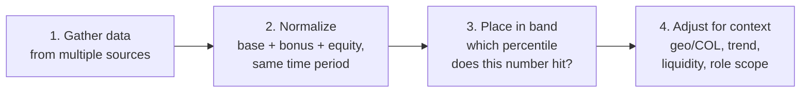
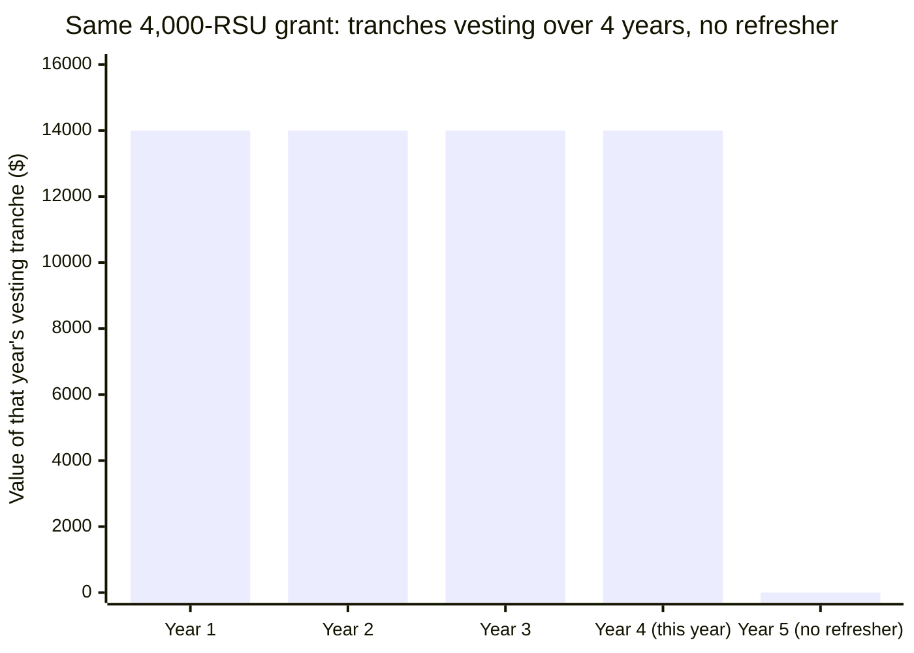

import LevelIntro from "../../../components/LevelIntro.astro";
import Checkpoint from "../../../components/Checkpoint.astro";

L1 named the gap: Dana's raise letter quotes a base-salary percentage while her equity is one year from vesting to $0. This level builds the two tools that close that gap — how to add up total comp correctly, and a repeatable process for finding out whether a number is actually fair.

<LevelIntro
  items={[
    "Total comp as three components with different shapes, not one number",
    "The four-step process: gather data, normalize, place in band, adjust for context",
    "Reading equity specifically: vesting, cliffs, refreshers, current vs. grant valuation",
  ]}
/>

## Total comp is three components, and they don't behave alike

If Dana's manager quotes "+5.6%" and that number is technically true, what makes it misleading anyway?

It's true about exactly one of three components, and silent about the other two — which don't move the same way base does.

| Component | How it's paid                                        | How it changes year to year                                                                                                  |
| --------- | ---------------------------------------------------- | ---------------------------------------------------------------------------------------------------------------------------- |
| Base      | Fixed salary, paid every period                      | Usually flat or a small annual bump — the number a raise letter tends to lead with                                           |
| Bonus     | A target percentage of base, paid if targets are hit | Scales with base, but is never guaranteed — it can land at 0% in a bad year                                                  |
| Equity    | A grant that vests in tranches over several years    | Can go to $0 the moment a grant finishes vesting, unless refreshed — this is the part a base-only comparison misses entirely |

A raise percentage calculated on base alone answers "did my fixed salary go up," which is a real question — but it's not the same question as "is my total pay, this year and next, actually fair for this role." Those can point in opposite directions at once, which is exactly Dana's situation: base is up, total comp next year is about to fall.

<Checkpoint question="Dana's manager could instead have quoted '+3.9% on total comp' (comparing $172,400 total comp last year to $179,000 this year) instead of '+5.6% on base.' Would that number, by itself, have told Dana everything she needed to know?">

No — it would have been a better number than the base-only one, since it
at least accounts for all three components in a single year, but it still
wouldn't show the vesting cliff. A single year-over-year total-comp
percentage compares this year to last year; it says nothing about _next_
year, when the equity tranche disappears without a refresher. Total comp
fixes the "which components count" problem; it doesn't fix the
"single-snapshot" problem — that needs the multi-year view covered later
in this level.

</Checkpoint>

## A four-step process for "is this fair"

Given that a single number from a raise letter isn't enough, what does a reader actually have to do, in order, to get a real answer?

**Step 1 — gather data from more than one source.** No single source is reliable alone:

| Source                                                      | Strength                                                  | Weakness                                                                     |
| ----------------------------------------------------------- | --------------------------------------------------------- | ---------------------------------------------------------------------------- |
| Aggregated self-reported bands (leveling.fyi-style sites)   | Large sample, broken down by level and location           | Self-reported — no verification, and leveling maps differ company to company |
| Formal comp surveys (e.g., Radford, Levels-style paid data) | Verified, employer-submitted, methodologically consistent | Expensive/access-gated; a job-seeker rarely sees the raw report directly     |
| A recruiter's stated range for a specific role              | Real, current, tied to an actual open req                 | One data point, and recruiters have their own incentive to anchor low        |

**Step 2 — normalize every offer to the same shape.** Add base + target bonus + this year's vesting equity, for the same one-year window, for every offer being compared — not "base here, total comp there," which is the exact mismatch that made Dana's raise letter misleading in the first place.

**Step 3 — place the normalized number in a band.** A market band for a role/level/location typically reports P25, P50 (median), P75, and P90. Where a number falls in that range is the actual signal — not whether the raw dollar figure feels large.

**Step 4 — adjust for context.** The same normalized total-comp number can mean different things depending on geography/cost of living, whether the equity is liquid (public) or illiquid (private), and whether this year's number is part of a rising or falling multi-year trend. All three get their own worked treatment in L3.

<Checkpoint question="A friend tells Dana 'I make $190,000 total comp, you should ask for that too.' Per the four-step process above, what step is missing before that number is actually useful to her?">

Steps 2 and 3 are both missing. Dana doesn't yet know whether her friend's
$190,000 was normalized the same way (same components, same one-year
window) as her own number, and she doesn't know where $190,000 falls in
the market band for _her_ specific role, level, and location — her
friend's number might be a different level, a different city, or include
a one-time signing bonus that isn't part of ongoing comp. A single
anecdotal data point skips straight to "here's a number" without doing
the normalization or band-placement work that makes it comparable.

</Checkpoint>

## Reading equity specifically

Equity is the component people misread most often — so what does it actually mean when a grant says "4,000 RSUs vesting over 4 years," and why do two valuations exist for the same shares?

- **Vesting schedule**: the calendar that releases a grant in tranches (commonly 25%/year for four years) rather than all at once. Only vested shares are actually yours — unvested shares are a future promise, not current pay.
- **Cliff**: many grants require a minimum period (often one year) before _any_ shares vest — before the cliff, the grant is worth $0 if you leave.
- **Refresher grant**: a new grant issued before the original one finishes vesting, so the tranche total doesn't drop to zero the year the original grant runs out. Dana's situation — a 4-year grant about to finish its last tranche with no refresher mentioned — is precisely the case a refresher exists to prevent.
- **Current valuation vs. grant valuation**: at a private company, shares are priced two different ways. The 409A (a periodic independent appraisal, used for tax/strike-price purposes) is usually well below what investors paid in the most recent funding round — and both of those are different again from whatever the company might eventually be worth at an IPO or acquisition. A public company sidesteps all of this: its stock has one observable, tradeable price today.

That last bar is the whole problem with reading Dana's raise letter as "total comp is fine" — the letter is accurate about this year and silent about the one right after it.
