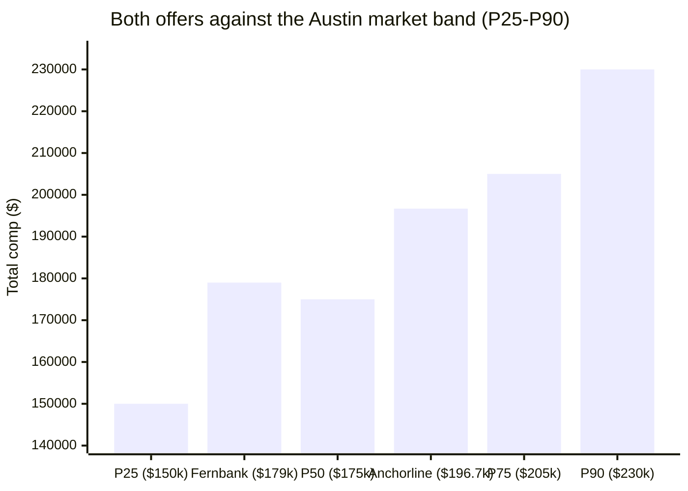

import Scenario from "../../../components/Scenario.astro";
import LevelIntro from "../../../components/LevelIntro.astro";
import Checkpoint from "../../../components/Checkpoint.astro";

L1 introduced Dana's raise letter and the equity cliff it didn't mention. L2 gave the four-step process (gather, normalize, place in band, adjust for context) and the vocabulary for reading equity specifically. This level walks Dana's actual two weeks of research and negotiation, move by move, with real numbers at every step — including the parts that have nothing to do with the offer letter itself.

<Scenario label="The two weeks">
  <Fragment slot="facts">
    

      
🏢 Fernbank Robotics — private, Series C, Austin. Raise offer: $150k base / 10% target bonus / $14k this year's equity tranche

      
🏙️ Anchorline Systems — public, NYSE-listed, New York City. Offer in progress

      
📊 Market band, Senior Backend Engineer, Austin: P25 $150k · P50 $175k · P75 $205k · P90 $230k

      
🧑‍💼 Priya Manetti — Dana's manager at Fernbank, delivered the raise letter

    

  </Fragment>

Dana doesn't respond to the raise letter right away. Over two weeks, she pulls market data from three independent sources, normalizes both Fernbank's raise offer and Anchorline's forming offer to the same total-comp shape, places both in a real market band, adjusts for the fact that one job is in Austin and the other is in New York City, and only then goes back to Priya — not to accept or reject, but to negotiate a specific, named ask.

**Before reading on: Dana ends up asking for one specific thing that isn't "more base salary." What single number from the four-step process would you guess drives that ask?**

</Scenario>

<LevelIntro
  items={[
    "Gathering and normalizing: turning two offer letters into comparable numbers",
    "Placing both in the band, and adjusting for cost of living and liquidity",
    "The negotiation: what Dana actually asks for, and why",
  ]}
/>

## Step 1 and 2: gathering data and normalizing both offers

A raise letter and a forming offer aren't naturally comparable — one quotes a base bump, the other is still being assembled by a recruiter. What does Dana have to do before she can put them side by side at all?

She checks three sources against each other rather than trusting any one of them: an aggregated self-reported leveling site (Senior Backend Engineer, Austin band), a friend-shared comp-survey summary from a former coworker now at a comp-analytics vendor, and the actual range Anchorline's recruiter states out loud on their first call ($150,000–$165,000 base for the level). All three roughly agree on the shape of the market, which is what makes her confident enough to use them — a single source that didn't cross-check against the others would have been a much shakier basis for a negotiation.

She then normalizes both offers to the same one-year total-comp shape: base + target bonus + this year's vesting equity value.

| Component            | Fernbank (raise offer)                       | Anchorline (steady-state, year 2+)                |
| -------------------- | -------------------------------------------- | ------------------------------------------------- |
| Base                 | $150,000                                     | $158,000                                          |
| Target bonus         | $15,000 (10%)                                | $23,700 (15%)                                     |
| This year's equity   | $14,000 (last tranche of the original grant) | $15,000 (RSU grant, $60,000 over 4 years, 25%/yr) |
| **Normalized total** | **$179,000**                                 | **$196,700**                                      |

Anchorline's first-year offer letter actually quotes $211,700 — it includes a one-time $15,000 signing bonus that only applies to year one. Dana deliberately excludes it from the comparison above: a signing bonus tells her something about year one, but comparing it against Fernbank's steady, ongoing raise would overstate how the two jobs compare in year two and beyond, which is the comparison that actually matters for a multi-year decision.

<Checkpoint question="Why does Dana exclude Anchorline's $15,000 signing bonus from the normalized total-comp comparison above, rather than including it to make Anchorline's number look even stronger?">

Because the signing bonus is a one-time, year-one-only payment, and the
comparison Dana is building is meant to answer "which job pays better on
an ongoing basis" — not "which job pays better in year one specifically."
Including it would inflate Anchorline's number in a way that doesn't
repeat in year two, making the two offers look further apart than they
actually are once both are running at steady state. This is the same
normalization discipline from L2's step 2: compare offers on the same
shape and the same time window, or the comparison isn't real.

</Checkpoint>

## Step 3: placing both numbers in the band

With two normalized numbers in hand — $179,000 and $196,700 — what does Dana actually learn by placing them against the market band instead of just comparing them to each other?

Comparing the two offers directly says Anchorline pays about $17,700 more. Placing both in the band says something more specific: Fernbank's raise offer sits just above the _median_ for the role, and Anchorline's offer sits _between_ the median and the 75th percentile — a real step up, but not an outlier offer, and not close to the 90th-percentile ceiling either. That distinction matters for what Dana asks for next: "get me to P90" would be an unreasonable ask against this band; "get me closer to Anchorline's placement" is not.

| Offer      | Normalized total comp | Percentile in band  |
| ---------- | --------------------- | ------------------- |
| Fernbank   | $179,000              | Just above P50      |
| Anchorline | $196,700              | Between P50 and P75 |

## Step 4: adjusting for context — cost of living and liquidity

The band comparison makes Anchorline look like the clear winner. What two adjustments does Dana still owe herself before treating that as settled?

**Cost of living.** Anchorline's office is in New York City; Fernbank's is in Austin. Using a standard cost-of-living index (Austin as baseline 100, NYC roughly 155 for comparable major line items — housing weighted heaviest), Dana converts Anchorline's $196,700 to Austin-equivalent purchasing power:

> $196,700 ÷ 1.55 ≈ **$126,900 Austin-equivalent**

That's a striking number: on a pure purchasing-power basis, Anchorline's nominally larger offer is worth _less_ real spending power than Fernbank's raise offer. Dana doesn't treat this as the final word either — a NYC role may carry other value (career capital, network, the specific team) that a COL index can't price — but it changes "clear winner" into "a real trade-off with a number attached," which is a very different conversation to walk into a negotiation with.

**Liquidity.** Fernbank's $14,000 equity figure is a private-company 409A valuation — real on paper, but not spendable until an exit event (acquisition or IPO) that may be years away or may never happen. Anchorline's $15,000 RSU figure is public-company stock, tradeable the day it vests. Two equity numbers of the same size are not the same risk:

|                | Fernbank equity                                                     | Anchorline equity                                                           |
| -------------- | ------------------------------------------------------------------- | --------------------------------------------------------------------------- |
| Priced by      | 409A appraisal (periodic, independent)                              | Live public market price                                                    |
| Realizable     | Only at a future exit event                                         | Immediately upon vesting                                                    |
| Value could be | Anywhere from $0 (failed exit) to several multiples of today's 409A | Moves with the public stock price, but is never $0 while the company trades |

<Checkpoint question="If Dana only did steps 1-3 (gather, normalize, place in band) and stopped there, what specific, real difference between the two offers would she have missed entirely?">

She'd have missed both context adjustments from step 4: that Anchorline's
nominally higher total comp is worth less in real purchasing power once
NYC's cost of living is priced in, and that Fernbank's equity carries
meaningfully more risk (illiquid, exit-dependent, could realistically be
worth $0) than Anchorline's immediately-tradeable RSUs. Steps 1-3 answer
"which number is bigger and where does it rank" — step 4 answers "what is
that number actually worth to me, given where I'd be living and how
certain that money really is" — a different and arguably more important
question.

</Checkpoint>

## The negotiation

With all four steps done, what does Dana actually walk into Priya's office and ask for?

Not a bigger base bump, and not a base-for-base match against Anchorline's number — she asks for one specific thing: a **refresher equity grant**, sized to close most of the gap between Fernbank's band placement (just above P50) and a target closer to P65-P70, structured to start vesting the year the original grant runs out so total comp doesn't fall to $150,000 + $15,000 next year. She brings the band chart, the vesting-cliff chart from L2, and a one-line frame: "the raise is fair for this year. Without a refresher, next year isn't."

| What Dana didn't ask for                                   | What Dana asked for instead                                                                 |
| ---------------------------------------------------------- | ------------------------------------------------------------------------------------------- |
| Match Anchorline's base salary dollar-for-dollar           | A refresher grant sized against the market band, not against a competing offer's raw number |
| Threaten to leave unless base goes up                      | Named the specific, dated problem (the vesting cliff) with a chart, not an ultimatum        |
| Accept the raise letter as-is because "it's still a raise" | Treated total comp, not base, as the actual thing being negotiated                          |

Priya comes back a week later with a refresher grant of 2,400 RSUs vesting over four years — not the full gap-closer Dana asked for, but a real, dated commitment that fixes the cliff. Dana takes the Fernbank offer, not because it beat Anchorline on a raw dollar comparison, but because once cost of living and liquidity were priced in, the two were close enough that other factors (team, role scope, no relocation) tipped it — a conclusion she could only reach by doing all four steps, not just the first two.

## A decision worksheet

Dana's specific numbers won't match anyone else's — so what does the same worksheet look like filled in for her case, and where would a genuinely different case diverge?

| Question                                                             | Dana's answer                                                                                                        |
| -------------------------------------------------------------------- | -------------------------------------------------------------------------------------------------------------------- |
| Gather: how many independent sources agree on the band?              | 3 — leveling site, comp-survey summary, recruiter-stated range — roughly consistent                                  |
| Normalize: same components, same one-year window, across all offers? | Yes — base + target bonus + this year's equity; one-time signing bonus excluded                                      |
| Place in band: where does each normalized number land?               | Fernbank just above P50; Anchorline between P50 and P75                                                              |
| Adjust: COL and liquidity, not just raw dollars?                     | NYC COL erased most of Anchorline's nominal edge; Fernbank's equity is less liquid but the refresher fixes the cliff |
| Ask: what specific, dated thing was requested?                       | A refresher grant sized against the band — not a base match, not an ultimatum                                        |

**This worked example is one case, not the whole territory.** Dana's situation happens to have two comparable-shaped offers and a band with good source agreement — a much messier real case might have sources that disagree sharply (a leveling site showing P50 at $160k against a recruiter range starting at $190k), which raises a different question entirely: what would Dana's next move be if the three sources she checked didn't agree with each other at all, and which one should she trust more, and why?
