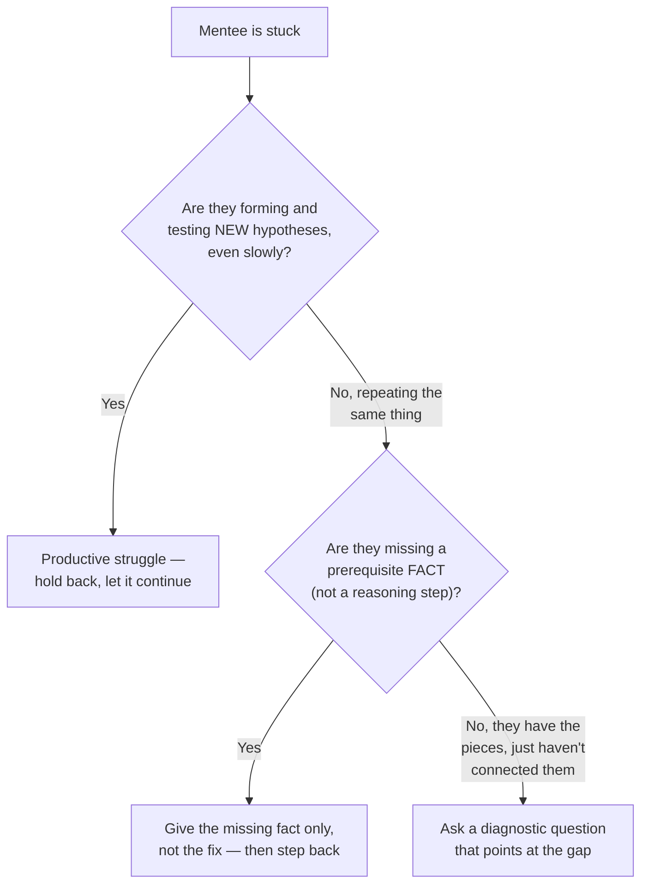

import LevelIntro from "../../../components/LevelIntro.astro";
import Checkpoint from "../../../components/Checkpoint.astro";

L1 named the core trade-off: mentoring is the skill of matching the nudge to
the struggle, not defaulting to "always fix it" or "always let them
flounder." This level builds the two tools that make that judgment call
concrete — a way to actually tell productive struggle from wasted struggle,
and a gradient for how much responsibility to hand over once you've decided
to step in.

<LevelIntro
  items={[
    "Diagnosing productive vs. wasted struggle",
    "The gradual-release gradient (I do -> you do)",
    "Matching the stage to the skill, not the person",
  ]}
/>

## Is this struggle worth letting continue?

**Before any technique for how to intervene, there's a prior question: how
does a mentor actually tell "still productively working the problem" apart
from "spinning with no new information"?**



Three concrete cases before the abstract labels:

| What you see                                                    | What it usually means | Better mentor move                                   |
| --------------------------------------------------------------- | --------------------- | ---------------------------------------------------- |
| They try a new idea, observe the result, and update their guess | Productive struggle   | Let them continue, maybe ask one clarifying question |
| They repeat the same attempt with different wording             | Wasted struggle       | Interrupt the loop with a diagnostic question        |
| They are missing a fact they could not infer                    | Missing prerequisite  | Give that fact briefly, then hand the problem back   |

The signal isn't time elapsed — Sam's 40 minutes doesn't by itself mean
"intervene now." The signal is whether each new attempt is testing a
different idea than the last one. A mentee who has cycled through the same
single hypothesis five times in a row has stopped learning from the
attempts; a mentee slowly narrowing down through three different
hypotheses in the same 40 minutes is still extracting value from the
struggle.

<Checkpoint question="Sam tries three different approaches in a row, each one testing a new guess based on what the last attempt revealed, and hasn't found the bug yet. Is this productive or wasted struggle, and what should Priya do right now?">

This is productive struggle, even though it hasn't produced a fix yet — the
signal isn't whether Sam has succeeded, it's whether each attempt is
carrying new information into the next one. Because Sam is still updating
the guess each time, Priya's move is to hold back rather than intervene:
stepping in now would remove the exact process that's building Sam's
ability to do this alone next time. Priya only needs to act once the
attempts stop changing — repeating the same thing with different wording,
or restating the same guess a fifth time — because that's the point where
struggle has stopped teaching anything and started just costing time.

</Checkpoint>

## The gradual-release gradient

**If the answer to "should I intervene" is yes, how much should be handed
over — the full fix, a hint, or a question?** A useful way to think about
this is a gradient of how much responsibility the mentor is holding versus
handing to the mentee, not a single fixed choice:

```text
1. I do, you watch    — mentor solves it while narrating the reasoning out loud
2. We do it together  — mentor and mentee work the same problem side by side
3. You do, I watch    — mentee drives, mentor only intervenes if truly stuck
4. You do it alone    — mentee handles the next one with no mentor present
```

Priya's "ask a diagnostic question and wait" sits at stage 3: Sam is
driving, Priya is only present to catch a genuine dead end. If Sam had
never encountered test mocking at all, starting at stage 3 would waste
time neither of them has — stage 1 or 2 first (show the concept, then do
one together) would get to a productive stage 3 much faster on the _next_
bug.

The same gradient works outside software. Learning a math method often
goes: teacher solves one while narrating, teacher and student solve one
together, student solves one while the teacher watches, then student solves
the next one alone. The point is not "never show the answer"; it is moving
responsibility over as the learner can carry it.

<Checkpoint question="A mentee has successfully done this exact kind of task alone several times before. The mentor still walks them through it step by step at stage 1, narrating the whole solution out loud. What's the mismatch, and what does it cost?">

The mismatch is picking a stage below what the mentee's actual readiness
calls for — stage 1 belongs to someone missing the underlying concept
entirely, not someone who's already demonstrated they can do the task
unassisted. Running a ready mentee through "I do, you watch" anyway costs
two things: it wastes time neither person needed to spend, since nothing
new is being transferred to someone who already has the skill, and it
signals a lack of trust in competence the mentee has already shown, which
tends to erode their engagement rather than build it. The fix isn't a
different technique — it's recognizing that the stage should track what
this specific mentee can already carry for this specific kind of problem,
not a mentor default applied uniformly.

</Checkpoint>

## Matching the stage to the mentee, not to the mentor's default

**Does the same mentee always sit at the same stage?** No — the stage
should track the specific skill being exercised, not the person overall. A
mentee who's confidently at stage 4 for writing tests might still need
stage 2 for a new deployment tool they've never touched. Picking one fixed
stage for a mentee across every kind of problem either babies someone who's
ready for more autonomy, or strands someone in unfamiliar territory with
too little support.

| Signal                                                              | Suggests                         |
| ------------------------------------------------------------------- | -------------------------------- |
| Mentee has done this exact kind of task before, successfully        | Stage 3 or 4                     |
| Mentee has the general skill but this specific tool/pattern is new  | Stage 2                          |
| Mentee is missing a foundational concept entirely                   | Stage 1, briefly, then move up   |
| Mentee is repeating the same failed approach with no new hypothesis | Drop back one stage, temporarily |

## The generalizable lesson

**Is "ask questions instead of giving answers" the actual rule to take
away from this unit?** Not quite — asking a diagnostic question when a
mentee is missing a basic prerequisite fact just wastes both people's time
circling something a direct, short explanation would resolve in ten
seconds. The generalizable skill is diagnosing _which_ situation is
actually in front of you — productive struggle, a missing fact, or an
unconnected piece — and picking the response that situation calls for, not
committing in advance to always-teach or always-tell.
