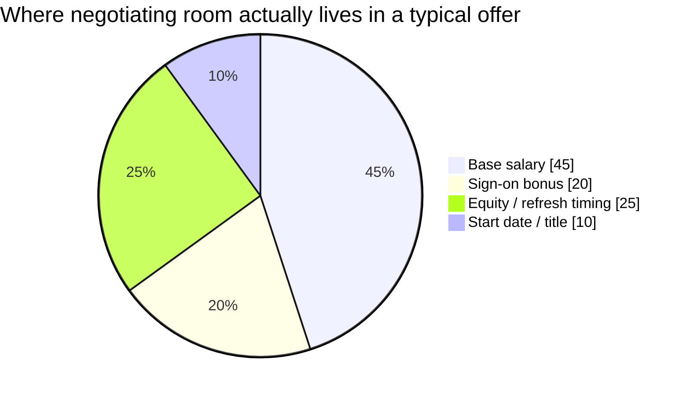

import Scenario from "../../../components/Scenario.astro";
import LevelIntro from "../../../components/LevelIntro.astro";

<Scenario>
  <Fragment slot="facts">
    

      
💼 Renata Cho — Staff-track data engineer, currently at Bellcrest Systems, $168,000 total comp

      
📞 Ashgrove Analytics recruiter, first call: "What are your current comp and expectations?" — before naming any number of their own

      
🅱️ Renata's BATNA: staying at Bellcrest is genuinely fine, not a bluff

    

    

      

        If Renata answers with "$168k, I'd want a solid bump" — where does that number sit inside a realistic offer range?
      

      

        

      

      
Near the floor of what Ashgrove could plausibly pay for this role — the exact spot an early, low anchor tends to land

    

  </Fragment>

Renata Cho is three interviews into a loop with Ashgrove Analytics, a mid-size analytics company hiring for a role one step above her current title. The interviews have gone well. On the recruiter call scheduling round four, the recruiter, Priyanka Osei, asks a routine-sounding question before naming a single number of Ashgrove's own: "So I can make sure we're aligned — what's your current comp, and what are you hoping for?"

Renata's current total comp is $168,000. She likes her job well enough. She hasn't done anything to figure out what this specific role, at this specific company, in this market, is actually worth.

**Before reading on: whatever number Renata says out loud next — even a cautious, hedged one — will quietly shape every offer number Ashgrove considers for the rest of the process. Why would that be true, if she hasn't even seen a job description with a salary range on it yet?**

</Scenario>

The question isn't "will Ashgrove pay Renata fairly." It's "which number does the rest of this negotiation get built around" — and the honest, first-instinct answer she's about to give is the wrong lever to pull, before she's negotiated a single dollar.

<LevelIntro
  items={[
    "Anchoring: why the first number stated shapes everything after it",
    "BATNA: the walk-away point that makes 'no' a real, safe option",
    "Framing a compensation ask as collaborative, not adversarial",
  ]}
/>

Plain-language map before the terms pile up:

| Term                  | Read it as                                                                                   |
| --------------------- | -------------------------------------------------------------------------------------------- |
| Anchoring             | The first number spoken in a negotiation pulls every later number toward it                  |
| BATNA                 | Best Alternative To a Negotiated Agreement — what you actually do if this deal falls through |
| Walk-away point       | The number below which you take your BATNA instead of the deal on the table                  |
| Collaborative framing | Asking in a way that treats the other side as a partner solving a shared problem             |
| Adversarial framing   | Asking in a way that treats the other side as an opponent to be beaten                       |
| Package negotiation   | Negotiating base, bonus, equity, sign-on, and start date together — not base salary alone    |

- **Whoever states a number first sets an anchor, and anchors are sticky.** Even an unrealistic anchor pulls the eventual outcome toward it — which is why "what are your expectations?" asked before any range is on the table is a real negotiating move, not small talk.
- **A BATNA is what makes "no" survivable.** Renata's walk-away point only has teeth because staying at Bellcrest is a real, acceptable outcome — a walk-away point backed by no real alternative is just a bluff, and bluffs get tested.
- **Negotiating well and preserving the relationship are not in tension when the ask is framed collaboratively.** "Help me understand how we get to a number that reflects the market for this role" invites problem-solving; "I won't accept less than X" invites a standoff.
- **A competing offer is leverage, not a threat, when it's used as information.** Naming a real number from a real process ("I have another offer at $Y") changes what's possible; announcing an ultimatum ("match this or I walk") changes the relationship instead.
- **The whole package moves, not just base.** Sign-on bonus, start date, equity refresh timing, and title all have negotiating room that a base-only ask leaves on the table.

None of this means Renata should refuse to answer Priya's question, or treat every conversation as a fight. It means the honest, unprepared answer to "what are your expectations" gives away the one thing she controls before the negotiation has properly started: who sets the anchor.
