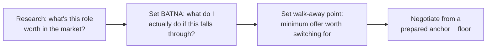
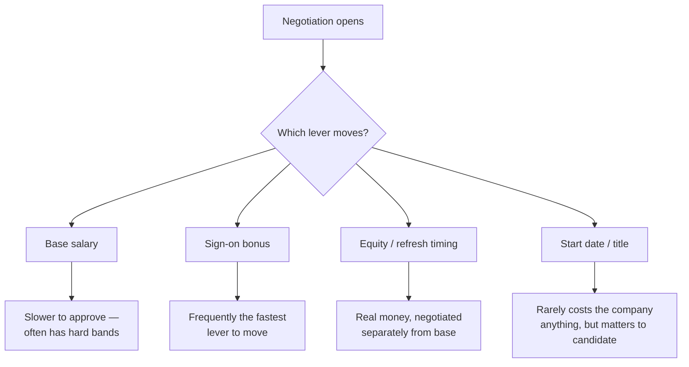

import LevelIntro from "../../../components/LevelIntro.astro";
import Checkpoint from "../../../components/Checkpoint.astro";

L1 left Renata mid-question, about to answer Priya's "what are your expectations?" without having prepared a number, a floor, or a plan for how to say it. This level builds the three tools that fix that: how anchoring actually works, how to set a real walk-away point, and how to run the conversation so the ask lands as a negotiation, not a confrontation.

<LevelIntro
  items={[
    "Why the first number spoken pulls every later number toward it",
    "Building a real BATNA and walk-away point, not a bluff",
    "The negotiation flow: prepare, anchor, use leverage, close collaboratively",
  ]}
/>

## Anchoring: why "who goes first" is the whole game

If Renata blurts out "$168k, hoping for a solid bump," what does that number actually do to the rest of the process — given that Ashgrove hasn't even shared a range yet?

It becomes the center of gravity every later number gets pulled toward, whether or not it was ever a fair starting point.

| Who anchors first                                                   | What tends to happen next                                                                                                                                               |
| ------------------------------------------------------------------- | ----------------------------------------------------------------------------------------------------------------------------------------------------------------------- |
| Candidate states a low/cautious number                              | The company's internal band is real, but the final offer clusters near the candidate's own number — the company rarely offers meaningfully more than what was asked for |
| Candidate states a well-researched, ambitious-but-defensible number | The final offer clusters higher, anchored toward that number, even though the company's band didn't change                                                              |
| Company states first (a real range or offer)                        | The candidate now has a concrete anchor to counter against, instead of guessing blind — generally the stronger position to negotiate from                               |
| Neither states a number yet (deflect-and-redirect)                  | The anchor gets set later, once the candidate has done the research to anchor confidently — costs a round of back-and-forth, buys real leverage                         |

The mechanism isn't that anchors are "correct" — an anchor can be completely disconnected from a company's actual budget and still pull the outcome toward it. That's what makes answering "what are your expectations" with an un-researched, defensive-sounding number a real cost, not a neutral pleasantry.

<Checkpoint question="Priya's question came before Ashgrove named any range of their own. Per the table above, why would deflecting ('I'd love to understand the range for this role first') generally put Renata in a stronger position than answering immediately with a guess?">

Because answering immediately means Renata sets the anchor with an
un-researched number — and per the anchoring mechanism, whatever number
she names, low or high, pulls the eventual offer toward it regardless of
whether it reflects the real market. Deflecting costs her a small amount
of back-and-forth (Priya may push back once), but it either gets Ashgrove
to state their range first — the stronger position — or buys Renata time
to bring a researched number to the anchor instead of a reflexive one.
Either outcome beats anchoring on a guess.

</Checkpoint>

## BATNA: the number that makes "no" survivable

Renata's walk-away point only matters if it's backed by something real — so what actually makes a BATNA strong instead of a bluff?

**BATNA** — Best Alternative To a Negotiated Agreement — is simply: what happens if this specific deal doesn't close. For Renata, that's staying at Bellcrest Systems, a job she genuinely doesn't dislike, at $168,000. That's what makes her walk-away point real: if Ashgrove's final offer lands below the point where switching jobs is clearly worth it, she has a perfectly fine place to be instead of taking a bad deal out of momentum or sunk cost.

A walk-away point isn't the number you'd love to get — it's the minimum number below which taking your BATNA is clearly the better choice. Setting it before the negotiation starts matters because setting it in the moment, under a recruiter's friendly pressure to "just say yes," produces a worse number almost every time.

| Without a prepared BATNA                                                  | With a prepared BATNA                                                              |
| ------------------------------------------------------------------------- | ---------------------------------------------------------------------------------- |
| "No" feels risky — might not get another shot, so pressure to accept      | "No" is a real, calm option — a fine outcome (staying put) is already secured      |
| Walk-away point gets improvised in the moment, usually lower than planned | Walk-away point was set with a clear head, before any offer created emotional pull |
| A weak final offer still might get accepted out of momentum               | A weak final offer gets a clean, unemotional "this doesn't work for me" — no drama |

<Checkpoint question="Suppose Renata disliked her current job and had no other offers in progress. Would 'staying at Bellcrest' still function as a real BATNA in the sense this level means?">

Only weakly. A BATNA's strength comes from how genuinely acceptable the
alternative actually is — if staying at Bellcrest were miserable, "I'll
just stay" isn't a real fallback, it's a bluff dressed up as one, and a
recruiter or hiring manager who senses that (through hesitation, a rushed
"fine, I'll take it" after a lowball, or simply too much eagerness) can
read it and hold their offer down accordingly. A BATNA has to actually be
something the person would be fine doing, not just something they say to
sound firm.

</Checkpoint>

## Framing the ask: collaborative, not adversarial

Given a researched anchor and a real BATNA, how the ask gets said still changes the outcome — so what's actually different between a collaborative and an adversarial frame?

| Adversarial framing                                             | Collaborative framing                                                                                      |
| --------------------------------------------------------------- | ---------------------------------------------------------------------------------------------------------- |
| "I won't accept less than $X."                                  | "Help me understand how we get to a number that reflects the market for this role."                        |
| "Match this offer or I walk."                                   | "I have another offer at $Y — I'd genuinely rather join Ashgrove; is there room to close that gap?"        |
| Treats the recruiter/hiring manager as an opponent to be beaten | Treats them as a partner who often _wants_ to get the number approved, and needs a case to make internally |
| Wins (if it works) leave the other side feeling extracted from  | Wins leave the other side feeling like they solved a problem together                                      |

The collaborative frame isn't softer negotiating — the numbers asked for can be identical. What changes is that it gives the other person a reason to advocate internally for the number, instead of a reason to dig in. A recruiter who has to go argue for budget with their own manager is far more likely to make that case for someone who framed the ask as "help me get here" than for someone who issued an ultimatum.

## The whole package, not just base

Once the frame is set, what is Renata actually negotiating — is it one number?

No — base is only one of several levers, and some of them are cheaper for a company to move than base itself:

A base-only ask leaves real value on the table for both sides: a sign-on bonus can often close a gap a rigid base band can't, and a later start date or adjusted equity vesting can matter more to a candidate than the headline base number, at no real cost to the company.
