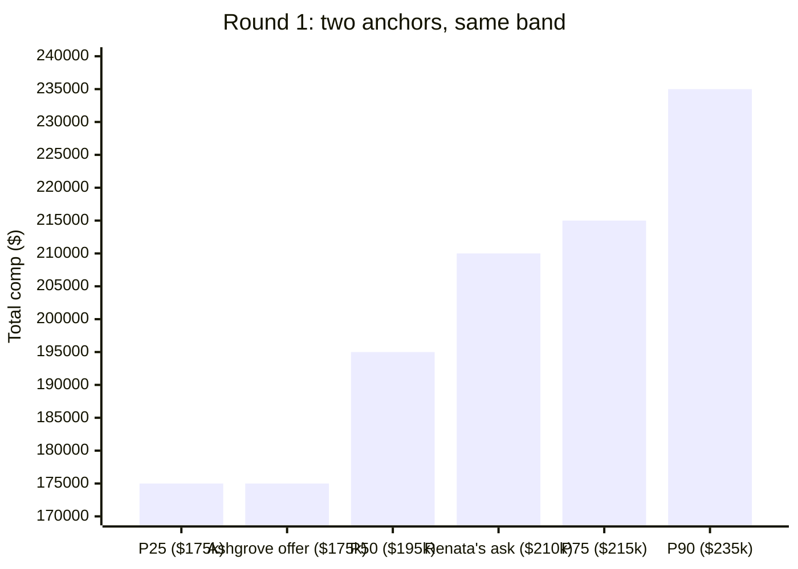

import Scenario from "../../../components/Scenario.astro";
import LevelIntro from "../../../components/LevelIntro.astro";
import Checkpoint from "../../../components/Checkpoint.astro";

L1 introduced the moment Renata almost answered "what are your expectations?" with an un-researched number. L2 gave the three tools that fix that: anchoring mechanics, a real BATNA, and collaborative framing. This level walks her actual three-week negotiation with Ashgrove Analytics, round by round, with real numbers — including the round where she has to decide, for real, whether to walk.

<Scenario label="The three weeks">
  <Fragment slot="facts">
    

      
💼 Renata's BATNA: stay at Bellcrest Systems, $168,000 total comp — genuinely fine, not a bluff

      
🎯 Renata's walk-away point: $185,000 ongoing total comp — set before any offer existed

      
📊 Market band, Staff Data Engineer, Ashgrove's location: P25 $175k · P50 $195k · P75 $215k · P90 $235k

      
🅱️ Competing offer in progress: Brightline Data, $182,000 total comp, written

      
🧑‍💼 Priya Osei — Ashgrove's recruiter, Renata's main point of contact throughout

    

  </Fragment>

Renata doesn't answer Priya's "what are your expectations?" on the spot. She deflects it collaboratively — "I'd love to understand the range budgeted for this role first, so I can give you a number that actually makes sense" — and spends the next few days doing the market-research process before a single number gets said out loud on either side.

**Before reading on: Renata ends up not accepting Ashgrove's second offer either, even though it clears her walk-away point. What do you think she asks for instead of just saying yes at that point?**

</Scenario>

<LevelIntro
  items={[
    "Preparing before the first real number: research, BATNA, walk-away point",
    "The anchor exchange and using a competing offer as leverage, not a threat",
    "Closing the package collaboratively — and the round where walking was the real option",
  ]}
/>

## Round 0: preparing before any number is said

Before Renata says a single dollar figure to anyone, what does she actually have in hand — and why does the order she builds these in matter?

She builds three things, in this order, deliberately before responding to Priya's original question:

1. **Market research.** Same four-step process as evaluating a raise: gather (leveling data, a comp-analytics contact, and the range Priya eventually states), normalize (base + bonus + this year's equity, same window), place in a band. The band for this role comes back P25 $175,000 / P50 $195,000 / P75 $215,000 / P90 $235,000.
2. **A real BATNA.** Staying at Bellcrest, $168,000, genuinely acceptable — she isn't unhappy there, which is exactly what makes it a real fallback rather than a bluff.
3. **A walk-away point.** Not "the number I'd love" but the minimum where switching is clearly worth the risk and disruption of a new job: $185,000 ongoing total comp, set in a calm moment with no offer on the table yet to create pressure.

| Prepared before any offer                  | Value                       |
| ------------------------------------------ | --------------------------- |
| Market band (P25–P90)                      | $175k – $235k               |
| BATNA (what happens if this falls through) | Stay at Bellcrest, $168k    |
| Walk-away point (minimum worth switching)  | $185,000 ongoing total comp |

<Checkpoint question="Renata sets her walk-away point at $185,000 before Ashgrove has said a single number. Why does the order — walk-away point before any offer exists — matter, rather than deciding it once an offer is in hand?">

Because deciding a walk-away point after an offer exists means deciding
it under pressure — an offer on the table creates real emotional pull
(momentum, sunk time in the interview process, fear of not getting
another shot) that pushes the number down in the moment. Setting it
beforehand, with a clear head and no specific offer to react to, is what
keeps the number honest. This is the same principle L2 named: a BATNA
improvised in the moment produces a worse number almost every time than
one set in advance.

</Checkpoint>

## Round 1: the anchor exchange

With research done, what actually happens when Renata and Priya both have to put a number on the table?

Priya circles back to her original question. Renata, prepared now, doesn't just answer — she reframes it: "Based on what I'm seeing for Staff-level data roles in this market, I'm looking at something in the $205,000–$215,000 total comp range. What range does Ashgrove have budgeted?" She names a specific, defensible number tied to real data (roughly P65–P75 in the band) rather than a vague "market rate," and she still invites Priya's range in the same breath — collaborative, not a demand.

Priya's answer: Ashgrove's initial verbal offer comes in at $175,000 total comp — base $155,000, 10% target bonus, and a modest equity grant. That's P25 in the band: a real, serious offer, but anchored near the low end.

Neither anchor is "wrong" — Ashgrove's offer is a real number backed by a real budget, and Renata's ask is a real number backed by real market data. What the gap tells her is where the actual negotiating room likely sits: probably somewhere between P50 and P75, not at either anchor exactly.

## Round 2: using the competing offer as leverage, not a threat

Renata's Brightline Data process finishes around the same time, producing a written offer at $182,000. What does she do with it — and why does _how_ she uses it matter as much as the fact that she has it?

She doesn't lead with an ultimatum. She goes back to Priya with the same collaborative frame from Round 1: "I want to be transparent — I have a written offer at $182,000 from another company, and I'd genuinely rather join Ashgrove. Is there room to close the gap toward the range we discussed?" The offer is real information, stated once, without a deadline attached or a "match this or I walk" framing.

| What Renata didn't do                                | What Renata did instead                                                                    |
| ---------------------------------------------------- | ------------------------------------------------------------------------------------------ |
| "Match $182,000 or I'm taking the Brightline offer." | Named the real number, stated a genuine preference for Ashgrove, and asked if there's room |
| Invented a competing offer that doesn't exist        | Used a real, written offer she actually has in hand                                        |
| Set an artificial deadline to pressure a fast answer | Let Priya take it back to whoever approves the number, on their normal timeline            |

Priya comes back a few days later with a revised offer: $196,000 total comp — base $175,000, 12% target bonus, and a slightly larger equity grant. That's between P50 and P75 in the band, and well above Renata's $185,000 walk-away point.

<Checkpoint question="The $196,000 revised offer clears Renata's $185,000 walk-away point by a comfortable margin. Per this level's opening question, she still doesn't just say yes here — what's the actual reason to negotiate further once an offer already clears your floor?">

Clearing the walk-away point means the offer is _acceptable_, not that
it's the best available outcome — the floor is a minimum, not a target.
The offer sitting between P50 and P75 tells Renata there's likely still
room (she originally asked for ~P65–P70, which $196,000 is close to but
slightly under), and the whole-package principle from L2 means base isn't
the only lever left. Negotiating one more time, on a specific and
reasonable ask, doesn't risk the floor she already knows is met — the
downside of asking again is small once you already have an acceptable
offer in hand.

</Checkpoint>

## Round 3: closing on the package, not just base

With an acceptable offer already in hand, what does Renata actually ask for — and why does it target something other than base?

She doesn't reopen the base number, which she suspects is close to Ashgrove's real ceiling for the level. Instead she asks for a $10,000 sign-on bonus, framed around a concrete, specific reason: her current equity at Bellcrest has an unvested balance she'd be walking away from, and a sign-on is the cleanest way to bridge that gap without reopening the base/bonus/equity structure Ashgrove already approved internally. This is a smaller, easier "yes" for Priya to get approved than renegotiating base — a sign-on line item typically has a separate, faster approval path than base band changes.

Priya returns with $8,000 sign-on — not the full ask, but a real, specific commitment that directly addresses the reason Renata gave.

| Round | What was offered / asked                                            | Where it sits                            |
| ----- | ------------------------------------------------------------------- | ---------------------------------------- |
| 1     | Ashgrove opens at $175,000 total comp                               | P25                                      |
| 1     | Renata counters at $205,000–$215,000, backed by market data         | P65–P75                                  |
| 2     | Renata surfaces the real $182,000 Brightline offer, collaboratively | Leverage, not a threat                   |
| 2     | Ashgrove revises to $196,000 total comp                             | Between P50 and P75 — clears walk-away   |
| 3     | Renata asks for a $10,000 sign-on, tied to a specific reason        | Package lever, not base                  |
| 3     | Ashgrove agrees to $8,000 sign-on                                   | Final: $196,000 ongoing + $8,000 sign-on |

Renata accepts. Total ongoing comp: $196,000, comfortably above her $185,000 floor and close to her original P65–P70 target — plus an $8,000 sign-on that softens the transition. Priya, throughout, never had a number extracted from her under pressure; every ask was framed as "help me get here" and backed by a real, specific reason.

## The round where walking was the real option

What if Ashgrove's revised offer in Round 2 had come back at $178,000 instead of $196,000 — still real, still a serious number, but below Renata's floor?

This is the scenario Renata actually prepared for in Round 0, and it's worth walking through because "knowing when to walk" only means something in the round where the number is genuinely below the floor, not the round where it's merely lower than hoped. At $178,000: below her $185,000 walk-away point, meaning her real BATNA (staying at Bellcrest, $168,000) plus the disruption of a job change no longer clearly wins. In that version of events, the collaborative frame still applies to declining, not just asking: "I appreciate the offer and the process — this doesn't get to a number that makes sense for me to leave Bellcrest, so I'm going to stay put for now. I'd genuinely like to stay in touch." No ultimatum, no burned bridge, and no accepting a below-floor offer out of interview-process momentum.

| If the final number clears the walk-away point     | If the final number is below the walk-away point                       |
| -------------------------------------------------- | ---------------------------------------------------------------------- |
| Negotiate the package, then accept                 | Decline calmly, citing the real BATNA, without ultimatums or drama     |
| The floor did its job by making "yes" a clear call | The floor did its job by making "no" a clear, un-agonized call instead |

<Checkpoint question="Renata's walk-away point worked because staying at Bellcrest was a genuinely fine outcome for her. If someone in her position actually disliked their current job and had no other offers, what would change about how they should handle a below-floor final offer?">

The honest floor for that person is genuinely lower, or the decision
genuinely gets harder — a person without a real BATNA doesn't get to
"decline calmly" with the same confidence, because there's no acceptable
fallback behind the decline. The fix isn't to fake a stronger BATNA than
they have; it's to be honest with themselves about a weaker negotiating
position going in (accept more of the offer as-is, or spend time
building a real alternative — even a single other application in
progress — before treating a walk-away point as safely enforceable).

</Checkpoint>

## A decision worksheet

Renata's specific numbers won't match anyone else's — so what does the same worksheet look like filled in for her case, and where would a genuinely different negotiation diverge?

| Question                                                 | Renata's answer                                                                               |
| -------------------------------------------------------- | --------------------------------------------------------------------------------------------- |
| Research: where does the role sit in a real market band? | P25 $175k / P50 $195k / P75 $215k / P90 $235k, from cross-checked sources                     |
| BATNA: what happens if this deal doesn't close?          | Stay at Bellcrest, $168,000 — genuinely acceptable                                            |
| Walk-away point: minimum worth switching for?            | $185,000 ongoing total comp, set before any offer existed                                     |
| Anchor: who stated a number, and how was it framed?      | Renata, with a researched range, framed collaboratively alongside asking Ashgrove's own range |
| Leverage: how was a competing offer used?                | Named once, honestly, without a deadline or ultimatum                                         |
| Close: what got negotiated in the final round?           | A sign-on bonus, tied to a specific reason — not reopening base                               |

**This worked example is one case, not the whole territory.** Renata's negotiation happened to go smoothly — the company negotiated in good faith, the gap closed in two rounds, and the walk-away point was never actually tested. A messier real case might involve a company that won't move at all after the first counter, or a candidate whose BATNA is genuinely weaker than staying at a job they like — which raises a different question worth sitting with: if Ashgrove's final answer to Renata's sign-on ask had been a flat "no, that's not something we do," would declining the $196,000 base offer over an unmet $8,000 sign-on ask actually be the right call, given everything else it already cleared?
