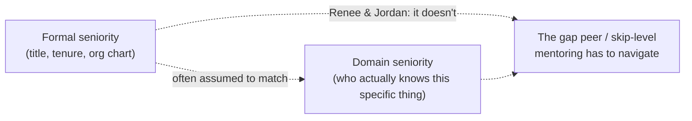

import Scenario from "../../../components/Scenario.astro";
import LevelIntro from "../../../components/LevelIntro.astro";

<Scenario>
  <Fragment slot="facts">
    

      
🧑‍💻 Renee: 3 years at the company, built the incident-postmortem practice from scratch

      
🧑‍💼 Jordan: staff engineer, 10 years overall, 3 weeks on this team

      
📝 Jordan writes Renee's calibration input this cycle

      
❓ Jordan has never run a blameless postmortem before

    

    

      

        Formal seniority gap (Jordan over Renee)
      

      

        

      

      
High — title, tenure, and this cycle's calibration input all favor Jordan

      

        Skill gap on postmortems (Renee over Jordan)
      

      

        

      

      
High — Renee designed the practice; Jordan has never run one

    

  </Fragment>

Renee is a mid-level engineer who built her team's blameless-postmortem practice over the last year — she's the person who actually knows how to run one well. Jordan just joined the team as a staff engineer: ten years of experience, a title two levels above Renee's, and — this cycle — the person writing Renee's calibration input. Jordan has never facilitated a postmortem, and the next one is Jordan's incident to run.

**Before reading on: Renee clearly knows something Jordan doesn't. So why does it feel so much riskier for her to say so than it would if their titles were reversed?**

</Scenario>

<LevelIntro
  items={[
    "Why seniority isn't one dial you're always above or below on",
    "Peer mentoring vs. skip-level mentoring, and what they share",
    "The status-without-authority problem, in outline",
  ]}
/>

Plain-language map before the terms pile up:

| Term                    | Read it as                                                                                                     |
| ----------------------- | -------------------------------------------------------------------------------------------------------------- |
| Peer mentoring          | Teaching someone who is your formal equal, or your formal senior, something you know better than they do       |
| Skip-level relationship | A mentoring connection with someone outside your own reporting line — not your manager, not your direct report |
| Formal seniority        | Title, tenure, pay band, org chart position — what shows up on paper                                           |
| Domain seniority        | Who actually knows more about a specific skill, tool, or piece of the system — independent of title            |
| Status gradient         | The direction seniority "should" flow in a conversation, by default social expectation                         |
| Standing                | How someone is seen and respected by others around them — what a misjudged correction can quietly cost         |

- **A single "seniority" number is a fiction.** Jordan outranks Renee on the org chart, on tenure, and on this cycle's calibration input. Renee outranks Jordan on exactly one thing: knowing how to run a postmortem. Traditional mentoring assumes both gradients point the same way — the org-chart-senior person is also the domain-senior one. Peer and skip-level mentoring are what you do when they don't.
- **Peer mentoring** is teaching an equal, or a formal senior, something you understand better than they do — Renee and Jordan's situation. **Skip-level mentoring** is a relationship that crosses reporting lines entirely — advising someone who isn't your manager, your report, or on your team's chain at all. Different mechanics, same underlying problem: you're offering real help to someone the org chart didn't hand you standing over.
- **The core tension isn't the knowledge gap — it's what correcting someone "above" you costs if you get the delivery wrong.** A junior getting told they're wrong by a senior costs the junior almost nothing socially; it's expected. A senior getting told they're wrong by someone junior can land as a challenge to their standing, even when the correction is accurate and offered with the best intentions.
- **Getting this wrong has two failure modes, not one.** Stay silent to avoid the awkwardness, and Jordan runs the postmortem badly, the team doesn't learn what Renee already knows, and Renee's actual expertise goes unused. Correct Jordan clumsily — publicly, or in a tone that reads as "let me show you how it's done" — and Jordan (who evaluates Renee's performance this cycle) may quietly read it as Renee not respecting the org chart, independent of whether Renee was right.
- **The fix is not "don't mention it" or "mention it anyway and hope for the best."** It's a specific way of framing domain expertise that doesn't require agreement about formal standing — covered in L2.

Renee hasn't said anything to Jordan yet. Nothing above says she's wrong to worry, or that she should stay quiet either — it says the two kinds of seniority she and Jordan hold are pointing in opposite directions, and the rest of this unit is about what to do with a gap like that instead of pretending it isn't there.
