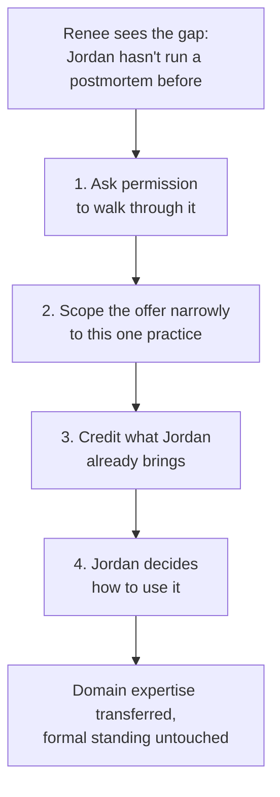

import LevelIntro from "../../../components/LevelIntro.astro";
import Checkpoint from "../../../components/Checkpoint.astro";

L1 named the actual problem: Renee has domain seniority over Jordan on postmortems, and Jordan has formal seniority over Renee on everything else, including this cycle's calibration input. This level covers the mechanics — what makes a peer-mentoring offer land as help instead of a challenge, and what changes when the relationship also crosses reporting lines entirely.

<LevelIntro
  items={[
    "A four-part framing that separates expertise from standing",
    "Directive vs. facilitative mentoring, and when each fits",
    "What's different about skip-level mentoring specifically",
  ]}
/>

## Why "just be humble about it" isn't enough on its own

Renee could soften her tone, hedge every sentence, and still land badly — so what is it about the framing itself, not just the delivery, that determines whether Jordan hears help or a challenge?

The instinct to just "be humble" treats this as a tone problem. It's partly a tone problem, but the bigger issue is structural: an unscoped correction ("you're doing this wrong") implicitly claims general authority over how Jordan works, which Renee doesn't have and isn't trying to claim. A scoped one ("here's the one thing about our specific postmortem format that's easy to miss") claims authority over exactly one narrow thing, which Renee genuinely has. The difference isn't softness — it's precision about what's actually being asserted.

Four moves that do this work, in order:

| Move                          | What it does                                                                                                | What it avoids                                                            |
| ----------------------------- | ----------------------------------------------------------------------------------------------------------- | ------------------------------------------------------------------------- |
| 1. Ask, don't announce        | "Want me to walk you through how we usually run these?" instead of starting to explain unprompted           | Framing the correction as something imposed rather than offered           |
| 2. Scope it narrowly          | Names the one specific practice ("our postmortem format"), not a general claim ("how to run meetings")      | Implying broader authority than the actual knowledge gap supports         |
| 3. Credit what they bring     | Names a specific thing Jordan's ten years actually adds — a harder question to ask, a broader pattern-match | Making it read as "the junior person knows more," full stop               |
| 4. Let them keep the decision | Renee explains the practice; Jordan still decides whether and how to run it that way this time              | Removing Jordan's actual authority over their own incident, which is real |

Notice what this sequence does _not_ require: it doesn't require Jordan to agree that Renee knows more, doesn't require Renee to defer on anything outside the narrow scope, and doesn't require either of them to have a conversation about status at all. The framing does the work that an explicit negotiation about who outranks whom would otherwise have to do badly.

<Checkpoint question="Renee could instead say, generally, 'I've noticed you're still getting used to how things work here — let me show you the ropes.' Using the four-move table, what's the specific problem with that phrasing, even if Renee's tone is warm?">

The problem is scope, not warmth — move 2. "How things work here," generally, is an unscoped claim that reaches into everything about how Jordan operates on the team, not just the one practice (postmortems) where Renee genuinely has more experience. Even delivered kindly, that phrasing implicitly asserts a broader authority than Renee actually has, which is exactly the kind of claim that reads as a challenge to a senior colleague's standing rather than a narrow, specific offer of help.

</Checkpoint>

## Directive vs. facilitative: which one fits here

Once Renee has permission to walk Jordan through the practice, how much should she actually decide for him versus ask questions and let him arrive at it himself?

Two modes of mentoring sit at opposite ends of a spectrum:

- **Directive** — "Do it this way; here's the format, here's the order, here's what to say." Fast, and appropriate when the mentee has explicitly asked for exactly that, or the cost of getting the specific mechanics wrong is high (a live, high-stakes incident, not a low-stakes practice run).
- **Facilitative** — "What do you think the goal of this step is? What would you want the room to walk away understanding?" Slower, and appropriate when the mentee has real standing to protect, real judgment worth drawing out, and time to build the skill rather than just get through the next instance of it.

With a downward-seniority mentee (a new grad, say), directive mentoring rarely costs anything socially — the junior person expects to be told things. With a peer whose formal standing exceeds yours, the same directive delivery reads differently: it can feel like being managed by someone who isn't your manager. The safer default with someone like Jordan is to lean facilitative — draw out what he already knows how to do (running a hard meeting, reading a room, three staff-level instincts postmortems don't change) and layer in the specific format on top, rather than scripting the whole thing for him.

This isn't a fixed rule — it shifts with trust and stakes, which is exactly the relationship the interactive demo on this page lets you explore directly. As trust builds and stakes are lower, a peer mentor can afford to be more directive without it landing badly; early on, with an unproven relationship and a status gap working against you, facilitative is the safer opening move.

<Checkpoint question="Jordan's actual live incident is happening in twenty minutes, and he asks Renee directly: 'Just tell me the format, I don't have time to figure it out myself right now.' Should Renee stay facilitative because that's the generally safer default with a status gap like this one?">

No — this is exactly the exception the section names: the mentee explicitly asked for directive help, and the stakes (a live incident, not a practice run) make speed the right priority over drawing out Jordan's own judgment. The "lean facilitative by default" guidance is for the ambiguous, lower-stakes case where Renee is choosing the approach herself; once Jordan explicitly requests directive help under time pressure, following that request respects his judgment about what he needs right now more than defaulting to facilitative would.

</Checkpoint>

## What's different about skip-level mentoring

Renee and Jordan share a team and a manager. What changes when the person you're mentoring isn't in your reporting line at all — say, an engineer two levels down from your own skip-level manager, who you were paired with through a formal mentoring program?

Skip-level mentoring keeps the same underlying problem — offering real help without an authority gradient handing it to you by default — but the specifics shift:

- **Your standing comes from proximity and perspective, not domain skill.** A skip-level mentor isn't usually teaching a narrow technical practice; they're often the only person who can honestly say what a promotion packet actually needs to look like, or what a particular manager two levels up actually values, precisely because they aren't that person's direct report and have less to lose by being candid.
- **You have zero formal authority over the outcome**, more completely than in peer mentoring. Renee at least works alongside Jordan; a skip-level mentor typically has no shared work at all — nothing to fall back on except the relationship and the credibility of what they say.
- **Triangulation is the specific new failure mode.** Passing along something the mentee's own manager should be telling them directly — or worse, something the mentee interprets as coming from "above," carrying more institutional weight than a peer's honest opinion — can undermine the actual manager's relationship with their report, or make advice sound like a verdict from on high when it was meant as one person's perspective.

The fix mirrors L2's four-move framing, with one addition: **name the boundary of what you can speak to.** "This is just how it's looked from where I sit — your manager may see it differently, and that's worth checking directly" keeps a skip-level opinion from being mistaken for an official read on the mentee's standing. The four moves that keep peer mentoring from reading as a status challenge are the same moves that keep skip-level mentoring from being mistaken for an authority it was never meant to carry.
