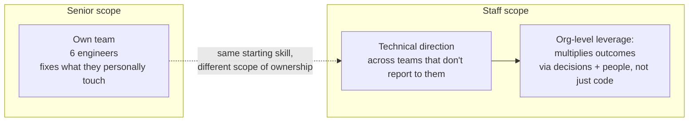

import Scenario from "../../../components/Scenario.astro";
import LevelIntro from "../../../components/LevelIntro.astro";

<Scenario>
  <Fragment slot="facts">
    

      
🏦 3 teams (Payments, Fulfillment, Search) each hand-rolled their own retry logic against the same flaky vendor

      
💸 $40,000 lost last quarter, org-wide, to duplicate-charge refunds

      
🧑‍💻 Marcus's own team: 6 engineers. The pattern he found touches 6 teams, ~30 engineers

    

    

      

        Share of the $40k Marcus recovers by only fixing his own team
      

      

        

      

      
~$13k of $40k/quarter — the rest keeps bleeding on two other teams

    

  </Fragment>

Marcus Chen is a senior engineer on the Payments team at Northwind Commerce, up for a staff-engineer promotion this cycle. While chasing a routine bug, he finds something bigger: Payments' checkout flow retries failed calls to Meridian Pay, the payment vendor, but so do Fulfillment's shipping-cost calculator and Search's checkout-adjacent pricing service — three teams, three separate hand-rolled retry implementations, none of them safely idempotent. When Meridian times out and a retry fires anyway, customers get charged twice. Org-wide, that's cost the company $40,000 in refunds and chargebacks last quarter alone.

Marcus is the strongest engineer on his team at exactly this kind of bug. He could open an editor this afternoon and ship a clean, correct, idempotent retry wrapper for Payments by Friday — fast, technically excellent, and entirely defensible in a code review.

**Before reading on: if Marcus ships that fix by Friday, has he done the highest-leverage thing available to him — or just the fastest thing a senior engineer would do?**

</Scenario>

Shipping his own team's fix by Friday would patch about a third of a $40,000-a-quarter problem and leave the other two teams to rediscover the same bug on their own timeline.

<LevelIntro
  items={[
    "Staff scope vs. senior scope: what actually changes",
    "Technical direction and org-level leverage as the job's real output",
    "Saying no and sponsoring others as staff-level moves",
  ]}
/>

Plain-language map before the terms pile up:

| Term                | Read it as                                                                                        |
| ------------------- | ------------------------------------------------------------------------------------------------- |
| Scope               | How many teams' decisions your judgment is expected to shape, not how hard the work is            |
| Technical direction | Steering a decision other people will implement, rather than implementing it yourself             |
| Org-level leverage  | Multiplying an outcome across teams instead of producing it once, yourself, for one team          |
| Sponsorship         | Deliberately handing a visible, growth-shaped opportunity to someone else instead of taking it    |
| "Moving the needle" | Work whose outcome is large enough, or common enough, to matter at the scale you're now judged on |

- **A senior engineer owns outcomes for their own team.** A staff engineer is expected to own outcomes that no single team's roadmap will fix on its own — the retry bug is a senior-scope problem three times over and a staff-scope problem once.
- **Staff scope is not "senior, but better" or "senior, but more experienced."** It's a different shape of ownership: technical direction across teams that don't report to you, and org-level leverage instead of individual output. Being the best individual contributor on your own team doesn't automatically produce either.
- **The obviously correct technical answer and the highest-leverage staff move are not always the same move.** Marcus's Friday fix is correct engineering and the wrong scope of ownership for the level he's being evaluated at.
- **A staff engineer says no to real, legitimate work that doesn't move the needle at the scope they're now responsible for** — not because the work is bad, but because saying yes to everything defends against nothing and multiplies nothing.
- **Sponsoring someone else's growth is itself a staff-level output**, not a nice-to-have on the side of the "real" work — handing a cross-team initiative to a mid-level engineer who's ready for it is exactly the kind of org-level leverage a senior engineer's job doesn't ask for.

Nothing above says Marcus's Friday fix is a bad idea for Payments. It says the question a staff-track decision actually turns on is narrower than "what's the correct fix" — it's "whose problem is this, at the scope I'm now being asked to own, and what's the highest-leverage way to close it there."
