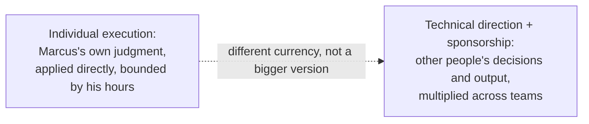
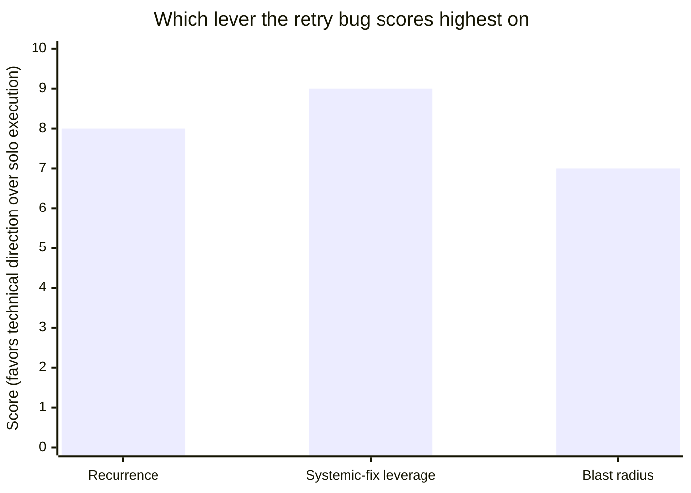

import LevelIntro from "../../../components/LevelIntro.astro";
import Checkpoint from "../../../components/Checkpoint.astro";

L1 named the gap: Marcus's Friday fix is correct engineering aimed at the wrong scope. This level makes that concrete — what is a staff engineer's actual leverage made of, and what does a real decision framework look like for choosing where to spend a limited number of hours?

<LevelIntro
  items={[
    "Two currencies of leverage: personal execution vs. multiplied outcome",
    "A framework for where a staff engineer spends attention",
    "Saying no as scope defense, not as being difficult",
  ]}
/>

## Two different currencies, not one ladder

If a staff engineer is still, technically, an individual contributor — no direct reports, no formal authority over the other two teams — where does their leverage actually come from?

| Currency             | How it's produced                                                                                        | Who it scales with                               |
| -------------------- | -------------------------------------------------------------------------------------------------------- | ------------------------------------------------ |
| Individual execution | Marcus personally writes, reviews, or ships the fix                                                      | Bounded by Marcus's own hours                    |
| Technical direction  | Marcus writes the design doc, gets Fulfillment's and Search's tech leads to agree to one shared approach | Scales with how many teams adopt it              |
| Org-level leverage   | The shared library gets built once, by someone Marcus sponsors, and adopted by every team with the bug   | Scales with adoption, not with Marcus's calendar |

A senior engineer's output is bounded by the first row no matter how good they are at it — there are only so many hours in Marcus's week, and none of them are transferable to Fulfillment's backlog. The second and third rows don't have that ceiling: a design doc that three teams adopt is worth three teams' worth of fixed bugs, without Marcus personally writing three teams' worth of code.

<Checkpoint question="Marcus could spend this sprint writing the shared retry library himself, end to end, across all three teams' codebases. Would that count as the 'technical direction' currency from the table above, or still the 'individual execution' currency?">

Still individual execution — currency isn't determined by how many
codebases the work touches, it's determined by whose judgment and whose
hours are doing the producing. If Marcus personally writes the fix for all
three teams himself, the outcome is still bounded by his own calendar; it
just took longer to hit the ceiling. Technical direction means the other
two teams' engineers adopt an approach and build toward it themselves,
which is what actually removes the "bounded by one person's hours" limit.

</Checkpoint>

## Where to spend attention: a framework

Not every cross-team problem deserves the technical-direction treatment, and not every problem is worth Marcus's personal execution either — so what decides which lever to pull?

Three questions, asked in this order:

1. **Blast radius** — how many teams, or how much revenue/risk, does this actually touch? A bug in one team's internal tooling has a small blast radius even if it's annoying; the duplicate-charge bug touches three teams and real customer money.
2. **Recurrence** — is this a one-time cleanup, or a pattern that will keep reappearing as long as the underlying cause (three independent implementations against one flaky vendor) stays unaddressed? A one-time fix doesn't need a shared library; a recurring pattern does.
3. **Leverage of a systemic fix** — if the pattern is real, does a single shared fix actually remove it for everyone, or would each team need a bespoke fix regardless? Some problems only look systemic; they're actually three unrelated bugs that happen to share a symptom.

Only when a problem scores high on all three — wide blast radius, real recurrence, and a systemic fix that genuinely transfers — does technical-direction-plus-sponsorship outrank personal execution. The retry bug scores high on all three: three teams, a vendor that isn't getting more reliable, and one idempotent-retry pattern that would actually work for all of them.

This doesn't mean a staff engineer never personally writes code. A narrow, time-critical, no-clear-owner problem — a production incident at 2am, a security patch that can't wait for cross-team consensus — is exactly when picking up the keyboard yourself is still the highest-leverage move, because the coordination cost of technical direction would be slower than just fixing it. The framework is for choosing the lever, not for banning one of them.

<Checkpoint question="A different bug crosses Marcus's desk: a one-off typo in an internal admin tool that only Marcus's own team uses, that will never recur once fixed. Using the three-question framework, should Marcus write a design doc and get org-wide buy-in, or just fix it himself?">

Just fix it himself. It fails two of the three questions outright: blast
radius is narrow (his own team's internal tool), and recurrence is zero (a
one-off typo, not a pattern from a shared root cause). Technical direction
is the right lever for wide-blast-radius, recurring, systemically-fixable
problems — applying it to a narrow one-off fix would just be slower than
individual execution for no leverage gained.

</Checkpoint>

## Saying no as scope defense

If Marcus says yes to every reasonable-sounding request that lands on his desk once he's operating at staff scope, what actually happens to his leverage?

It gets spent on whichever request arrived most recently, not on the highest-blast-radius problem available. Saying no to a legitimate, well-intentioned ask isn't obstruction — it's the same scarce-attention logic as the framework above, applied out loud instead of just inside Marcus's own head:

| Situation                                                                       | What saying yes actually costs                                                                        |
| ------------------------------------------------------------------------------- | ----------------------------------------------------------------------------------------------------- |
| A VP asks for a sprint of prototyping on a flashy, unrelated feature            | The sprint Marcus would have spent closing the $40k/quarter leak                                      |
| A team asks Marcus to personally review every PR in their codebase              | Every hour reviewing is an hour not spent on the one fix worth three teams' worth of outcome          |
| A well-meaning peer asks Marcus to "just take a look" at their design, unscoped | Time that doesn't show up anywhere as technical direction, because it isn't aimed at a scored problem |

None of these requests are bad requests in isolation — that's exactly what makes them easy to say yes to, and exactly why saying no on purpose, with a stated reason, is a real staff-level skill rather than a personality trait some staff engineers happen to have.
