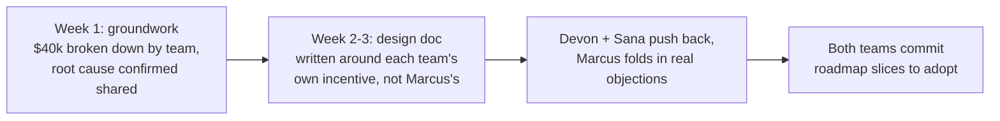

import Scenario from "../../../components/Scenario.astro";
import LevelIntro from "../../../components/LevelIntro.astro";
import Checkpoint from "../../../components/Checkpoint.astro";

L1 introduced Marcus's choice: fix his own team's retry bug by Friday, or spend the sprint building cross-team buy-in instead. L2 gave the framework (blast radius, recurrence, systemic-fix leverage) and named saying no as scope defense. This level walks the whole quarter in enough detail to show what a staff-scope case actually looks like built, move by move — including the parts that had nothing to do with writing code.

<Scenario label="The quarter">
  <Fragment slot="facts">
    

      
🧑‍💻 Aliyah Osman — mid-level engineer, Payments team, already cataloging retry edge cases unasked

      
🧑‍🔧 Devon Ruiz — tech lead, Fulfillment; owns a second hand-rolled retry implementation

      
🧑‍💼 Sana Patel — tech lead, Search; owns a third

      
📋 Greg Whitfield — VP of Engineering; asks Marcus for a sprint on an unrelated demo feature mid-quarter

    

  </Fragment>

Marcus doesn't ship the Friday fix. Instead, over one quarter, he writes a design doc proposing a single shared idempotent-retry library owned by the Platform team, gets Devon's and Sana's teams to commit to adopting it, hands the actual build to Aliyah — who's been informally tracking Meridian Pay's failure modes for weeks without being asked to — and, partway through, turns down a VP's request for a sprint of unrelated prototyping work.

**Before reading on: none of those four moves involves Marcus personally writing the retry fix. What does the promotion committee actually see at the end of the quarter that they wouldn't have seen from a fast, well-executed Friday fix?**

</Scenario>

<LevelIntro
  items={[
    "The four moves, in order, and why each one had to happen before the next",
    "The VP conversation: saying no without saying 'not my job'",
    "A decision worksheet, and where a real case gets messier than this one",
  ]}
/>

## Move 1: turning a bug into a scoped problem

A design doc that says "let's fix retries" doesn't get three teams to change their code — so what does Marcus actually have to establish before he writes a single sentence of the proposal?

Marcus spends the first week not writing a design doc at all. He pulls the actual numbers: how much of the $40,000 in Q2 refunds is attributable to each team's implementation, how often Meridian Pay times out (about 2% of calls, roughly steady for the past two quarters, not a one-off spike), and whether Fulfillment's and Search's retry bugs are the same root cause as his own team's or just superficially similar. They turn out to be the same cause — none of the three implementations treats a retry as idempotent, so a slow response that eventually succeeds gets charged twice when the client-side retry also lands.

That week of groundwork is what turns "I noticed a bug" into a scoped problem: a specific, quantified, three-team pattern with one shared root cause, which is exactly what L2's framework needs answered before technical direction is the right lever at all. Skipping this step and going straight to a proposal would have produced a doc that sounded confident but couldn't survive Devon or Sana asking "how do you know our bug is really the same as yours?"

| Question the groundwork had to answer             | Answer Marcus found                                                             |
| ------------------------------------------------- | ------------------------------------------------------------------------------- |
| How much of the $40k is each team's share?        | Payments ~$18k, Fulfillment ~$14k, Search ~$8k, roughly proportional to traffic |
| Is Meridian Pay's flakiness a one-off or ongoing? | Steady ~2% timeout rate for two quarters — ongoing, not a spike                 |
| Do all three teams share the same root cause?     | Yes — none of the three retry implementations is idempotent                     |

## Move 2: the design doc and cross-team buy-in

With the numbers in hand, what does Marcus's design doc actually have to do that a normal team-level design doc doesn't?

A team-level design doc has to convince people who already report into the same roadmap. Marcus's doc has to convince two tech leads, Devon and Sana, who don't answer to him, have their own quarterly priorities already set, and have no obligation to adopt anything he proposes. He writes the doc around their incentive, not his: instead of "here's the correct architecture," it leads with each team's own dollar figure from the table above, and proposes the shared library as something Platform team will own long-term — so adopting it isn't "doing Marcus a favor," it's offloading a maintenance burden onto a team whose job is exactly that.

Devon and Sana both push back on parts of the design — Sana wants a feature flag so Search can roll out gradually instead of all at once, and Devon flags that Fulfillment's retry logic also handles a shipping-rate-lock case the shared library doesn't cover yet. Marcus doesn't treat either objection as a threat to the plan; he folds the feature flag into the design and scopes the shipping-rate-lock case as a fast-follow rather than a blocker. Both objections make the doc stronger, and by week three, both teams have committed a slice of their own roadmap to adopting it next quarter.

<Checkpoint question="Sana's feature-flag objection and Devon's shipping-rate-lock objection both got folded into the design instead of being pushed back on. Per this section, why does treating real objections this way strengthen a cross-team proposal rather than water it down?">

Because a proposal aimed at getting two independent teams to voluntarily
commit roadmap time has to survive contact with their actual constraints,
not just Marcus's own reasoning. Devon and Sana don't report to Marcus —
if the doc had ignored their objections, the realistic outcome isn't that
they adopt it anyway, it's that they quietly don't adopt it at all, and
Marcus is left with a technically elegant proposal that only fixes his own
team's third of the problem. Folding in real constraints is what turns a
document into something two other teams are actually willing to build
their own commitments around.

</Checkpoint>

## Move 3: sponsoring Aliyah instead of building it himself

Marcus could build the shared library personally at this point — he has the design, the buy-in, and the skill. Why hand it to Aliyah instead, and what makes that a staff-scope move rather than just delegation?

Aliyah, a mid-level engineer on Marcus's own team, had already been informally tracking Meridian Pay's failure modes in a personal doc for weeks, unasked — the same kind of unprompted, already-occurring signal that shows real readiness rather than aspiration. Marcus proposes she lead the build, with him reviewing design decisions but not writing the code himself. This isn't Marcus offloading work he doesn't want to do; the two things that change once Aliyah leads it are the ones that actually matter for staff-scope leverage:

1. **The org gets a second person who can operate at cross-team scope**, not just a library. Aliyah spends the build presenting design trade-offs to Devon's and Sana's teams directly, which is exactly the technical-direction skill L2 described — and skill she wouldn't get if Marcus did that talking for her.
2. **Marcus's own attention is freed for the next blast-radius-scored problem**, instead of being consumed by the implementation of this one. Sponsorship isn't generosity for its own sake; it's the mechanism by which one staff engineer's leverage compounds instead of staying capped at whatever they can personally execute.

By the end of the quarter, Aliyah has shipped the library, presented it at the engineering-wide design review herself, and is the one Devon's team now emails with integration questions — visible, attributable growth that a promotion committee can see independent of Marcus.

## Move 4: the VP conversation

Mid-quarter, Greg Whitfield asks Marcus to spend the next sprint prototyping a customer-facing "smart checkout recommendations" feature for an upcoming demo — a real request, from someone senior, for genuinely interesting work. What does Marcus actually say?

He doesn't say "that's not my job" — it is, in the sense that Marcus is a capable engineer who could build a good prototype. He says three things, in order: he names the trade-off explicitly ("a sprint on this is a sprint not spent on the retry rollout, which is currently on track to close a $40k/quarter leak"), he offers a smaller version of what Greg actually wants (a half-day spike to scope the recommendation feature's feasibility, not a full sprint building it), and he suggests a specific alternative owner (a senior engineer on Growth team who isn't mid-rollout on anything comparable). Greg takes the half-day-spike-plus-alternative-owner option.

| What Marcus didn't do                             | What Marcus did instead                                                          |
| ------------------------------------------------- | -------------------------------------------------------------------------------- |
| Refuse without explanation                        | Named the specific trade-off in dollar terms Greg already cared about            |
| Silently drop the retry rollout to avoid conflict | Protected the higher-blast-radius commitment he'd already made to Devon and Sana |
| Say yes and quietly fall behind on both           | Offered a smaller, real version of the ask plus a named alternative owner        |

<Checkpoint question="Marcus could have simply said yes to Greg's request and tried to do both the retry rollout and the recommendation prototype in the same sprint. Connect this back to L2's attention framework — what would that have actually cost?">

L2's framework exists because attention is scarce and leverage comes from
spending it on the highest blast-radius, highest-recurrence, most
systemically-leverageable problem available — not from doing everything
asked of you. Saying yes to both wouldn't have added hours to Marcus's
week; it would have split his attention across a scored, three-team,
$40k/quarter problem and an unscored, unrelated demo feature, most likely
slowing the retry rollout at the exact moment Devon's and Sana's teams
were relying on his follow-through to justify the roadmap slices they'd
already committed. Saying yes to everything spends leverage on whichever
ask is loudest, not on what actually moves the needle.

</Checkpoint>

## A decision worksheet

Marcus's specifics won't match anyone else's — so what does the same worksheet look like filled in for a case that's structurally different, say a problem with no clear systemic root cause at all?

| Question                                                                | Marcus's answer                                                                    |
| ----------------------------------------------------------------------- | ---------------------------------------------------------------------------------- |
| Blast radius: how many teams / how much money?                          | 3 teams, $40,000/quarter, confirmed via a week of groundwork                       |
| Recurrence: one-off or ongoing pattern?                                 | Ongoing — Meridian Pay's ~2% timeout rate has held steady for two quarters         |
| Systemic-fix leverage: does one fix really transfer to all three teams? | Yes — same root cause (non-idempotent retries) confirmed before proposing anything |
| Who executes, and what does that choice produce beyond the fix itself?  | Aliyah leads the build; the org gains a second cross-team-capable engineer         |
| What got said no to, and on what stated basis?                          | A VP's demo-feature sprint, traded for a scoped half-day spike plus another owner  |

**This worked example is one case, not the whole territory.** A problem that scores high on blast radius but turns out, after real groundwork, to have three genuinely unrelated root causes wouldn't support a single shared fix at all — the right staff-scope move there might be coordinating three separate, smaller fixes rather than one shared library, which is a different kind of technical direction, not a failure of the framework. And a request from a VP is easier to negotiate down than a request from someone with no formal standing to trade against at all — what would Marcus's options actually look like if the ask that competed for his attention came from a peer he genuinely wanted to help, with no dollar figure to point to on either side?
