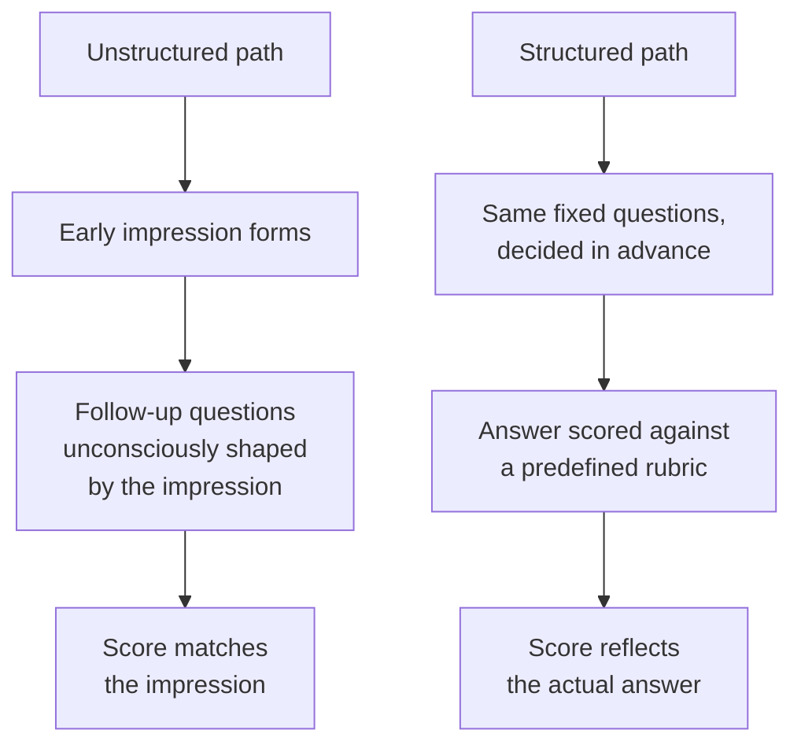

## Why the halo effect survives good intentions

**If an interviewer genuinely wants to be fair, why doesn't just trying
harder to be objective fix the problem?** Because the halo effect doesn't
operate through conscious intent — it shapes which follow-up questions
feel natural to ask, and how an ambiguous answer gets read, without the
interviewer noticing it's happening. Wanting to be fair doesn't disable
the mechanism; it just makes the interviewer more confident in a judgment
that was never actually re-examined.

## What a real rubric anchor looks like

**"Rate the answer 1-5 for problem-solving" sounds structured — is it?**
Not really — without anchors describing what each number concretely
means, a "5" is still whatever the interviewer's gut says a 5 is,
re-introducing the same bias through the back door. A real anchor states,
in advance, what a specific answer would need to include:

| Score | What it concretely requires (decided before interviewing anyone)                                                            |
| ----- | --------------------------------------------------------------------------------------------------------------------------- |
| 1     | No structured approach; jumps to a solution without identifying the actual problem                                          |
| 3     | Identifies the core problem and proposes a reasonable approach, but doesn't consider trade-offs or edge cases               |
| 5     | Identifies the core problem, considers at least one trade-off explicitly, and names a concrete way to validate the solution |

## Why fixed questions matter as much as the rubric

**If the rubric is well-anchored, does it matter whether every candidate
gets the same questions?** Yes — a rubric can only fairly compare answers
to the _same_ question. If Candidate A gets an easier version of the
question (consciously or not, because the interviewer already likes
them), a "5" from Candidate A and a "5" from Candidate B aren't actually
comparable, even with identical rubric wording.

## What structure doesn't eliminate

**Does structured interviewing remove personal impressions entirely?**
No — an interviewer can still personally like or dislike a candidate.
What structure removes is that impression's ability to silently determine
the _score_ — the rubric forces the evaluation to be anchored to the
actual content of the answer, not the feeling the candidate left behind.
Personal impressions can still inform other parts of a hiring decision
(team fit conversations, for instance) as long as they're not smuggled
into the competency scores themselves.

## Comparing the two approaches

|                                 | Unstructured                                          | Structured                                                       |
| ------------------------------- | ----------------------------------------------------- | ---------------------------------------------------------------- |
| Questions                       | Improvised, vary by candidate                         | Fixed, same for every candidate                                  |
| What "good" means               | Decided in the moment, often after the fact           | Decided in advance, before any candidate is seen                 |
| What drives the score           | Often the early impression                            | The specific content of the answer, against the rubric           |
| Comparability across candidates | Low — everyone effectively took a different interview | High — everyone answered the same questions, scored the same way |

## The generalizable lesson

**Is this really about interviewing specifically, or a broader pattern?**
The underlying move — deciding evaluation criteria _before_ seeing the
thing being evaluated, rather than after — generalizes to any judgment
at risk of being shaped by an early impression: code review, performance
calibration, even judging a competition. Anywhere a first impression
could quietly bias which evidence gets sought out and how it gets
interpreted, fixing the criteria in advance is what breaks that loop.
