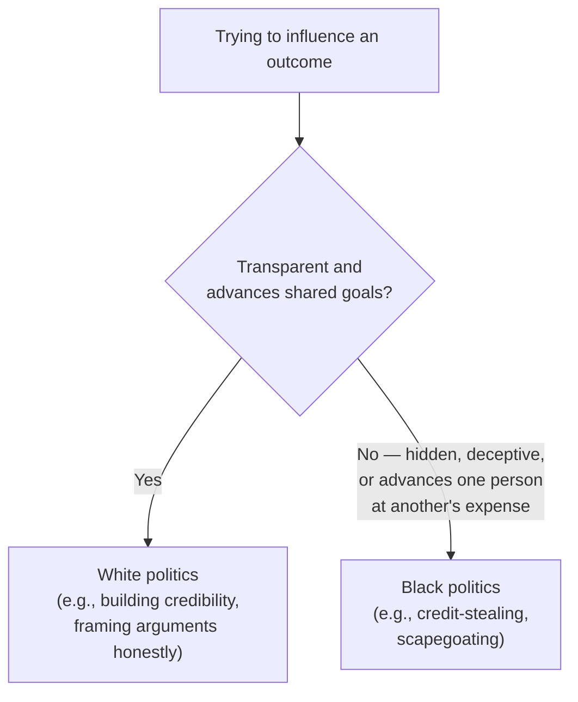

## The five tactics, and what each one actually does

**If "black politics" is one category, why does it help to name five
separate tactics within it?** Because each one damages trust through
a different mechanism, and recognizing which one is happening
changes what evidence to look for and how to respond:

| Tactic               | What it actually does                                                                           |
| -------------------- | ----------------------------------------------------------------------------------------------- |
| Credit-stealing      | Presents someone else's work or idea as your own, or lets others believe it's yours             |
| Scapegoating         | Directs blame for a failure onto someone who wasn't actually responsible for it                 |
| Sabotage             | Deliberately undermines someone else's work or standing, often while appearing supportive       |
| Weaponized rumors    | Spreads unverified or false information to damage someone's reputation, with the source hidden  |
| Manufactured urgency | Falsely frames a decision as time-critical to bypass normal scrutiny or push it through quickly |

**Do all five require the same kind of evidence to recognize?** No —
credit-stealing is often visible in a single moment (a specific
meeting, a specific claim); scapegoating and sabotage usually require
noticing a pattern over time; weaponized rumors require tracing where
information actually originated, which is often deliberately
obscured.

## What makes something "black" rather than "white" politics

**If both white and black politics involve trying to influence
outcomes, what's the actual dividing line?**

The dividing line isn't "trying to influence people" — every
functioning workplace involves that. It's whether the tactic is
transparent and could survive being stated openly ("I built a strong
case and presented it clearly") versus whether it depends on
concealment or deception to work ("I let people believe this was my
idea"). Credit-stealing specifically fails this test: it only works
if the original contributor's role stays hidden or unclear.

## Why deniability is what makes black politics hard to call out

**If credit-stealing is so common, why don't more people confront it
directly when it happens?** Because most black-politics tactics are
built with deniability in mind — the person doing it can usually
offer an innocent-sounding explanation ("I didn't mean to leave you
out," "I just didn't think to mention who ran the numbers"), which
makes a direct, public accusation risky: if the pattern isn't
established yet, the accuser can come across as petty or paranoid,
even when the underlying instinct is correct.

**Does this mean a single ambiguous incident should just be ignored?**
Not necessarily — but it does mean the response to a single incident
should usually be different (privately raising it, starting to
document) from the response to an established pattern (a more direct
conversation, escalation). Conflating the two — treating every
ambiguous moment as proof of a deliberate pattern — is itself a
common mistake, covered further in L3.

## Failure modes at this level

- **Treating every uncredited mention as deliberate credit-stealing.**
  Genuine oversights happen; jumping straight to the worst
  interpretation on a single incident can damage a relationship that
  didn't need to be damaged.
- **Ignoring a real pattern because each individual incident is
  deniable.** If the same person "forgets" to credit the same
  colleague multiple times, deniability on any one instance doesn't
  make the pattern itself deniable.
- **Responding to black politics with black politics.** Retaliating
  in kind (spreading a rumor back, sabotaging in return) trades one
  form of trust damage for another and rarely improves the underlying
  situation.
