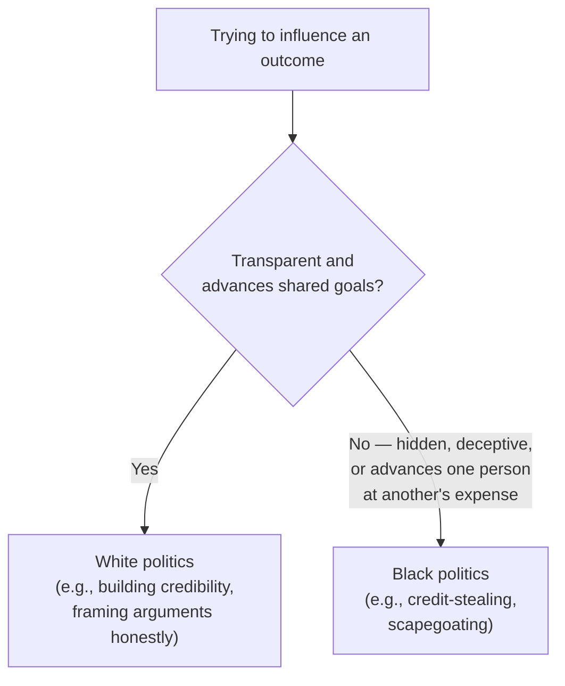

import LevelIntro from "../../../components/LevelIntro.astro";
import Checkpoint from "../../../components/Checkpoint.astro";

L1 named credit-stealing as one of five black-politics tactics and
introduced intent and deniability as the two things that shape how you
respond to it. This level goes one level deeper: what each of the five
tactics actually does, where the line between white and black politics
actually falls, and why deniability specifically is what makes black
politics hard to call out in the moment.

<LevelIntro
  items={[
    "What each of the five tactics actually does",
    "The white/black dividing line",
    "Why deniability blocks direct confrontation",
  ]}
/>

## The five tactics, and what each one actually does

**If "black politics" is one category, why does it help to name five
separate tactics within it?** Because each one damages trust through
a different mechanism, and recognizing which one is happening
changes what evidence to look for and how to respond:

| Tactic               | What it actually does                                                                           | In simpler words                                     |
| -------------------- | ----------------------------------------------------------------------------------------------- | ---------------------------------------------------- |
| Credit-stealing      | Presents someone else's work or idea as your own, or lets others believe it's yours             | "I did this," when someone else did                  |
| Scapegoating         | Directs blame for a failure onto someone who wasn't actually responsible for it                 | "It was their fault," when it was not                |
| Sabotage             | Deliberately undermines someone else's work or standing, often while appearing supportive       | Quietly making someone else's work fail              |
| Weaponized rumors    | Spreads unverified or false information to damage someone's reputation, with the source hidden  | Using gossip as a weapon while hiding who started it |
| Manufactured urgency | Falsely frames a decision as time-critical to bypass normal scrutiny or push it through quickly | Inventing hurry so people do not review carefully    |

**Do all five require the same kind of evidence to recognize?** No —
credit-stealing is often visible in a single moment (a specific
meeting, a specific claim); scapegoating and sabotage usually require
noticing a pattern over time; weaponized rumors require tracing where
information actually originated, which is often deliberately
obscured.

<Checkpoint question="A colleague publicly says 'I did this' about something someone else built, versus a colleague who publicly blames someone else for a decision that colleague made. Which tactic is each one, and why does that difference change what kind of evidence you need before responding?">

The first is credit-stealing and the second is scapegoating. Credit-stealing
is often visible in a single moment — one specific claim, in one specific
meeting, is enough to notice it happening. Scapegoating usually needs more
than one instance before it's distinguishable from a genuine, honest
misassignment of blame, because a single instance of "it was their fault"
can plausibly reflect the accuser's real (if mistaken) understanding of
what happened, in a way that "I did this" over visibly someone else's work
rarely can. That's why the response to a single credit-stealing incident
can move faster than the response to a single scapegoating incident — the
underlying evidence bar is different, even though both are black politics.

</Checkpoint>

## What makes something "black" rather than "white" politics

**If both white and black politics involve trying to influence
outcomes, what's the actual dividing line?**

The dividing line isn't "trying to influence people" — every
functioning workplace involves that. It's whether the tactic is
transparent and could survive being stated openly ("I built a strong
case and presented it clearly") versus whether it depends on
concealment or deception to work ("I let people believe this was my
idea"). Credit-stealing specifically fails this test: it only works
if the original contributor's role stays hidden or unclear.

This is the same transparency test from
[white politics](/corporate-politics/white/): if explaining the move
openly would make it look worse, the move probably depends on the
concealment. [Framing](/corporate-politics/framing/) is different: it
can present true work clearly without erasing who did it.

## Why deniability is what makes black politics hard to call out

**If credit-stealing is so common, why don't more people confront it
directly when it happens?** Because most black-politics tactics are
built with deniability in mind — the person doing it can usually
offer an innocent-sounding explanation ("I didn't mean to leave you
out," "I just didn't think to mention who ran the numbers"), which
makes a direct, public accusation risky: if the pattern isn't
established yet, the accuser can come across as petty or paranoid,
even when the underlying instinct is correct.

Deniability is the built-in escape hatch: the act benefits the person
now, and if challenged later they can claim innocent intent. That does
not prove they meant harm, but it does mean your response should create
a clearer record without jumping straight to a public accusation.

**Does this mean a single ambiguous incident should just be ignored?**
Not necessarily — but it does mean the response to a single incident
should usually be different (privately raising it, starting to
document) from the response to an established pattern (a more direct
conversation, escalation). Conflating the two — treating every
ambiguous moment as proof of a deliberate pattern — is itself a
common mistake, covered further in L3.

Example: "Here is the analysis" with no names may be an ambiguous
omission. "Here is the approach I came up with" over work you built is
much clearer because it claims authorship. Repetition after a private
conversation is clearer still, because the person can no longer claim
they did not know the credit was missing.

<Checkpoint question="Why does deniability specifically make black politics harder to call out than an honest mistake would be — and what does that imply about how a single incident should be handled versus a repeated one?">

Deniability works because it hands the person doing it a ready-made,
innocent-sounding excuse — "I didn't mean to leave you out" — that's
genuinely hard to disprove after just one occurrence, which is exactly
what makes a loud, public accusation risky on a single incident: if
intent isn't yet established, the person raising it can come across as
overreacting even when their read is correct. That's why a single
ambiguous incident calls for a lower-confrontation response, like
privately raising it or starting to document what happened, rather than
a direct accusation. A repeated incident changes the calculation,
because the same deniable excuse stops covering a pattern — the person
can no longer plausibly claim they didn't know, which is what justifies
a more direct response the second or third time around.

</Checkpoint>

## Failure modes at this level

- **Treating every uncredited mention as deliberate credit-stealing.**
  Genuine oversights happen; jumping straight to the worst
  interpretation on a single incident can damage a relationship that
  didn't need to be damaged.
- **Ignoring a real pattern because each individual incident is
  deniable.** If the same person "forgets" to credit the same
  colleague multiple times, deniability on any one instance doesn't
  make the pattern itself deniable.
- **Responding to black politics with black politics.** Retaliating
  in kind (spreading a rumor back, sabotaging in return) trades one
  form of trust damage for another and rarely improves the underlying
  situation.
