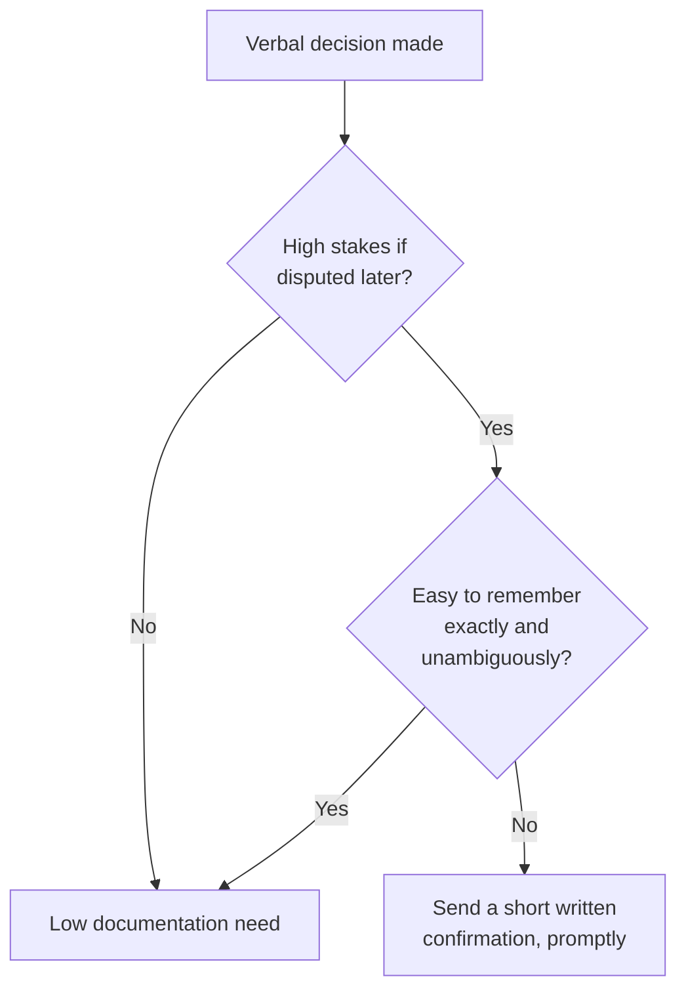

import LevelIntro from "../../../components/LevelIntro.astro";
import Checkpoint from "../../../components/Checkpoint.astro";

L1 laid out the basic instinct: verbal decisions with real stakes deserve a
written trail. L2 gets precise about the part that actually trips people
up — why the same habit can read as either professional diligence or
paranoid distrust, and how to tell which decisions genuinely need it.

<LevelIntro
  items={[
    "What separates paranoid framing from professional framing",
    "When a decision actually needs a written trail",
    "What a strong confirmation actually contains",
  ]}
/>

## The gap is smaller than it feels

**If sending a confirmation email feels like publicly doubting a
colleague, how is it ever not paranoid?** Because what makes it read
as paranoid usually isn't the act of writing something down — it's
the framing, the audience, and the timing. The exact same information,
written two different ways, lands completely differently.

| Element  | Reads as paranoid                                                        | Reads as professional                                                                 |
| -------- | ------------------------------------------------------------------------ | ------------------------------------------------------------------------------------- |
| Framing  | "I want this on record in case you deny it later"                        | "Just confirming what we agreed, so I have it for my notes"                           |
| Audience | Sent to the director's manager or a wide group, without them in the loop | Sent directly to the person who gave the instruction, as the primary recipient        |
| Timing   | Sent only after a problem has already surfaced                           | Sent right after the conversation, as a routine habit, before anything has gone wrong |
| Tone     | Detailed, defensive, anticipating an argument                            | Short, neutral, restating facts without editorializing                                |

**Does this mean documentation only works if sent immediately?** Not
strictly — but the closer to the original conversation it's sent, the
more it reads as routine practice rather than a reaction to trouble,
which is exactly the distinction that keeps it from looking paranoid.

## When it matters most

**Every verbal decision could theoretically be documented — is that
actually the standard to aim for?** No — documenting literally
everything would itself start to read as excessive and would bury the
decisions that actually matter. The signal to watch for is **stakes
and ambiguity together**: a decision that's low-stakes, or one that's
completely unambiguous and easy to remember correctly, doesn't need a
written trail. The Scenario's decision — skip a security review, under
schedule pressure, with real consequences if something goes wrong — is
exactly the combination that calls for it.

<Checkpoint question="A teammate verbally agrees, in a pair-programming session, to rename a local variable for clarity — nothing else changes, and the rename will be sitting right there in the diff either way. Does the stakes-and-ambiguity test call for a written confirmation here?">

No. Run it through both parts of the test: the stakes are essentially zero
— a variable name doesn't carry consequences if remembered wrong — and even
if it did, there's no ambiguity to resolve, because the diff itself is a
permanent, unambiguous record of exactly what was agreed. A written
confirmation adds nothing here that the code review doesn't already provide,
which is exactly the kind of case L2's "don't document everything" warning
is about — sending one anyway would just train the teammate to see every
interaction as being logged for the record.

</Checkpoint>

## What a good written confirmation actually contains

**What makes a confirmation useful later, versus vague enough to be
disputed anyway?** It has to restate the specific decision, not just
that "a conversation happened."

| Weak confirmation                                      | Strong confirmation                                                                                                                                    |
| ------------------------------------------------------ | ------------------------------------------------------------------------------------------------------------------------------------------------------ |
| "Thanks for the chat earlier!"                         | "Confirming what we discussed: we're shipping the payments feature without the security review this sprint, and will schedule the review post-launch." |
| "Following up on our conversation about the timeline." | "Confirming: the security review is deferred until after the Mar 15 launch, per your instruction, given the schedule pressure this sprint."            |

A strong confirmation names the specific decision, the reasoning
given (if any), and — implicitly, just by existing — the date. It
doesn't need to say "in case this comes up later"; the written record
speaks for itself without that framing ever needing to be stated.

<Checkpoint question="A colleague, after verbally agreeing to skip the security review, replies to your written confirmation with just: 'Got it, thanks!' Does their reply function as a second, independent piece of evidence about what was decided, the way your confirmation does?">

Only partly. Their two-word reply confirms they received and didn't object
to your message — that has some evidentiary value, since a reply staying
silent on the specifics could be read as tacit agreement. But it's not
independently strong evidence of the decision itself the way your message
is: it doesn't restate what was agreed, so on its own, out of context, "Got
it, thanks!" could be a reply to almost anything. Its value comes entirely
from being attached to your specific, detailed confirmation — which is
exactly why the discipline has to start with the person documenting, not
wait for the other side to write the detailed version.

</Checkpoint>

## Failure modes at this level

- **Waiting until a dispute is already brewing to start documenting.**
  By the time a problem has surfaced, any documentation sent looks
  reactive and defensive — exactly the paranoid framing this unit is
  trying to avoid. The habit only works as a habit, applied
  consistently before trouble, not as a tool reached for once trouble
  starts.
- **Documenting everything, regardless of stakes.** This doesn't
  protect anyone more — it just trains colleagues to see every
  message from this person as a potential paper trail, which produces
  exactly the paranoid reputation the careful, selective version
  avoids.
- **Writing a vague confirmation that doesn't actually restate the
  decision.** "Thanks for the chat" creates no more of a record than
  no message at all — the specific content of the decision has to be
  in writing, not just evidence that a conversation occurred.
