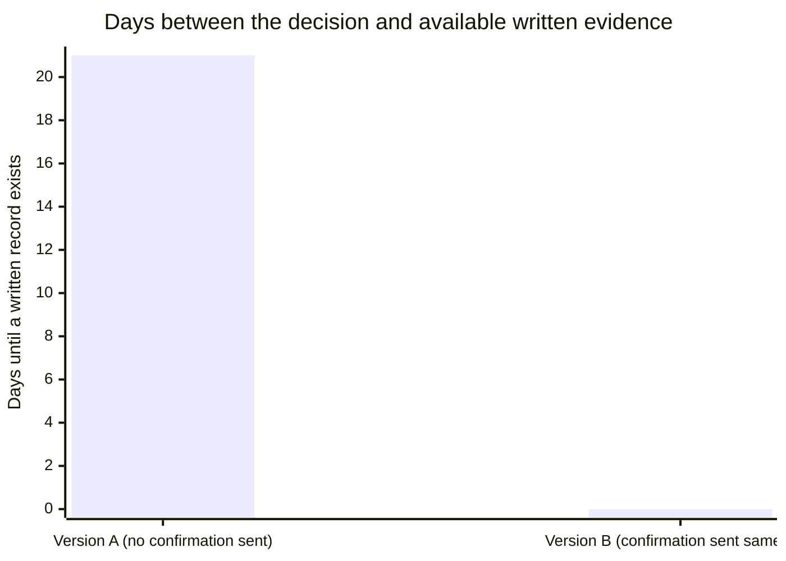

## Version A: no paper trail (the Scenario as written)

**Walking through exactly what happens in the incident review when
there's nothing in writing.** The vulnerability surfaces. In the
review, someone asks why the security review was skipped. The engineer
says the director told them to, in a hallway conversation three weeks
earlier. The director says: "I never told anyone to skip the review."

At this point, the room has two accounts and no way to check either
one. What actually happens next depends heavily on organizational
power, not on what was true:

- The director outranks the engineer, so their account carries more
  default credibility in the room, independent of accuracy.
- The engineer has no way to produce evidence, so the disagreement
  reads as "he said, she said" — which functionally means the more
  senior account wins by default.
- The engineer now carries individual responsibility for a decision
  that was, in fact, made by someone else — and has no way to correct
  that record after the fact.

**Is this director necessarily lying?** Not always — this is worth
sitting with, because it changes what documentation is actually for.
People genuinely misremember hallway conversations, especially ones
they didn't consider important at the time. The engineer's
documentation discipline isn't only protection against bad faith —
it's protection against a completely ordinary, sincere memory gap.

## Version B: the same Scenario, with a written confirmation

**Now replay the exact same hallway conversation, except the engineer
sends this immediately afterward:**

> **To:** [Director]
> **Subject:** Confirming — payments launch, security review timing
>
> Hi [Director] — confirming what we just discussed: given the
> schedule pressure this sprint, we're shipping the payments feature
> without the security review, and will schedule the review after
> launch. Let me know if I've got that wrong.

Three weeks later, when the vulnerability surfaces, the incident
review has a dated, written record — sent to the director directly, at
the time, in a completely neutral tone. **Does this eliminate the
director's incentive to say "I never said that"?** No — incentives to
avoid blame don't disappear just because a record exists. What changes
is that the room no longer has to decide between two competing
memories; there's a contemporaneous document that resolves the factual
question regardless of what anyone now prefers to remember.

| Element                            | Version A (no trail)                      | Version B (written confirmation)                                   |
| ---------------------------------- | ----------------------------------------- | ------------------------------------------------------------------ |
| What the room has to go on         | Two competing memories, three weeks old   | A dated, written record from the day of the decision               |
| Whose account defaults to credible | The more senior person's, by default      | Neither — the record speaks independent of seniority               |
| Engineer's position afterward      | Carries the decision's consequences alone | Record shows the decision and its rationale, accurately attributed |

The 21 in Version A isn't "21 days until someone writes something
down" — it's the fact that, by the time of the incident review, no
written record exists at all; the bar represents how far removed the
dispute is from any contemporaneous evidence, which is the entire gap
Version B closes to zero.

## Extend it: what if the decision-maker is much more senior?

**The Scenario's director is one level up. What changes if the verbal
instruction instead comes from a VP, or someone the engineer has very
little standing to question?** The mechanics of documentation don't
change — a short, neutral confirmation still works the same way. What
changes is the framing risk: sending "confirming what we discussed" to
someone significantly more senior can read as more presumptuous the
larger the power gap, simply because it's less common for junior
people to do this upward. The fix isn't skipping the confirmation —
it's leaning even harder into L2's "professional" framing: address it
to the senior person directly (not cc'd to their manager), keep it
genuinely short, and frame it as making sure _the engineer_ has it
right ("just want to make sure I understood correctly") rather than as
holding the senior person accountable. The same habit, applied more
carefully, still works — it just requires more deliberate tone control
the larger the seniority gap is.

## Failure modes at this level

- **Only documenting decisions from people at or below your own
  level.** The instinct to avoid "questioning" someone senior is
  exactly backward — a decision from someone more senior, with more
  authority behind it, is often higher-stakes to have on record, not
  lower.
- **Sending the confirmation, but cc'ing people who weren't part of
  the original conversation.** This is what tips a confirmation from
  "professional" into "paranoid" per L2's table — it signals the
  message is for an audience beyond the person who made the decision,
  which reads as building a case rather than keeping a record.
- **Treating a written confirmation as proof the other person can't
  push back.** Version B doesn't eliminate disagreement — it just
  changes what the disagreement is actually about, from "what was
  said" (now resolved) to whatever legitimate substance remains, like
  whether the original decision was a good one.
