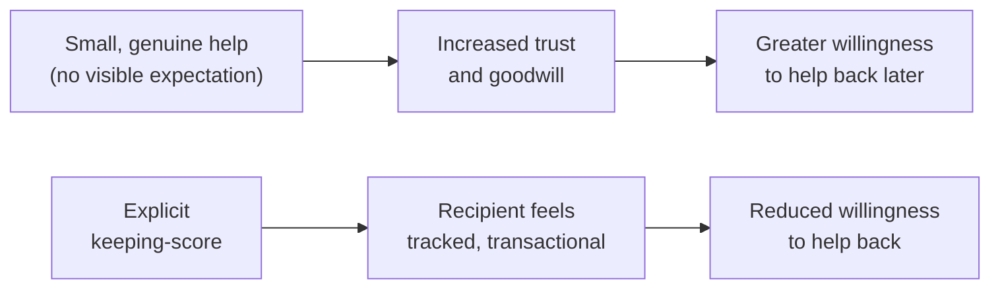

## Why an explicit ledger backfires

**If reciprocity is the mechanism, wouldn't it work even better to
explicitly track who owes what, so nothing gets forgotten?** No — the
moment help is offered with a visible expectation of return, it stops
reading as goodwill and starts reading as a transaction. People sense
when a favor comes with strings, even unstated ones, and it makes them
more guarded rather than more willing to help back. The mechanism only
works when the person receiving help doesn't feel tracked.

## What "banking" actually looks like, concretely

**What counts as a genuine deposit, versus something that reads as an
obvious ploy?** The test isn't the size of the favor — it's whether it
would still make sense to offer if nothing were ever asked in return.
Answering a quick question from someone on another team, reviewing a
small PR without being asked twice, or sharing context that saves someone
else time — these read as genuine because they cost little and carry no
visible follow-up ask. A large, unsolicited favor delivered right before
a known request, on the other hand, tends to read as exactly what it
is — a setup.

| Genuine deposit                                      | Reads-as-a-ploy version                                        |
| ---------------------------------------------------- | -------------------------------------------------------------- |
| Answering a quick Slack question, unprompted         | Volunteering unsolicited large help right before a known ask   |
| Reviewing a colleague's PR without being asked twice | Publicly announcing "I helped you, so..."                      |
| Sharing useful context that saves someone else time  | Doing a favor and immediately following up asking for one back |

## Why timing between deposit and withdrawal matters

**Does it matter how long ago the deposit was made relative to the
withdrawal?** A favor immediately followed by an ask reads as a
transaction regardless of how genuinely the initial help was intended —
the proximity itself signals quid pro quo. Genuine relationship capital
accumulates precisely because it isn't attached to a specific, nearby
ask; the gap in time (and the absence of any explicit tally) is part of
what keeps it reading as goodwill rather than a trade.

## The cold-ask problem

**What happens when there's no prior relationship at all, and the need is
genuinely urgent?** A cold ask isn't automatically doomed, but it has to
work with what's actually available: clear, specific, low-cost framing
("this would take you five minutes and unblocks something time-sensitive
on my end") and, ideally, routing through someone who _does_ have
relationship capital with the person being asked, rather than pretending
a relationship exists that doesn't. Cold asks succeed on the strength of
the ask itself, not on borrowed trust that hasn't actually been earned.

## The generalizable lesson

**Is this really about favors specifically, or something broader about
how trust gets built?** The underlying mechanism — small, consistent,
genuinely-given contributions building a reserve of goodwill that doesn't
need to be spent immediately or tracked explicitly — is the same pattern
behind most durable working relationships, not just favors. The corrosive
version (visible score-keeping, favors timed suspiciously close to asks)
undermines trust in any relationship, not just a professional one; the
generative version works the same way everywhere it appears.
