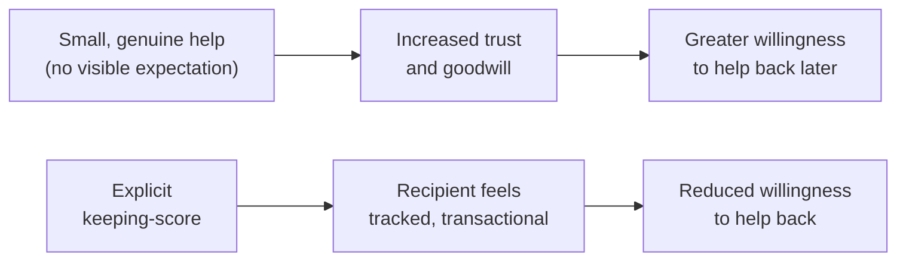

import LevelIntro from "../../../components/LevelIntro.astro";
import Checkpoint from "../../../components/Checkpoint.astro";

L1 named the basic shape of the favor economy — small deposits of goodwill
that make future asks land more easily. L2 works out the rule that makes
that mechanism actually function: reciprocity only builds capital while it
stays genuine, and it breaks the moment it starts looking tracked.

<LevelIntro
  items={[
    "Why explicit score-keeping backfires",
    "What separates a genuine deposit from an obvious ploy",
    "The cold-ask problem, with no capital to draw on",
  ]}
/>

## Why an explicit ledger backfires

**If reciprocity is the mechanism, wouldn't it work even better to
explicitly track who owes what, so nothing gets forgotten?** No — the
moment help is offered with a visible expectation of return, it stops
reading as goodwill and starts reading as a transaction. People sense
when a favor comes with strings, even unstated ones, and it makes them
more guarded rather than more willing to help back. The mechanism only
works when the person receiving help doesn't feel tracked.

## What "banking" actually looks like, concretely

**What counts as a genuine deposit, versus something that reads as an
obvious ploy?** The test isn't the size of the favor — it's whether it
would still make sense to offer if nothing were ever asked in return.
Answering a quick question from someone on another team, reviewing a
small PR without being asked twice, or sharing context that saves someone
else time — these read as genuine because they cost little and carry no
visible follow-up ask. A large, unsolicited favor delivered right before
a known request, on the other hand, tends to read as exactly what it
is — a setup.

If the office examples are unfamiliar: Slack is just a workplace chat;
a PR is a proposed code change someone reviews; sharing context means
explaining useful background so another person does not waste time.
The non-technical equivalent is lending clear notes, explaining a task,
warning someone about an avoidable mistake, or helping tidy up before
anyone asks you for a favor.

| Genuine deposit                                      | Reads-as-a-ploy version                                        |
| ---------------------------------------------------- | -------------------------------------------------------------- |
| Answering a quick Slack question, unprompted         | Volunteering unsolicited large help right before a known ask   |
| Reviewing a colleague's PR without being asked twice | Publicly announcing "I helped you, so..."                      |
| Sharing useful context that saves someone else time  | Doing a favor and immediately following up asking for one back |

<Checkpoint question="Using the test above — 'would it still make sense to offer if nothing were ever asked in return' — is reviewing a colleague's PR unprompted still a genuine deposit if you happen to know that colleague will need to approve your project's budget next quarter?">

It depends on whether the help would have happened anyway, not on whether
a future benefit exists somewhere in the picture. If you'd have reviewed
that PR regardless of who the colleague was or what they might approve
later, the fact that a future ask happens to exist doesn't retroactively
make the help a ploy — most working relationships have some future
overlap, and treating every one of them as disqualifying would make
genuine help nearly impossible to give. What would disqualify it is
choosing to help specifically because of the upcoming approval, or timing
it deliberately close to the budget request — the test is about intent
and proximity, not about whether any future connection exists at all.

</Checkpoint>

## Why timing between deposit and withdrawal matters

**Does it matter how long ago the deposit was made relative to the
withdrawal?** A favor immediately followed by an ask reads as a
transaction regardless of how genuinely the initial help was intended —
the proximity itself signals quid pro quo. Genuine relationship capital
accumulates precisely because it isn't attached to a specific, nearby
ask; the gap in time (and the absence of any explicit tally) is part of
what keeps it reading as goodwill rather than a trade.

Quid pro quo means "this for that." The problem is not that exchange is
always bad; the problem is that pretending to give free help while
quietly treating it as "this for that" makes people feel tracked.

<Checkpoint question="Given that proximity between a favor and an ask is what signals quid pro quo, why doesn't that same problem apply to someone with no prior relationship at all who simply asks for help directly, with nothing offered beforehand?">

Because there's no favor sitting close to the ask for the proximity to
implicate — a cold ask isn't a favor followed suspiciously fast by a
request, it's just a request with no history attached at all. The
transactional read comes specifically from a recent deposit that looks
retroactively purchased by the withdrawal that follows it; someone who
never made a deposit in the first place isn't triggering that same
suspicion, they're simply starting from zero rather than from a debt
relationship. That's a different problem — not "this looks like a
setup," but "there's no accumulated goodwill to draw on" — and it calls
for a different fix, which is what a cold ask actually has to work with.

</Checkpoint>

## The cold-ask problem

**What happens when there's no prior relationship at all, and the need is
genuinely urgent?** A cold ask isn't automatically doomed, but it has to
work with what's actually available: clear, specific, low-cost framing
("this would take you five minutes and unblocks something time-sensitive
on my end") and, ideally, routing through someone who _does_ have
relationship capital with the person being asked, rather than pretending
a relationship exists that doesn't. Cold asks succeed on the strength of
the ask itself, not on borrowed trust that hasn't actually been earned.

A simple cold-ask shape is: "I know this is short notice. The smallest
thing that would help is X. It would take about Y minutes and it
unblocks Z. No worries if today is not possible." Specific and bounded
means the other person can see exactly what saying yes would cost.

## The generalizable lesson

**Is this really about favors specifically, or something broader about
how trust gets built?** The underlying mechanism — small, consistent,
genuinely-given contributions building a reserve of goodwill that doesn't
need to be spent immediately or tracked explicitly — is the same pattern
behind most durable working relationships, not just favors. The corrosive
version (visible score-keeping, favors timed suspiciously close to asks)
undermines trust in any relationship, not just a professional one; the
generative version works the same way everywhere it appears.
