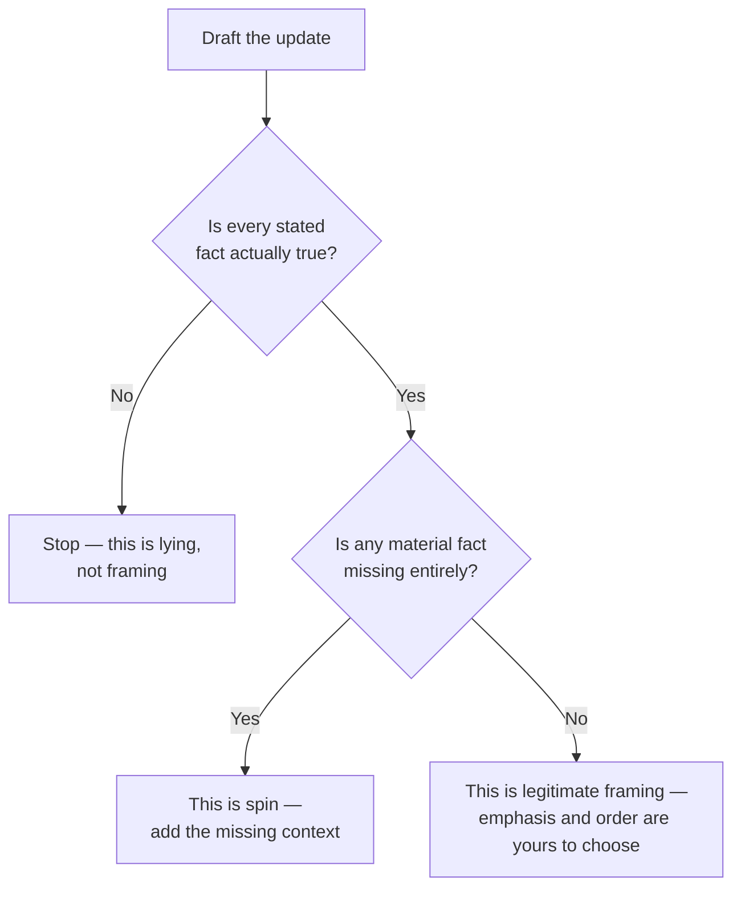

import LevelIntro from "../../../components/LevelIntro.astro";
import Checkpoint from "../../../components/Checkpoint.astro";

L1 drew the line between framing (legitimate) and spin (dishonest by
omission) in one sentence. L2 turns that line into a test you can
actually run on a real narrative, and shows why avoiding the choice
entirely isn't the safe option it looks like.

<LevelIntro
  items={[
    "The two-question honesty test",
    "What makes a fact 'material'",
    "Why 'just report it chronologically' isn't neutral",
  ]}
/>

## Three things that can look similar from the outside

**If two updates about the same project can read completely
differently, how do you tell whether the difference is legitimate
storytelling or something dishonest?** By checking two separate
questions, not one: is every stated fact true, and is every _material_
fact included?

| Approach    | Every stated fact true? | Every material fact included?        | What's actually happening                                                     |
| ----------- | ----------------------- | ------------------------------------ | ----------------------------------------------------------------------------- |
| **Framing** | Yes                     | Yes                                  | Choosing order and emphasis among facts that are all present                  |
| **Spin**    | Yes                     | **No** — material facts are left out | Creating a misleading overall impression by omission, not by false statements |
| **Lying**   | **No**                  | N/A                                  | Asserting something that isn't true                                           |

Framing and lying are easy to tell apart — one changes emphasis, the
other changes facts. Spin is the harder case, because every individual
sentence in a spun narrative can be checked and found true. The tell
isn't in any single sentence; it's in what's missing.

<Checkpoint question="A teammate writes a project update that contains zero false statements, but leaves out that the project caused a production outage. Using the table above, is this framing or spin, and why?">

Spin. The table's first check — is every stated fact true — passes, which is exactly what makes spin harder to catch than an outright lie. But the second check fails: the outage is a material fact, one that would change a reasonable reader's understanding of how the project actually went, and it isn't mentioned at all rather than just given less space. Framing requires both checks to pass; this narrative only passes one, which is what makes it spin instead of legitimate emphasis.

</Checkpoint>

## What makes a fact "material"

**If leaving out details makes something spin, does that mean every
version has to include literally everything?** No — the test isn't
"everything," it's _materiality_: would a reasonable reader's
understanding of the outcome actually change if they learned this
fact? A project update can reasonably skip which specific IDE the
team used; it can't reasonably skip a production outage the project
caused. The first detail doesn't change how anyone should read the
outcome. The second one does.

A reasonable reader means a normal person trying to understand the
result fairly, not someone looking for excuses. Everyday examples:
"we finished late because the bus broke down" is material if timing is
being judged; "I used a blue pen" usually is not. "The event raised
$500" is material; "the poster font was Arial" usually is not. "No one
was hurt" is material after an accident; "the chairs were green" is
not.

## A self-check before sending a narrative out

The two questions in this flowchart are independent checks, not a
single vague "does this feel honest" judgment call — which is what
makes the self-check actually usable in the moment, rather than
something that only becomes obvious in hindsight.

In simpler checklist form: did I say anything false? Did I leave out
anything that would change the reader's judgment? Did I give serious
facts enough space for their seriousness?

## Why framing is worth doing deliberately, not avoiding

**If spin and lying are both risks nearby, is the safest move to avoid
shaping the narrative at all — just report facts in whatever order
they happened?** No — chronological order isn't neutral either; it
just means someone else's instinctive reaction becomes the default
framing instead of a deliberate one. If a win and a setback both
happened, _not_ choosing how to present them doesn't avoid framing —
it just means the reader's own assumptions (often "no news is good
news," or the opposite) fill the gap left by an undeliberate telling.
Owning the narrative honestly is the alternative to that default, not
a departure from honesty.

Chronological order is just one frame: "first we failed, then we
fixed it" feels different from "we delivered the result, after a
failure we fixed." Both can be honest if both include the same
material facts.

<Checkpoint question="Someone argues that reporting events strictly in the order they happened is the 'neutral' choice, so it can't be a form of framing. Is that right?">

No. Chronological order is a choice like any other — it just happens to be the choice someone makes by default when they don't decide anything deliberately. It still determines what a reader encounters first, and first position still carries the most weight regardless of why it was chosen. Calling it "neutral" only hides that a decision was made; it doesn't remove the decision. The real alternative to careless framing isn't avoiding framing altogether — it's choosing the order and emphasis on purpose, the same way L3's Draft B does compared to Draft A's unintentional, chronological "issues along the way" opening.

</Checkpoint>
