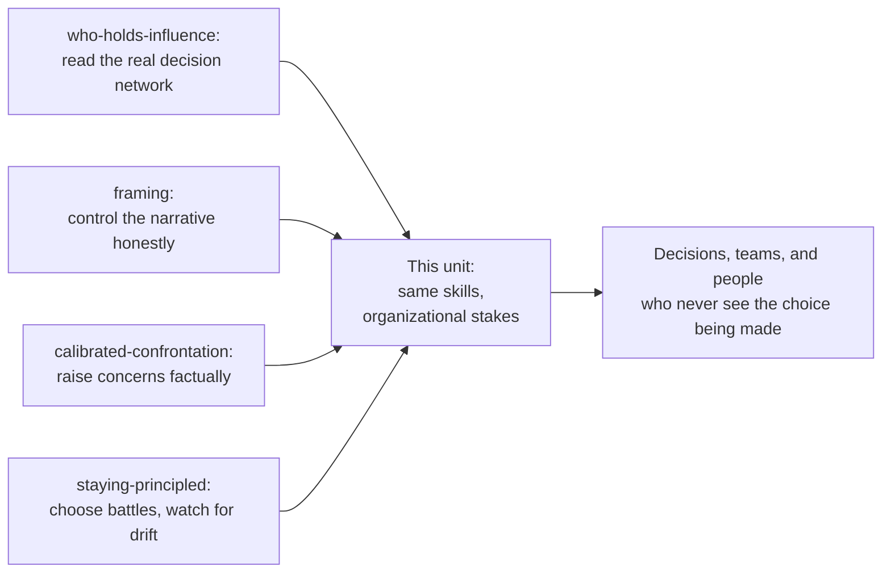

import LevelIntro from "../../../components/LevelIntro.astro";
import Checkpoint from "../../../components/Checkpoint.astro";

L1 left you with one decision that can be narrated two ways — making it
better, or making it safer for the person making it. This level builds the
actual model: why the stakes are categorically higher once influence reaches
organizational scale, a real two-question test for telling the two uses
apart in the moment, and an honest reckoning with why self-interest never
fully disentangles from legitimate influence.

<LevelIntro
  items={[
    "Why scale raises the stakes without changing the underlying skills",
    "The two-question test, applied to real examples",
    "Why the entanglement with self-interest has to be managed, not denied",
  ]}
/>

## Same skills, larger blast radius

**If this track already taught reading rooms, framing, coalition-building,
and choosing battles — what's actually new here?** Nothing in the skill
set. What changes is who's downstream of getting it wrong.

Every arrow into the diagram above is a skill this track already built for
individual-scale stakes: reading a room to avoid getting blindsided,
framing your own work honestly, raising a concern without it backfiring,
choosing which battles are worth your capital. **None of those skills
change shape at staff level. What changes is the size of what they touch.**
A junior engineer who mishandles a disagreement mostly costs themselves
standing in one room. A staff engineer whose objection reliably moves a
launch decision is, whether they think of it this way or not, making a call
on behalf of everyone who'll be affected by that launch and never sees the
conversation that decided it.

This is [`staying-principled`](/corporate-politics/staying-principled/)'s
identity-drift mechanism, unchanged in structure, viewed at a different
scope. There, a slow accumulation of individually-defensible compromises
cost the person making them — their own sense of who they are. Here, the
same slow accumulation — softening a concern here, timing a disclosure
there, each one still individually defensible — costs whatever the
influence should have served instead: a better decision, a fairer outcome,
a team that didn't get blindsided. **The mechanism that makes drift hard to
catch is identical. The bill just gets sent to more people.**

<Checkpoint question="Someone argues that because a staff engineer has the same underlying political skills as everyone else in this track, the earlier units already fully cover the staff-level case — this unit shouldn't need to exist separately. What's the gap in that reasoning?">

The skills are the same, but the earlier units were built around
individual-scale stakes — a battle that mostly costs the person choosing it
if they get it wrong. At staff-level influence, the same choice made the
same way now has a much larger blast radius: the people affected by a
launch decision, a design call, or a reorganization typically never see the
conversation that decided it, and can't correct for a bad call the way a
peer in the room sometimes can. Identical skill, identical mechanism for
drift, but a categorically different stake — which is exactly why the
question "am I still using this for the org's good" needs its own explicit
test at this scale, not an assumption that getting the mechanics right is
enough.

</Checkpoint>

## A real test: two questions, not a feeling

**If "am I using my influence well" can't be answered by how justified it
feels in the moment — the same problem L1's staff engineer faces, feeling
the quiet-and-safe option and the vocal-and-costly option both narrate as
reasonable — what actually tells them apart?** Two questions, asked
honestly, before acting:

1. **Does this use of influence make the decision more likely to be right —
   or just more likely to go the way I want?** Not "will it work" — that's
   answerable for both a good-faith concern and a self-serving one. The
   question is whether the _reasoning_ driving the move is aimed at getting
   the org's decision correct, independent of which way that decision
   happens to cut for the person making it.
2. **Would I be comfortable if the actual reasoning behind this move were
   fully visible to everyone it affects?** Not "would it be praised" — full
   visibility of a well-intentioned but wrong call is uncomfortable and
   still passes. The test fails specifically when the visible reasoning
   would read as self-protective once seen plainly — "I stayed quiet because
   raising it would have cost me something," not "I stayed quiet because I
   was genuinely unsure."

| Move                                                                                                                                                                 | Makes the decision more likely to be right?                                             | Reasoning survives full visibility?                                                                                      | Verdict                                                                       |
| -------------------------------------------------------------------------------------------------------------------------------------------------------------------- | --------------------------------------------------------------------------------------- | ------------------------------------------------------------------------------------------------------------------------ | ----------------------------------------------------------------------------- |
| Raising a specific, checkable technical risk directly to the people deciding, before the launch is locked                                                            | Yes — new information reaches the decision-makers while it can still change the outcome | Yes — "I think this fails under condition X, here's why" holds up said aloud to everyone                                 | Passes both — legitimate                                                      |
| Staying quiet on the same risk because the project's champion is politically useful to know                                                                          | No — the decision proceeds without information that would have changed it               | No — "I didn't want to spend capital with someone I need later" does not survive being said aloud to the people affected | Fails both — self-interest, not org good                                      |
| Timing the disclosure of a real risk to land right before your own promotion review, so you're seen raising it                                                       | Ambiguous — the risk itself is real and worth raising                                   | Fails — the _timing_ choice, if visible, reads as self-serving even though the concern itself was legitimate             | Partial: the content passes, the execution doesn't — worth separating the two |
| Quietly building support for a technically sound proposal by talking to the right people before the meeting, the way [`white`](/corporate-politics/white/) describes | Yes — surfaces real support and concerns before the room, rather than ambushing anyone  | Yes — "I checked with the people this affects before proposing it publicly" holds up in the open                         | Passes both — legitimate                                                      |

**The third row matters more than the other three, because it's the one
that doesn't resolve cleanly.** A concern can be entirely legitimate and
still be _used_ in a way that fails the visibility test — the two questions
aren't only about whether to raise something, but about whether every part
of how and when it's raised would hold up seen in full. That's a sharper
tool than "is this move honest," because a move can be honest in content
and still be partly in service of the mover rather than the decision.

<Checkpoint question="A staff engineer raises a real, well-founded technical concern about a colleague's design — but specifically chooses to raise it in a large cross-team meeting, where it visibly damages the colleague's standing, instead of in the design review where the decision is actually being made. Using the two-question test, what's wrong with this move, given that the concern itself is legitimate?">

The content passes the first question — a real concern, if acted on, does
make the decision more likely to be right. The move still fails, because
the _choice of venue_ doesn't survive the second question: raising a valid
concern in a room built to maximize the colleague's public embarrassment,
rather than the room where the decision is actually made, serves something
other than decision quality — visible standing, at the colleague's expense.
If the actual reasoning behind picking that meeting ("I wanted this seen by
more people, including people who matter to my own reputation") were fully
visible, it wouldn't hold up. A legitimate concern doesn't automatically
legitimize every way of deploying it — the two questions apply to the
execution, not just the content.

</Checkpoint>

## The entanglement that doesn't resolve

**If the test above works, why isn't this unit finished at "just apply the
two questions"?** Because the two questions assume you can cleanly separate
"what's good for the org" from "what's good for me" often enough to check
one against the other — and for a staff engineer, that separation is
genuinely, permanently incomplete.

Being seen as effective, trustworthy, and influential is not a corrupting
side effect of doing this job well — **it is, in real and legitimate part,
what doing this job well produces.** A staff engineer who consistently
raises real risks at the right moment, in the right way, _does_ build a
reputation for judgment, and that reputation genuinely does help their
career. Denying that entanglement exists is not the disciplined position —
it's a way of making the entanglement invisible to yourself, which is
exactly the condition [`staying-principled`](/corporate-politics/staying-principled/)
warns is hardest to catch from the inside.

The actual discipline is narrower and more honest than "have no stake in
the outcome":

- **Expect the overlap, most of the time.** Most good uses of influence
  serve the org and the person's standing simultaneously — that's not a red
  flag, it's what a well-functioning incentive structure looks like when
  it's working.
- **Watch specifically for the moments they diverge** — where the
  organizationally correct move and the personally safe move point
  different directions, the way L1's scenario does. Those moments are rare
  precisely because the overlap is common, which is exactly why they're
  easy to miss or rationalize away when they show up.
- **At the moment of divergence, the test is which one gets chosen — not
  whether a stake in the outcome existed at all.** Having a stake is the
  normal condition of the job, not a disqualifying conflict; choosing the
  stake over the org's good, at the specific moment they split, is the
  actual failure this unit is naming.

This is the honest version of the whole unit's answer: not "eliminate
self-interest," which isn't achievable and would be dishonest to claim, but
"notice the fork when it appears, and take the branch that serves the
org's actual decision — especially the one time in twenty it costs you
something to do it." L3 follows one staff engineer at exactly that fork.
