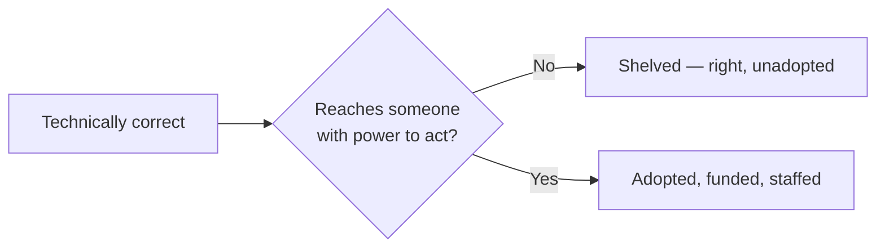

import Scenario from "../../../components/Scenario.astro";

<Scenario>
  <Fragment slot="facts">
    

      
📄 Proposal: automated rollback for a known outage risk

      
✅ Technically correct — nobody disputes the design

      
🔇 Posted to a channel, no one with authority claims it

    

    
Two weeks later

    

      
👍 A few "nice writeup" reactions

      
📭 Zero follow-up, zero funding, zero staffing

    

  </Fragment>

An engineer spots a real gap: a bad deploy can't roll back automatically, and the one time it mattered, the outage ran 40 minutes longer than it needed to. They write it up carefully — the risk, the mechanism, the fix, the incident it points back to — and post it where the team can see it.

Two weeks pass. A couple of "nice writeup" reactions. No funding, no staffing, no schedule. The proposal isn't wrong. Nobody has told them it's wrong. It simply isn't _happening_.

**Before reading on: if being correct isn't what got this stuck, what's the missing variable — and is it something you can only get by being senior, or something you can build on purpose?**

</Scenario>

- Decisions in an organization aren't made by "whoever is technically correct" — they're made by whoever can get a decision actually adopted, funded, staffed, and sustained. That capability is **power**, and it's a real resource, not a character flaw in the people who have it.
- Power is not the same thing as being liked, being senior, or being loud. It's the ability to make things happen — get resources allocated, get a proposal prioritized, get a team to actually change direction.

- Four common sources of power in an org, none of which require a title:

| Source           | What it lets you do                                            |
| ---------------- | -------------------------------------------------------------- |
| Formal authority | Directly allocate budget, headcount, or roadmap priority       |
| Expertise        | Have your technical judgment taken as sufficient justification |
| Relationships    | Get people to back a proposal because they trust _you_         |
| Information      | Frame things in terms decision-makers already care about       |

- Being technically right and having none of these is a genuinely common, genuinely frustrating position — and the frustration is real, but "I was right and it didn't matter" describes a power gap, not proof the system is broken or that political skill is beneath serious work.
- **Politics, in the neutral sense this unit uses the word, is just the process of getting a group of people with different incentives to align on a decision.** It's not inherently manipulative — treating it as inherently dirty is itself a stance that cedes influence to people who don't share that squeamishness.
- The goal here isn't to teach manipulation — it's to make power visible as a factor so it can be reasoned about deliberately, the same way you'd reason about any other constraint, instead of being repeatedly surprised that being right wasn't sufficient.
