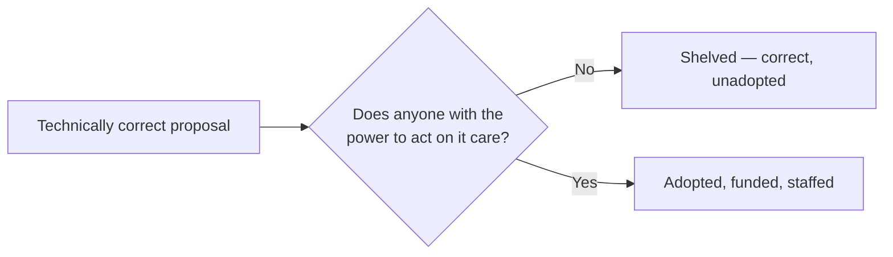

## Why "being right" is necessary but not sufficient

Correctness gets a proposal to the gate — it doesn't get it through. What's on the other side of that gate is a completely separate question: does someone with actual capacity to act (budget, headcount, priority-setting authority, or enough trust that others will follow their lead) find this proposal worth spending that capacity on? A proposal can be perfectly correct and simply never reach anyone positioned to move it — that's not a contradiction, it's the whole reason power is a distinct variable from correctness.

## Four sources of power, and how each one actually moves a decision

| Source           | What it lets you do                                                                                    | How it's built                                                                                                             |
| ---------------- | ------------------------------------------------------------------------------------------------------ | -------------------------------------------------------------------------------------------------------------------------- |
| Formal authority | Directly allocate budget, headcount, or roadmap priority                                               | Granted by title/role — the fastest lever, but the one you have least direct control over gaining                          |
| Expertise        | Have your technical judgment taken as sufficient justification on its own                              | Built by being right, repeatedly, on record, over time — compounds slowly but doesn't require a title                      |
| Relationships    | Get people to back a proposal because they trust the proposer, not just the pitch                      | Built through consistent, reciprocal follow-through long before you need the favor                                         |
| Information      | Frame a proposal in terms of what decision-makers already care about, avoid fights already lost before | Built by paying attention to context outside your own team — what's been tried, what leadership is actually optimizing for |

None of these require being disliked, dishonest, or manipulative to acquire — that association is a common reason engineers avoid thinking about power deliberately, but the sources themselves (track record, trust, context, formal role) are the same things that make someone a good colleague, applied with intent instead of accumulated by accident.

## The adoption pipeline

Technical merit is evaluated first — necessary, but per the diagram above, not sufficient on its own. The next step is finding someone in the org who actually has power over the problem the proposal addresses; with no such sponsor, the proposal is shelved regardless of how correct it is. If a sponsor exists, the proposal still has to be translated into terms of what _that sponsor_ is accountable for — a sponsor with formal authority needs the framing connected to what they can directly allocate; a sponsor whose power comes from relationships needs the framing strong enough that vouching for it is worth spending their own trust on.

This makes explicit what "politics" often gets blamed for when it's really just this pipeline running as designed: a correct proposal with no sponsor, or a sponsor whose incentives were never addressed in the framing, produces the exact same outcome ("shelved") as a genuinely bad proposal — from the outside they can look identical, which is part of why "I was right and it didn't matter" is such a common and disorienting experience.

## Politics as a neutral mechanism, not a moral failing

The word carries a negative connotation mostly because its most visible instances are its abuses (credit-stealing, undermining, hoarding information as leverage). But the underlying mechanism — aligning people with different incentives toward a shared decision — is present in every functioning organization and isn't optional to opt out of; declining to engage with it deliberately doesn't remove power from the equation, it just means decisions get made by whoever _did_ engage with it, correct or not.
