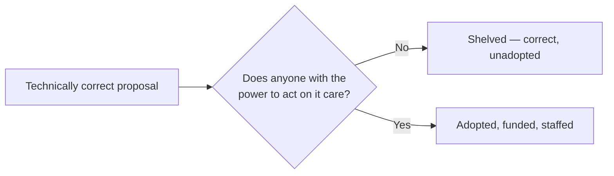
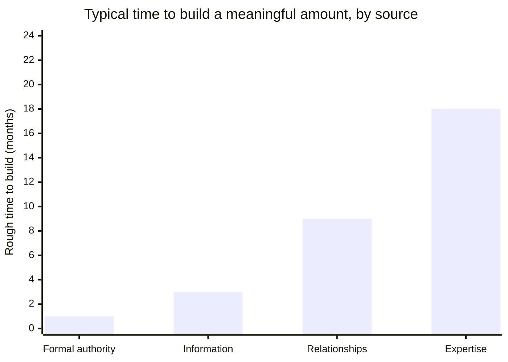
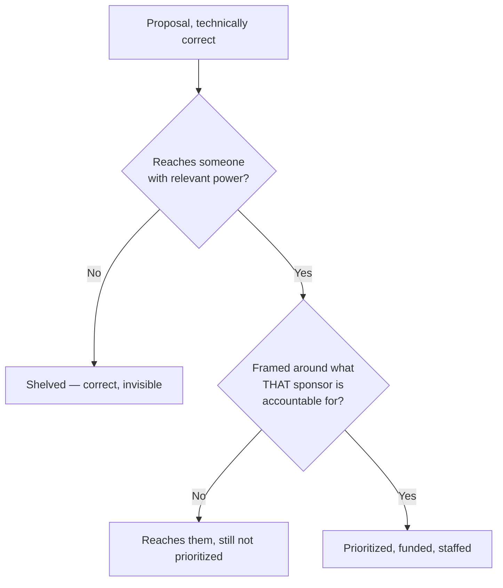

import LevelIntro from "../../../components/LevelIntro.astro";
import Checkpoint from "../../../components/Checkpoint.astro";

L1 named power as a real, distinct resource and outlined its four sources
against the stalled rollback proposal. L2 works out why correctness alone
never moved that proposal, and the exact pipeline a proposal has to travel
through to actually get adopted.

<LevelIntro
  items={[
    "Why correctness alone doesn't move decisions",
    "The four sources of power, compared",
    "The sponsor-plus-framing adoption pipeline",
  ]}
/>

## Why "being right" is necessary but not sufficient

Two proposals, identical in technical quality, can have completely different fates — one adopted within a month, one shelved indefinitely. If correctness alone decided outcomes, that gap shouldn't exist. What's the variable that actually explains it?

Correctness gets a proposal to the gate — it doesn't get it through. What's on the other side is a separate question entirely: does someone with actual capacity to act (budget, headcount, priority-setting authority, or enough trust that others will follow their lead) find this proposal worth spending that capacity on? A proposal can be perfectly correct and simply never reach anyone positioned to move it — that's not a contradiction, it's the whole reason power is a distinct variable from correctness.

Capacity means available ability to do something: money, people,
calendar space, attention, or authority. Roadmap means the list of
work the team has already committed to. Headcount means people
assigned to the work, not just agreement that the work is a good idea.

## Four sources of power, and how each one actually moves a decision

Before the table: name one person whose opinion reliably moves decisions in a group you're part of, and ask yourself _why_ — is it their title, their track record, the fact that people trust them personally, or that they seem to know things others don't? Most people can answer instantly, which is itself evidence these four sources are already something you reason about intuitively, just not always on purpose.

| Source           | What it lets you do                                                                                    | How it's built                                                                                                             |
| ---------------- | ------------------------------------------------------------------------------------------------------ | -------------------------------------------------------------------------------------------------------------------------- |
| Formal authority | Directly allocate budget, headcount, or roadmap priority                                               | Granted by title/role — the fastest lever, but the one you have least direct control over gaining                          |
| Expertise        | Have your technical judgment taken as sufficient justification on its own                              | Built by being right, repeatedly, on record, over time — compounds slowly but doesn't require a title                      |
| Relationships    | Get people to back a proposal because they trust the proposer, not just the pitch                      | Built through consistent, reciprocal follow-through long before you need the favor                                         |
| Information      | Frame a proposal in terms of what decision-makers already care about, avoid fights already lost before | Built by paying attention to context outside your own team — what's been tried, what leadership is actually optimizing for |

None of these require being disliked, dishonest, or manipulative to acquire — that association is a common reason people avoid thinking about power deliberately, but the sources themselves (track record, trust, context, formal role) are the same things that make someone a good colleague, applied with intent instead of accumulated by accident.

Incentives are the things a person is rewarded, measured, or pressured
to improve. A sponsor is someone with enough power over the problem to
spend resources or credibility on the proposal. Framing is how you
explain the proposal so the sponsor can see why it matters to their
own responsibilities.

A rough sense of how much these sources typically compound over time versus how fast they can be spent — formal authority can be granted overnight by a promotion, but the other three only accumulate through repeated, real interactions:

Formal authority can arrive in a single conversation (a promotion, a reorg); expertise is the slowest because it requires being right, publicly, enough times that people stop double-checking you. This is directional, not a formula — the point is that three of the four sources are patient investments, which is exactly why they're easy to under-invest in when a proposal feels urgent right now.

<Checkpoint question="A newly hired engineer has no title and no track record yet at this company, but a senior engineer who trusts them from a previous job vouches for their proposal directly to a director. Which of the four sources of power is doing the work here, and could the new engineer have gotten the same effect through expertise instead, on their first week?">

Relationships — specifically, borrowed trust: the senior engineer is
spending their own accumulated relational credibility on the new
hire's behalf, which is why the proposal reaches the director at all.
Expertise couldn't have substituted for this in week one, because the
table above is explicit that expertise is built slowly, by being right
repeatedly and on record — there's no way to already have a track
record at a company you just joined. Relationships are the one source
in the table that can be transferred from someone else on your behalf,
which is exactly what's happening here.

</Checkpoint>

## The adoption pipeline

Given a correct proposal and someone who does have power over the problem, is that automatically enough? What's the one more thing that has to be true before that person actually spends their capacity on it?

Pipeline here just means "path of steps." It is not a special
software system; it is the route a proposal must travel from "good
idea" to "people are actually working on it."

Technical merit is evaluated first — necessary, but per the diagram above, not sufficient on its own. The next step is finding someone in the org who actually has power over the problem the proposal addresses; with no such sponsor, the proposal is shelved regardless of how correct it is. If a sponsor exists, the proposal still has to be translated into terms of what _that sponsor_ is accountable for — a sponsor with formal authority needs the framing connected to what they can directly allocate; a sponsor whose power comes from relationships needs the framing strong enough that vouching for it is worth spending their own trust on.

This makes explicit what "politics" often gets blamed for when it's really just this pipeline running as designed: a correct proposal with no sponsor, or a sponsor whose incentives were never addressed in the framing, produces the exact same outcome ("shelved") as a genuinely bad proposal — from the outside they can look identical, which is part of why "I was right and it didn't matter" is such a common and disorienting experience.

<Checkpoint question="The pipeline diagram fails a proposal at the framing question when it isn't 'matched to what the sponsor is accountable for.' If a sponsor has formal authority over budget but no obvious personal stake in the proposal's topic, what exactly do you need to find out about them before you pitch — and is a stronger, better-argued case enough on its own?">

A better-argued case is not enough on its own — what's missing is
information about what that specific sponsor is currently measured or
pressured on: their team's goals this quarter, the metric their own
manager is asking them about, the problem that's actually on their
plate right now. The framing step only succeeds when the pitch shows
how the proposal moves something already on that sponsor's scorecard,
not when the argument for the proposal itself gets more thorough — a
technically stronger case aimed at criteria the sponsor doesn't own
stalls the same way a weaker one would, because the gap was never
about argument quality in the first place.

</Checkpoint>

## Politics as a neutral mechanism, not a moral failing

If the underlying mechanism here isn't optional — every group of people with different incentives has to align somehow — what actually happens when someone refuses to engage with it on principle?

The word "politics" carries a negative connotation mostly because its most visible instances are its abuses (credit-stealing, undermining, hoarding information as leverage). But the underlying mechanism — aligning people with different incentives toward a shared decision — is present in every functioning group and isn't optional to opt out of; declining to engage with it deliberately doesn't remove power from the equation, it just means decisions get made by whoever _did_ engage with it, correct or not.

This does not excuse dishonest politics. It separates the neutral
skill from the abuse: understanding who can act, what they care about,
and how to connect a true proposal to those cares is not the same as
stealing credit or manipulating people.
