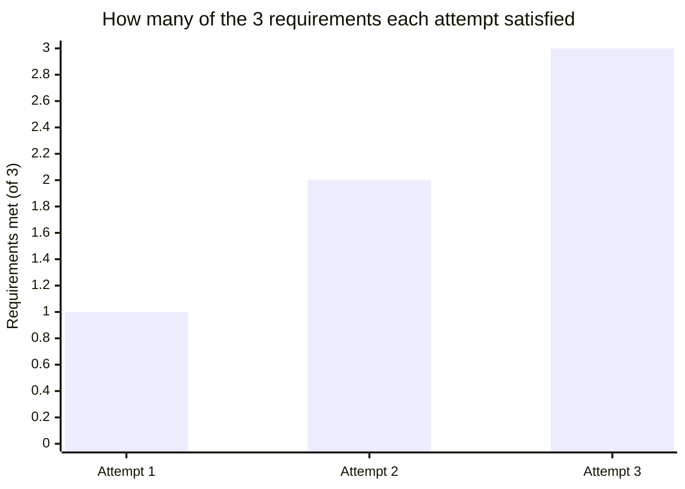

import Scenario from "../../../components/Scenario.astro";

<Scenario label="The scenario">
  <Fragment slot="facts">
    

      
⚠️ Risk: no automated rollback, outage ran 40 min longer than needed

      
🛠️ Fix proposed: automated rollback — unchanged across all 3 attempts

    

    
Three attempts

    

      
1️⃣ General channel — no sponsor found

      
2️⃣ Infra manager — sponsor found, wrong framing

      
3️⃣ Same manager — framed to their actual metric

    

  </Fragment>

An engineer identifies that the deployment pipeline has a real, quantifiable risk: a bad deploy can't be rolled back automatically, and the one time it mattered, an outage ran 40 minutes longer than necessary while someone manually worked out the rollback steps. They propose building automated rollback.

The proposal is technically sound throughout all three attempts below. **What's the one thing that's different each time — and is it the idea, the person pitching it, or something else entirely?**

</Scenario>

Watch for what changes between the three attempts, and — just as important — what stays exactly the same.

## Attempt 1: correctness alone

A design doc, technically thorough, posted to a general engineering channel. It explains the mechanism, the risk it addresses, and links the incident postmortem as evidence. No response for two weeks beyond a couple of "nice writeup" reactions. Nobody with the authority to prioritize infra work against feature roadmap commitments saw it as _their_ problem to solve — it was correct, visible, and completely inert, because visibility isn't the same as reaching someone positioned to act.

## Attempt 2: correctness plus a sponsor, but a mismatched framing

The engineer takes the same doc directly to the infra team's manager, who does have budget authority over this exact kind of work. The manager reads it, agrees it's a real risk, but doesn't prioritize it that quarter — their team's roadmap is measured on a different metric (infra cost reduction) that this proposal doesn't touch. The proposal reached a sponsor this time, but was framed entirely around "this is correct and important" rather than "this moves something you're accountable for" — an appeal to correctness aimed at someone who needed an appeal to their actual incentives.

## Attempt 3: correctness, a sponsor, and incentive-aligned framing

The engineer reframes the same technical proposal, unchanged in substance, around a second effect it also has: every manual rollback currently requires a senior on-call engineer's direct involvement, meaning incident response capacity is bottlenecked on a handful of people — automating it would reduce that bottleneck, which is a metric the infra manager's own manager has been explicitly asking about (on-call sustainability, reducing dependency on a few key people). Same proposal, same author, same technical design — but now framed in terms the sponsor is personally accountable for improving. It gets prioritized the next planning cycle.

## What changed between attempts, concretely

This isn't a vague impression — three variables, each either present or absent, and only their combination predicts the outcome:

| Attempt | Correctness | Sponsor found | Framing matched sponsor's incentives                                      |
| ------- | ----------- | ------------- | ------------------------------------------------------------------------- |
| 1       | Yes         | No            | N/A — never reached anyone with power                                     |
| 2       | Yes         | Yes           | No — framed around the proposal's merit, not the sponsor's accountability |
| 3       | Yes         | Yes           | Yes — framed around a metric the sponsor was already being measured on    |

The technical proposal never changed. What changed was whether it reached someone with the power to act, and whether it was framed in terms that connected to what that person was actually accountable for — both are power-and-incentive questions, entirely separate from whether the underlying engineering was sound, which it was in all three attempts.

## Failure modes

- **Concluding from Attempt 1 or 2 that the org is dysfunctional or doesn't value good engineering.** It's a common and understandable read, but it mistakes a missing sponsor or a framing mismatch for a verdict on the idea's merit — the same idea succeeded on attempt 3 with the identical technical content, which is direct evidence the org _could_ act on it, given the right pipeline.
- **Reframing dishonestly instead of finding a genuinely true connection.** Attempt 3's on-call-bottleneck framing wasn't invented — it was a real, true effect of the same proposal that simply hadn't been foregrounded yet. Framing around incentives means finding and emphasizing a true connection, not fabricating one; a sponsor who later discovers the framing was hollow spends trust that's expensive to rebuild.
- **Treating "find a sponsor" as a one-time transaction instead of a relationship.** A sponsor who backs a proposal is lending some of their own credibility to it — repeatedly bringing them only asks with no reciprocal investment (helping with their priorities, being reliable on commitments) erodes the relationship a future ask depends on.
- **Assuming this only applies to big, visible proposals.** The same three-part pipeline (correct, reaches someone with power, framed to their incentives) applies to a code review pushback, a small process change, or a one-off resource request — the scenario here is large mainly to make each part legible, not because the pattern only shows up at that scale.

## Beyond this example

  🔄 This rollback proposal
  &rarr;
  💼 Whatever's stuck in your own queue right now

The rollback story is one case, not the whole territory — a few questions to test whether the model transferred, not just the specific scenario above:

- Attempt 2 had a sponsor with real budget authority, and it still stalled. If the sponsor's power had come from relationships instead of formal budget authority, would "not this quarter" have looked the same, or would the failure mode have shown up differently — say, as a lukewarm "I'll mention it" instead of a clear no?
- What would attempt 3 have needed to look like if there had been no true secondary effect to find — if the proposal genuinely only benefited outcomes nobody currently sponsoring anything was measured on? Is there still an honest path to adoption, or does the pipeline predict this proposal simply waits until someone's incentives shift?
- Think of something you believe is correct right now that hasn't moved. Using just the three-column table above: which column is actually missing — no sponsor, or a sponsor with the wrong framing? Naming which one first is often the difference between "reframe the pitch" and "find a different person to pitch it to."
