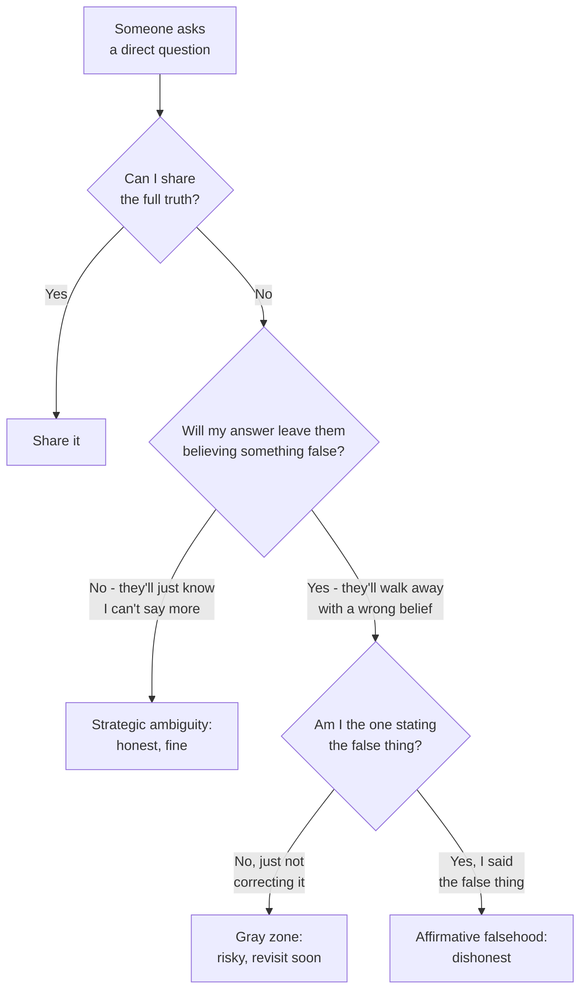

## Where the line actually sits

**Is any answer that leaves someone with an incomplete picture
dishonest?** No — almost every workplace conversation involves leaving
things out, whether for confidentiality, relevance, or simple brevity.
What makes an answer dishonest isn't what it omits, it's whether it
plants a false belief. "I can't discuss specifics" leaves Sam without
an answer. "Yes, totally safe" gives Sam a wrong one. The first is
silence about the truth; the second is a manufactured falsehood — and
that difference is the entire line.

"Plants a false belief" means the listener leaves thinking something
specific that is not true, because of what you said. The test is not
"did I say every fact?" The test is: "will they reasonably walk away
believing X, and do I know X is false?"

Read the diagram as a story: first ask whether you are free to say the
whole truth. If not, your job is to avoid creating a wrong picture. If
the other person invents a wrong conclusion on their own, that is not
automatically the same as you lying — but once you can see the
conclusion forming and they may act on it, you need to redirect it as
much as your constraint allows.

## Withholding vs. lying, side by side

|                                   | Withholding (strategic ambiguity)              | Lying (affirmative falsehood)                         |
| --------------------------------- | ---------------------------------------------- | ----------------------------------------------------- |
| What's said                       | True, but incomplete                           | Untrue, stated as fact                                |
| What the listener walks away with | "I don't have the full picture yet"            | A specific false belief they'll act on                |
| Reversible if it comes out later  | Yes — "I wasn't free to say more" holds up     | No — the person was told something false, on purpose  |
| Trust cost if discovered          | Low to moderate — usually understood as normal | High — reads as a deliberate betrayal, not discretion |

**Reversible** means that, when the full story comes out later, your
earlier answer can still be explained honestly: "I could not say more
then, but I did not tell you the opposite." A lie is not reversible in
that way.

## Why the gray zone still needs care

**If silence isn't a lie, is silence always fine?** Not quite — silence
crosses into risky territory the moment you can see the other person
forming a specific wrong conclusion and you say nothing to redirect
them, especially when they're about to act on it. Priya isn't lying if
she just declines to answer. But if Sam says "okay, so I probably don't
need to update my resume then?" and Priya lets that stand without
correction, she's now permitting a false belief to guide a real
decision — closer to the false side of the line even though she never
said an untrue sentence herself.

So the gray zone is not a clean permission slip. It is an alert: "I may
not have lied yet, but a false belief is becoming practically important."
A safer line is: "I can't confirm specifics, but I would not assume you
do not need a plan B."

## Prepare the honest line before pressure arrives

Gray situations get worse when you improvise under pressure. If you know
someone may ask about something you cannot fully discuss, prepare one
sentence that is true, incomplete, and does not create false comfort:

- "I can't discuss that plan yet, but I would not make decisions as if
  nothing could change."
- "I can't confirm specifics, but this is worth keeping on your radar."
- "I don't want to give you false certainty, and I cannot say more yet."

Preparing the line is not manipulation. It is how you avoid panicking
into either disclosing too much or reassuring someone falsely.

## Timing is a separate axis from truthfulness

**Does it matter when true information gets shared, even if every
individual statement along the way was honest?** Yes — timing is its
own lever, independent of wording. The same fact, disclosed the moment
you're free to share it versus held back for weeks past that point,
can be responsible in one case and harmful in the other. Two people can
each speak only the truth, on identical facts, and still land very
differently: one discloses the instant they're authorized to, the
other sits on it long after there was any real reason to, and someone
makes an avoidable, costly decision in the gap.

In simpler terms, there are two separate questions: **is what I said
true?** and **did I update the person soon enough for the decision they
had to make?** A truthful sentence can still become harmful if it is
left standing after the situation changes.

## The generalizable lesson

**Is this really about Priya and Sam's specific reorg, or does it
generalize?** It generalizes to any situation where you know something
you can't yet fully share — a pending decision, a confidential
negotiation, an unfinished plan. The two questions that matter every
time are the same: does what I'm about to say create a false belief,
not just an incomplete one, and once I'm free to disclose the truth, am
I doing it promptly or sitting on it longer than the constraint
actually requires?

A pending decision could be "the club trip date may change." A
confidential negotiation could be "two teams are discussing a move, but
it is not final." An unfinished plan could be "the budget is being
reviewed." Different setting, same test: do not create false certainty,
and update promptly when the constraint is gone.
