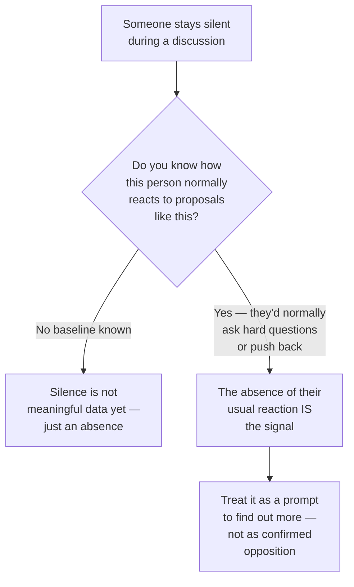

## Why hedge language exists in the first place

**If a director actually has real doubts about a proposal, why not
just say so in the meeting?** Because saying "I don't think this is
right" out loud, in front of the proposer's peers, creates open
conflict that most people in most organizational settings would
rather avoid — especially when their doubts aren't fully formed yet,
or when disagreeing publicly could look like undermining a colleague.
Hedge language exists specifically to let someone avoid committing
to a position without creating that conflict:

Do not read the next table as a secret dictionary where every phrase
always means the same thing. A useful read needs three pieces together:
the phrase, the lack of a concrete next action, and the context you
expected. "Interesting" plus a specific question can be real interest;
"interesting" alone, when real interest would normally ask something
specific, is the signal.

| Phrase                                       | Common subtext                                                              | What it usually is NOT                                                |
| -------------------------------------------- | --------------------------------------------------------------------------- | --------------------------------------------------------------------- |
| "Let's take it offline"                      | "I'm not going to debate this here, and I may not actually follow up"       | A guaranteed commitment to a real follow-up conversation              |
| "Interesting" (alone, no follow-up question) | Polite acknowledgment without endorsement                                   | Genuine enthusiasm — real enthusiasm usually asks a specific question |
| "Worth exploring"                            | Mild, hedged interest that commits to nothing concrete                      | Approval to proceed                                                   |
| "I'd want to think about that"               | Real hesitation being deferred rather than stated                           | A rhetorical formality before agreeing                                |
| "Let me loop in [someone else]"              | Delegating the actual decision (or the risk of saying no) to another person | Simple information-sharing                                            |

"Loop in" just means bringing another person into the conversation.
Sometimes that is normal information-sharing. Sometimes it means "I do
not want to be the person who says yes or no." The difference depends
on whether the next person actually has authority or whether the topic
is being passed around to avoid a clear answer.

**Is every use of these phrases actually a hedge?** No — that's the
central caution of this level. The same words can be literal:
"interesting" sometimes just means interesting. The point isn't to
treat every hedge phrase as coded opposition — it's to notice when
hedge language appears _in place of_ a specific, substantive
reaction to a proposal that would normally get one, and to treat
that gap as worth investigating rather than as settled approval.

## Silence as signal — and its one critical precondition

**If someone says nothing in a meeting, is that itself meaningful?**
Only relative to what they'd normally do — silence is data only when
you know the person's baseline:

Silence from someone who's quiet in every meeting tells you nothing
new. Silence from the one person who reliably asks the hard question,
on exactly the topic where you'd expect them to ask it, is
meaningful precisely because it breaks their own pattern — but even
then, it's a signal to investigate, not a confirmed verdict. They
might have been distracted, might already have raised the concern
privately, or might be saving a bigger objection for a smaller,
lower-stakes setting.

## Turning a read into a question, not an accusation

**Once you suspect a hedge or a meaningful silence, what's the
actual next move?** Not confronting anyone about a guess, and not
quietly assuming the worst — the useful move is a direct, low-stakes
follow-up that turns the ambiguous signal into real information:
"Hey, you were quiet on the proposal — anything I should know before
I go further with it?" This works whether the read was right or
wrong: if there was a real concern, it usually surfaces once asked
directly and privately; if there wasn't, nothing is lost by asking.

Useful follow-up questions sound like this:

- Soft: "I noticed we did not get many concrete questions. Is there a
  risk I should check before going further?"
- Specific: "When you mentioned cost, which cost worries you most:
  infrastructure, maintenance, or priority against other projects?"
- To a senior person: "You were quieter than usual on this topic, and
  I value your read. Is there anything I am missing?"

These are low-stakes because they do not accuse. They give the other
person an easy path to share information.

## Failure modes at this level

- **Treating every hedge phrase as proof of hidden opposition.**
  Some hedges really are just polite filler — reading conspiracy into
  every "let's take it offline" burns trust and wastes energy on
  false signals.
- **Reading silence from someone with no established baseline.**
  Without knowing what someone's normal reaction looks like, their
  silence in one meeting is just an absence, not evidence of
  anything.
- **Acting on a read as if it were confirmed, instead of verifying
  it.** The entire value of noticing subtext is that it prompts a
  direct question — skipping that step and acting on a guess (either
  by dropping the proposal or by escalating conflict) is exactly what
  turns a useful read into a costly overreaction.
