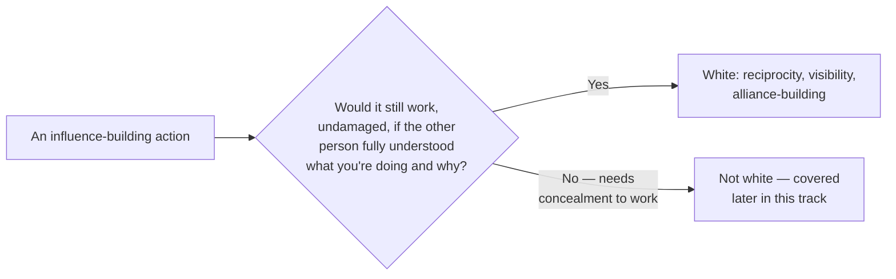

import Scenario from "../../../components/Scenario.astro";

<Scenario>
  <Fragment slot="facts">
    
Engineer A

    

      
📅 12 months of genuine help, no ask attached

      
🙋 3 people offer to back the proposal, unprompted

    

    
Engineer B

    

      
📅 1 month of outreach, right before the ask

      
😐 Polite, lukewarm reception — "networking with an agenda"

    

  </Fragment>

Two engineers both want the same thing eventually: a big proposal that needs
real organizational trust behind it to get adopted. Both spend the year
before that proposal helping colleagues, showing up for people, building
relationships. Neither one ever says anything untrue or manipulative in any
single conversation.

One of them ends up with three people offering to back the proposal before
they even ask. The other gets polite silence, and a private comment that the
outreach felt like "networking with an agenda."

**Before reading on: if neither engineer lied or manipulated anyone, what's
the one variable that explains why only one of them got spontaneous,
unprompted support?**

</Scenario>

It wasn't honesty — both were honest. It was **timing and pattern**: whether the help came with no immediate ask attached, spread out over real time, or arrived compressed into the weeks right before it was needed.

In plain language: Engineer A's help looked like real help because it
stood on its own for months. Engineer B's help looked like preparation
for a request because it arrived right before the request.

- **"White" politics is influence built through mechanisms that are transparent, reciprocal, and would survive being said out loud.** This unit builds directly on `corporate-politics/power-real-resource`'s four sources of power (formal authority, expertise, relationships, information), focused on the legitimate ways to build the latter three.
- **Reciprocity** is the core mechanism of relationship-based influence: consistently helping people — reviewing their work, sharing useful context, covering for them when it matters — builds a real, felt sense of obligation that isn't transactional in the moment, but compounds into people being willing to back you later. This only works if it's genuine; help given purely to extract a later favor reads as transactional and undermines the very trust it's trying to build.
- **Being visibly useful** is different from being useful. Doing good work that nobody outside your immediate team ever hears about builds skill but not influence. Sharing what you learned, presenting results, writing up a postmortem others can learn from — these make real work legible to people who'd otherwise never encounter it, which is a precondition for that work translating into trust beyond your immediate circle.
- **Alliance-building** means deliberately investing in relationships with people whose support you'll eventually need, before you need it — the same principle covered in `power-real-resource`'s L3 case study ("a sponsor who backs a proposal is lending some of their own credibility to it"), generalized from one proposal into an ongoing practice.

Quick vocabulary: a **proposal** is an idea that needs approval or
support; **backers** are people willing to defend or recommend it;
**formal authority** is official permission to decide; **expertise** is
being trusted because your judgment has been good; **relationships**
are trust built with people over time; and **information** is knowing
what decision-makers already care about.

Two ways the exact same kind of help can be given — only one of them builds durable trust:

| &nbsp;                                    | What it produces                                                                                 |
| ----------------------------------------- | ------------------------------------------------------------------------------------------------ |
| Help with an explicit "in exchange for X" | Settles one transaction. Builds no ongoing trust.                                                |
| Help given consistently, no immediate ask | Accumulates as felt goodwill. The other person tends to repay it later, on their own initiative. |

The dividing line between white and the grayer/darker politics covered later in this track isn't "does this involve strategy or awareness of relationships" — all politics involves that. The line is a mechanical test, not a feeling:

- A common misconception this unit corrects: that "white" politics means avoiding self-interest entirely, or that visibly promoting your own work is inherently manipulative. Legitimate influence-building is compatible with real self-interest — the test is the mechanism's honesty and reciprocity, not the presence of a personal motive.
- The practical skill: building influence through help that's genuinely given, work that's genuinely made visible, and relationships genuinely invested in before they're needed — not because it's the "nice" option, but because it's the durable one. Influence built this way survives scrutiny and keeps compounding, where the approaches covered later in this track tend to erode under either.
