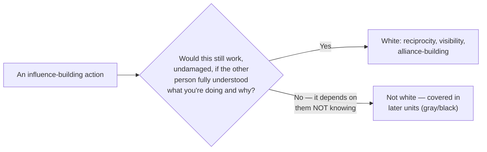
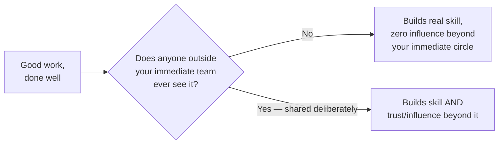

## The dividing line, as a test rather than a feeling

This test is deliberately mechanical, not about intent alone — a genuinely generous favor and a calculated one can look identical from outside, but the test isn't "were you being nice," it's "does this mechanism require concealment to function." Reciprocity built through real help works exactly the same whether or not the other person consciously notices the pattern — telling them "I've been helping you because I value our working relationship" doesn't break it. A manipulation tactic, by contrast, typically stops working the instant it's named.

## Reciprocity: why genuine help compounds differently than transactional help

| Approach                                                           | What it produces                                                                                                                                                                          |
| ------------------------------------------------------------------ | ----------------------------------------------------------------------------------------------------------------------------------------------------------------------------------------- |
| Help given with an explicit, immediate "in exchange for X"         | A transaction — settles the specific exchange, builds no ongoing trust                                                                                                                    |
| Help given consistently, with no immediate ask                     | A felt sense of goodwill that isn't owed anywhere specific, but accumulates — the person helped tends to look for ways to reciprocate on their own initiative, later, without being asked |
| Help given, then explicitly called in as a favor immediately after | Reads as having had an ulterior motive the whole time, retroactively recoloring the original help as transactional                                                                        |

The middle row is the actual mechanism — it requires patience (the payoff isn't immediate or guaranteed) and genuine investment (help given only when it's likely to be noticed and repaid isn't the same pattern), which is exactly why it's slower than more manipulative alternatives but also why it's durable: it doesn't depend on the other person never noticing the pattern.

## Visibility: the gap between doing good work and it mattering for influence

Visibility isn't self-promotion in the sense of exaggerating results — it's the deliberate act of making real work legible to people who'd otherwise never encounter it: a postmortem write-up, a brief share-out of what a project actually involved, a clear explanation of a hard trade-off that was navigated. None of this requires inflating anything; it requires the separate, often-skipped step of actually telling people, in a form they can absorb, what was true anyway.

## Alliance-building as ongoing practice, not a single transaction

`corporate-politics/power-real-resource`'s case study showed a sponsor lending credibility to one specific proposal, and noted that sponsorship depends on a relationship built _before_ the ask. This unit generalizes that: alliance-building means treating relationships with people whose future support might matter as worth investing in continuously — genuinely helping with their priorities, being reliable on commitments, showing up for things that aren't immediately about your own agenda — specifically so that when a real ask eventually comes, it's landing on an already-established foundation of trust, not a cold introduction.
