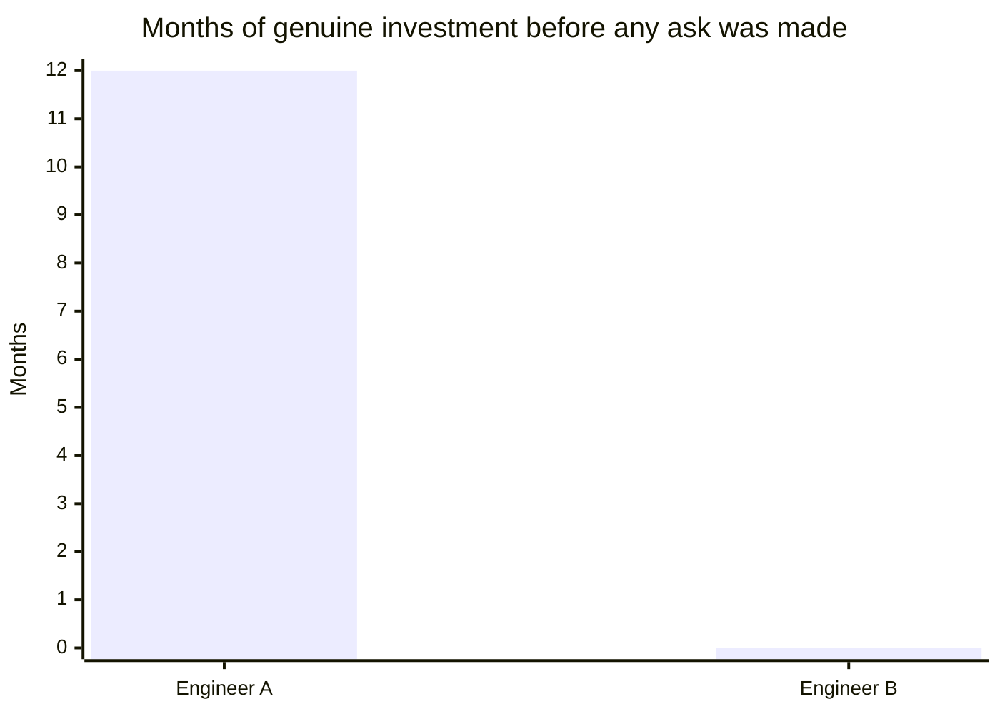

import Scenario from "../../../components/Scenario.astro";

<Scenario label="The scenario">
  <Fragment slot="facts">
    
Both engineers

    

      
🎯 Same eventual goal: propose a big architecture change

      
✅ Every individual conversation, honest — no lies, no manipulation

    

    
Engineer A

    

      
📅 12 months, help spread out, no immediate ask

      
🙋 3 unprompted backers when the proposal drops

    

    
Engineer B

    

      
📅 1 month, outreach compressed right before the ask

      
😐 Lukewarm reception, "networking with an agenda"

    

  </Fragment>

Two engineers, Engineer A and Engineer B, both want to eventually propose and
lead a significant architecture change — the kind of proposal that needs
real organizational trust behind it to get adopted, per
`power-real-resource`'s adoption pipeline. Neither one says anything untrue
or manipulative, in any single conversation, at any point in the year.

**Watch how they spend the year leading up to that proposal differently —
and ask yourself, before reading on: if both are equally honest the whole
way through, what single variable could still produce two completely
different receptions?**

</Scenario>

## Engineer A: the year of legitimate investment

**Months 1–3:** Reviews teammates' PRs thoughtfully and promptly, including ones outside strict obligation. Helps a struggling colleague debug a gnarly production issue late on a Friday, with no ask attached. None of this is framed as an investment — it's just consistently being a good, reliable colleague.

If the technical words are new: a PR is a proposed code change that
someone else reviews; debugging means finding and fixing the cause of a
problem; a production issue is a real problem affecting the live
service, not just a practice exercise.

**Months 4–6:** Writes up a detailed postmortem after an incident A helped resolve, shared team-wide — not self-promotional, just genuinely useful, and it makes A's judgment on that class of problem visible to people outside A's immediate team for the first time. Presents a short, well-received share-out on a technique that solved a real recurring pain point.

The important move is not "look at me." It is "here is what happened,
what we learned, and how others can avoid the same problem." That makes
real judgment visible without inventing credit.

**Months 7–9:** Proactively helps a colleague on an adjacent team prepare for a high-stakes internal presentation, purely because it seemed genuinely useful and the colleague was stressed about it — no connection yet to A's own eventual proposal.

An adjacent team is a nearby team whose work touches yours. A
high-stakes presentation is one where the outcome matters for that
person's work or reputation.

**Months 10–12:** A drafts the architecture proposal. When floating it informally first, three separate people — the colleague from the Friday debugging session, someone who read the postmortem, and the adjacent-team colleague from the presentation prep — independently offer to back it, without being asked, because each has their own accumulated, genuine reason to trust A's judgment and want to help.

## Engineer B: the shortcut

**Months 1–9:** Does solid individual work, kept mostly within their own team, with no particular effort toward visibility or cross-team relationships — not bad, just not building anything beyond immediate scope.

**Month 10:** Realizing a big proposal is coming, B starts scheduling "coffee chats" with several senior people B hasn't previously had much relationship with, each one steering quickly toward B's own upcoming proposal and asking for support.

**Month 11:** B drafts and shares the proposal. Response is polite but lukewarm — several of the people B met with a month earlier don't actively object, but don't advocate for it either; one privately remarks that B's outreach felt like "networking with an agenda," even though B never said anything untrue or manipulative in any single conversation.

## Why the same underlying goal produced different outcomes

Nothing B did was dishonest — every individual coffee chat was a genuine, above-board conversation. What differed is exactly the reciprocity mechanism from L2: A's help was consistently given with no immediate ask, accumulating goodwill that people repaid on their own initiative later; B's outreach was compressed into a single month, explicitly aimed at an immediate ask, which reads — accurately — as transactional, even without any single instance of dishonesty. The transparency test from L2 makes this precise: A's pattern would work identically if fully explained ("I invest in helping colleagues because I think it's the right way to work, and yes, it also means people trust my judgment when I need that trust later"); B's compressed, ask-adjacent outreach reads differently once its timing and pattern are visible, even though B never said anything false.

Side by side, the two years look identical on every honesty measure and completely different on one dimension:

| &nbsp;                               | Engineer A                            | Engineer B                              |
| ------------------------------------ | ------------------------------------- | --------------------------------------- |
| Any dishonest statement, ever?       | No                                    | No                                      |
| Months of investment before an ask   | ~9–12                                 | 0 (outreach and ask are the same month) |
| Help framed as help, or as outreach? | As help — no ask attached at the time | As outreach — steered toward the ask    |
| Reception when the ask finally comes | 3 unprompted backers                  | Polite, lukewarm, one direct pushback   |

## Failure modes

- **Starting influence-building only once you need it.** B's mistake wasn't dishonesty — it was timing. The same actions, spread genuinely across years rather than concentrated right before an ask, would read completely differently, because reciprocity specifically depends on not being tightly coupled to an immediate, visible payoff.
- **Treating visibility-building as inherently self-promotional, and avoiding it out of discomfort.** Some people avoid A's month-4-6 postmortem-sharing and presenting out of a feeling that it's boastful — but per L2, this is different from exaggeration; sharing real, useful work accurately isn't self-promotion, it's making true information available to people who'd benefit from it, and avoiding it entirely just means good work stays invisible to anyone who could otherwise trust it.
- **Confusing "genuine" with "unstrategic."** A's choices weren't random acts of kindness with zero awareness of their broader value — A plausibly understood, at some level, that this pattern of behavior builds trust and influence over time. Genuine and strategic aren't opposites; the test from L2 isn't "did you have zero self-interested awareness," it's whether the mechanism requires the other person not understanding what's happening.
- **Assuming this approach guarantees a specific outcome.** A's proposal getting real, unprompted support is a plausible and common result of this pattern, not a certainty — legitimate influence-building improves the odds a good proposal gets a fair hearing; it doesn't guarantee adoption of a proposal that's actually wrong, and treating it as a magic formula misunderstands what it's actually doing.

## Beyond this example

  🏗️ This architecture proposal
  &rarr;
  💼 Whatever you're building toward right now

Engineer A and Engineer B are one case, not the whole territory — a few questions to test whether the model transferred, not just the specific year described above:

- What if Engineer A's year of genuine help had gone almost entirely unnoticed — no postmortem got much attention, no presentation landed well? Does the reciprocity mechanism still "work" if the visibility half never lands, or does A end up in the same position as someone who did good work with zero influence beyond their immediate circle?
- Engineer B wasn't malicious, just late and compressed. What would it look like for someone to run the exact same one-month compressed outreach, but for reasons that really were manipulative — deliberately picking targets based on formal power alone, with no intention of ever reciprocating? Would the outward pattern look any different from B's, or would it take much longer to become visible?
- Think of a real ask you'll eventually need to make — a promotion case, a proposal, a request for someone's public support. Using the table above: how many months of genuine, no-strings investment do you currently have banked with the people whose backing you'd need, and is there still time to close that gap before the ask has to happen?
