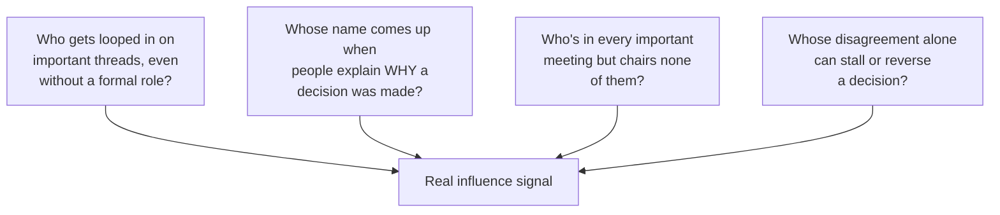
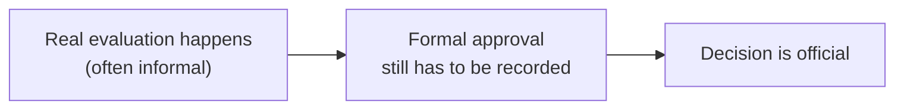

import LevelIntro from "../../../components/LevelIntro.astro";
import Checkpoint from "../../../components/Checkpoint.astro";

L1 showed that the formal org chart and the real decision network can be two different
maps of the same org. This level gets concrete: what does the informal network actually
look like when you go looking for it, and how do you trace it yourself?

<LevelIntro
  items={[
    "The 4 observable signals of real influence",
    "A repeatable exercise: trace the last three decisions",
    "Why mapping influence differs from just networking",
  ]}
/>

## Influence leaves traces, even when it's informal

**If the informal decision network isn't written down anywhere, how do you actually find
it?** It's genuinely invisible on any org chart — but it isn't invisible in practice. It
leaves consistent, observable traces in how decisions actually happen:

Applied to the CI-proposal incident: the senior IC was consistently cc'd on infrastructure
threads despite no formal role requiring it; when the director explained the approval,
they cited the IC by name; and the IC would have shown up, if anyone had been watching, at
every infrastructure-adjacent conversation without chairing a single one of them. All four
signals point at the same person — that convergence is what makes the informal network
legible, once you know to look for it.

Plain terms: being looped in or cc'd means someone is included in the
conversation even when they do not own it. A thread is a written
conversation. Chairing a meeting means officially leading it. If a
person keeps appearing, being cited, or slowing a decision by
disagreeing, that is a signal of real influence.

<Checkpoint question="Suppose someone is invited to every planning meeting, but they never speak up, are never cited when a decision is explained afterward, and their absence has never once changed an outcome. Do they count as a real-influence signal by these four criteria?">

No. Simply being present or invited isn't one of the four signals on its own — the
signals are about what happens _around_ a person's involvement: being looped in on
threads they don't own, being named when a decision is explained, appearing across
meetings without chairing any of them, or having disagreement alone stall a call. A
silent, uncited, outcome-neutral presence in the room satisfies none of those — it's
attendance, not influence. The four signals exist precisely to separate "this person is
in the room" from "this person's judgment shapes what happens in the room," and this
case is squarely the former.

</Checkpoint>

## A concrete exercise: trace the last three decisions

**Rather than guessing at who holds influence, what's an actual, doable way to find out?**
Pick the last three significant decisions in your area and, for each one, write down not
who signed off, but **who was actually consulted before the decision was made**:

| Decision                 | Who formally approved | Who was actually consulted first                 |
| ------------------------ | --------------------- | ------------------------------------------------ |
| CI vendor change         | Director              | Senior IC (infra), one platform lead             |
| Team reorg               | VP                    | Two team leads, one senior IC (different domain) |
| New service architecture | Director              | Senior IC (infra) again, a principal engineer    |

**A name appearing in the "actually consulted" column more than once, across otherwise
unrelated decisions, is the single strongest signal of real influence this exercise can
produce** — it's not a one-off relationship, it's a consistent pattern of being the person
whose judgment gets checked before a call is made.

You can run the same exercise outside a company: list the last three
decisions in a class project, family business, club, or community
group. Do not only write who had the official right to decide; write
whose opinion people checked before the decision felt safe.

## Why this differs from just "networking"

**Is this just a more elaborate way of saying "build relationships with important
people"?** Not quite — the exercise above is diagnostic, not aspirational. It's not about
deciding who to befriend; it's about accurately mapping _how decisions in your specific
org actually happen_, so that when you need something approved, you know whether the
correct move is the formal channel, an informal conversation, or — most often — both,
because the formal approval still has to happen even after the real evaluation occurs
informally first.

The CI proposal's mistake wasn't skipping the formal chain — the formal approval still had
to happen, and did. The mistake was treating the formal chain as the _only_ step, when in
this org, for this category of decision, a real evaluation step existed upstream of it
entirely.

<Checkpoint question="A colleague hears about this exercise and decides the real lesson is to start scheduling coffee chats with whoever their trace-the-last-three-decisions exercise turns up, regardless of whether they have any actual proposal to discuss with them. Is that the skill this section is describing?">

No, and the distinction matters. The exercise is diagnostic — its output is a map of
where real evaluation happens for a given category of decision, so that when you
actually have a well-reasoned case to make, you know whether to route it through the
formal channel, an informal conversation first, or both. Scheduling relationship-building
chats with influential people independent of any real proposal is the aspirational,
networking version this section explicitly contrasts itself with. The map is the same
either way, but using it to curry favor rather than to get a genuine case properly
evaluated is exactly the misuse the next section calls out — it substitutes access for
merit instead of using access to get merit a fair hearing.

</Checkpoint>

## This is a map, not a strategy — using it well matters

**Once you can see the informal network, what's the actual, legitimate use of that
information?** Two very different responses to the same map:

- **Legitimate**: when you have a real, well-reasoned proposal, get feedback from the
  people who actually shape decisions in that area early, the same way you'd seek out a
  domain expert's review before finalizing a design — this improves the proposal and
  surfaces objections before they become a stalled decision.
- **Not what this unit is teaching**: currying favor with influential people regardless of
  whether your actual case has merit, or using the map purely to route around people whose
  formal approval you're supposed to earn on the substance.

The map is the same either way — what separates the two is whether the underlying case is
actually sound, and whether the formal process still gets respected once the informal
evaluation is done.

"Currying favor" means trying to win someone over through flattery or
useful favors instead of through the strength of the case. Mapping
influence is legitimate when it helps you get better feedback and
respect the formal decision; it turns unhealthy when it becomes a way
to dodge the people or standards that should still evaluate the work.
