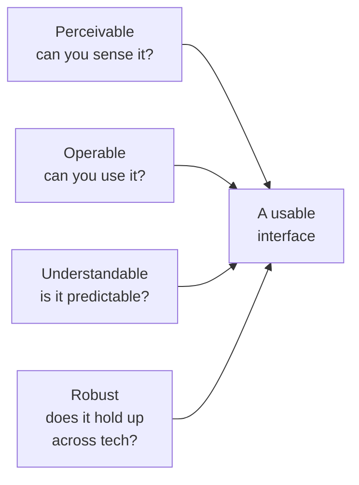

import Scenario from "../../../components/Scenario.astro";
import LevelIntro from "../../../components/LevelIntro.astro";

<Scenario>
  <Fragment slot="facts">
    
Three barriers, one checkout

    

      
✕ <strong>Close button</strong> — icon only, no accessible name

      
🏷️ <strong>Email field</strong> — placeholder text used as the only label

      
🎨 <strong>Error text</strong> — light red on white, 2.3:1 contrast

    

    
Each barrier ships invisibly — the page looks completely normal on a screen with a mouse and good vision.

  </Fragment>

A team ships a checkout redesign. It looks great, QA signs off, launch goes fine — for a few weeks. Then support tickets start arriving: "I can't tell what this button does," "my screen reader just says 'button' over and over," "I can't read the error message, it's too faint." None of these are bugs in the usual sense — nothing crashed, nothing is `undefined`. The `×` button really is a button. The email field really does have a placeholder that says "Email." The error text really is red.

**If every element technically works, why can some people not complete checkout at all?**

</Scenario>

Because "works" quietly meant "works for one specific way of using a computer" — a mouse, full color vision, fine motor control, no assistive technology in the loop. The moment any of those assumptions doesn't hold, the same markup that passed QA becomes a wall.

<LevelIntro
  items={[
    "The four qualities every accessible interface needs (POUR)",
    "Disability categories and what each one actually needs from a design",
    "WCAG conformance levels, and what 'accessible' means as a checkable claim",
  ]}
/>

## The shape of the problem

- **Accessibility** is the practice of designing and building things so people with a wide range of abilities — vision, hearing, motor control, cognition — can actually use them, not just view them.
- It's usually framed around **disability**, but the same design choices also help someone with a broken arm, a bright-sunlight glare on their phone, a slow connection, or a toddler on their lap holding the mouse hand hostage. Accessible design tends to be _better_ design for everyone under constraint, not a narrow accommodation for a narrow group.
- **"We'll add it later" fails structurally, not just in practice.** Accessibility is rarely one feature you can bolt on — it's dozens of small decisions (is this a `<button>` or a `
`? does this color pass contrast? does this modal trap keyboard focus?) baked into markup and layout choices made on day one. Retrofitting means re-opening components that shipped months ago, under a deadline nobody budgeted for, instead of making the same decision correctly once.
- The excuse "it's for a small number of users" undercounts badly: the World Health Organization estimates over a billion people live with some form of disability, and that's before counting _situational_ and _temporary_ limitations — a sprained wrist, a noisy room, a cracked phone screen.

## Four qualities an interface needs: POUR

WCAG (the Web Content Accessibility Guidelines) organizes every accessibility requirement under four principles, nicknamed **POUR**:

| Principle          | Plain question                                                         | Fails when...                                                                                |
| ------------------ | ---------------------------------------------------------------------- | -------------------------------------------------------------------------------------------- |
| **P**erceivable    | Can it be sensed at all — seen, heard, or felt?                        | An icon-only button has no text alternative for a screen reader                              |
| **O**perable       | Can it be used without a mouse, or without fine motor control?         | A dropdown only opens on `mouseover`, with no keyboard equivalent                            |
| **U**nderstandable | Is the content and behavior predictable?                               | An error message says "Invalid input" with no hint what's actually wrong                     |
| **R**obust         | Does it keep working across browsers, zoom levels, and assistive tech? | A custom checkbox built from a styled `
` that no screen reader recognizes as a checkbox |

All four are load-bearing at once — the checkout page in the scenario above fails Perceivable (icon button, low-contrast error) and Understandable (placeholder-as-label disappears once you start typing) simultaneously, from two completely different root causes.

## Who "different abilities" actually means

"Accessibility" tends to conjure one mental image — a screen-reader user who is fully blind. That's one real case among several very different ones, each needing a different fix:

| Category                                                          | Example need                                                                                 | What design has to provide                                                       |
| ----------------------------------------------------------------- | -------------------------------------------------------------------------------------------- | -------------------------------------------------------------------------------- |
| Visual (blind, low vision, color blindness)                       | A way to perceive content without relying on sight, or with limited/altered color perception | Text alternatives, sufficient contrast, meaning never conveyed by color alone    |
| Auditory (deaf, hard of hearing)                                  | A way to get audio content without hearing it                                                | Captions, transcripts, visual alerts instead of audio-only cues                  |
| Motor (limited fine motor control, no mouse use, tremor)          | A way to operate everything without precise pointing                                         | Full keyboard operability, large enough click/tap targets, no strict time limits |
| Cognitive (memory, attention, reading, or processing differences) | Predictable, simple, forgiving interactions                                                  | Clear language, consistent navigation, error messages that say what to fix       |

**Guiding question: does the checkout scenario above map to just one row of this table, or several?** Several — the icon-only button hits Visual and Cognitive at once (no text alternative _and_ no plain-language cue), the placeholder-only label hits Cognitive (the hint vanishes exactly when it's needed most), and the low-contrast error hits Visual. One redesign, four different unmet needs.

## What "accessible" means as a checkable claim

WCAG doesn't leave "accessible" as a vibe — it defines three **conformance levels**, each one a stricter bar than the last:

| Level                                        | What it means                                                            | Example criterion                     |
| -------------------------------------------- | ------------------------------------------------------------------------ | ------------------------------------- |
| **A** (minimum)                              | Basic barriers removed — without this, some users are completely blocked | Every image has alternative text      |
| **AA** (the common legal/industry target)    | Barriers reduced to a broadly usable level for most assistive tech       | Text contrast ratio of at least 4.5:1 |
| **AAA** (highest, rarely required site-wide) | The strictest bar, sometimes impossible to hit for all content types     | Text contrast ratio of at least 7:1   |

Most organizations target **AA** — it's what most accessibility laws and procurement standards reference, and AAA is generally reserved for specific high-stakes content rather than an entire site, since some AAA criteria (like the 7:1 contrast ratio) are genuinely hard to satisfy with a full brand color palette.

Designing accessibly from the start isn't a separate track of work bolted onto "real" design — it's the same design decisions (what element is this, what does this color communicate, can this be reached without a mouse) made with the full range of users in view the first time, instead of a second time under a deadline.
