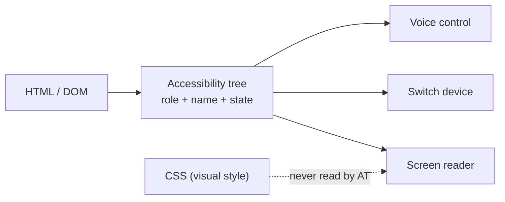

import Scenario from "../../../components/Scenario.astro";
import LevelIntro from "../../../components/LevelIntro.astro";
import Checkpoint from "../../../components/Checkpoint.astro";

<Scenario label="Same pixels, different markup">
  <Fragment slot="facts">
    <p class="not-prose mb-1 text-xs font-semibold tracking-wide text-slate-400 uppercase">Two "buttons"</p>
    <div class="not-prose grid grid-cols-1 gap-2 text-xs sm:grid-cols-2">
      <div class="rounded border border-rose-300 p-2 dark:border-rose-800">
        <div class="font-mono">&lt;div onclick&gt;Save&lt;/div&gt;</div>
        <div class="mt-1 text-rose-600 dark:text-rose-400">Screen reader hears: nothing clickable announced</div>
      </div>
      <div class="rounded border border-emerald-300 p-2 dark:border-emerald-800">
        <div class="font-mono">&lt;button&gt;Save&lt;/button&gt;</div>
        <div class="mt-1 text-emerald-600 dark:text-emerald-400">Screen reader hears: "Save, button"</div>
      </div>
    </div>
  </Fragment>

A designer hands off a mockup with a styled `<div>` that looks exactly like a button — right color, right padding, right hover state — and an engineer wires up an `onclick` handler on it. Visually, it's indistinguishable from a real `<button>`. It responds to a mouse click identically.

**A screen reader user tabs through the page. Do they ever land on this "button" at all?**

</Scenario>

They don't — a `<div>` isn't in the browser's list of focusable, interactive elements by default, so Tab skips straight past it, and even if a screen reader user did somehow land on it, there'd be no announcement telling them it's clickable. The pixels lied about what the element actually is.

<LevelIntro
  items={[
    "The accessibility tree — what assistive tech reads instead of pixels",
    "Semantic HTML first, ARIA only to patch a real gap",
    "Role, name, and state — the three things every control must expose",
  ]}
/>

## From DOM to what assistive tech actually hears

**Guiding question: when a screen reader announces "Save, button," where does it get that sentence from — the CSS, the DOM, or something else entirely?**

Neither, directly. The browser builds a separate, parallel structure alongside the DOM called the **accessibility tree**: for every element, it computes a **role** ("button," "link," "checkbox"...), an **accessible name** (the label a person would use to refer to it), and a **state** (checked, expanded, disabled...). Assistive technology — screen readers, switch devices, voice control — reads _that_ tree, not the raw HTML and never the CSS.



A native `<button>` gets `role: button` for free, straight from the HTML spec — the browser computes it automatically. A `<div onclick>` gets `role: generic` (effectively nothing) unless someone manually tells the browser otherwise. Visually identical; structurally, one exists in the accessibility tree as an interactive control and the other doesn't exist there at all.

## The first rule of ARIA: don't reach for it first

**Guiding question: if a `<div>` can be given a role, a name, and keyboard handling manually, why does the specification itself say "no ARIA is better than bad ARIA"?**

ARIA (Accessible Rich Internet Applications) attributes — `role`, `aria-label`, `aria-expanded`, and dozens more — exist to describe custom widgets that have no native HTML equivalent, like a tab panel or a combobox. They can retrofit a role onto a `<div>`:

```html
<!-- Retrofitted: works, but every behavior has to be built by hand -->
<div
  role="button"
  tabindex="0"
  aria-label="Save"
  onclick="save()"
  onkeydown="if(event.key==='Enter')save()"
>
  Save
</div>
```

```html
<!-- Native: the browser already provides role, focus, and Enter/Space activation -->
<button onclick="save()">Save</button>
```

Both can end up accessible — but the `<div>` version only works if _every_ expected behavior is added by hand: it needs `tabindex="0"` to be reachable by Tab, a manual `aria-label` or visible text for the name, and a keydown handler so Enter _and_ Space both activate it, because native buttons respond to both and a screen reader user will expect that. Miss any one of those and it's a plausible-looking button that's silently broken for keyboard and screen-reader users. The native `<button>` gets all of it — role, focus, name from its own text content, Enter and Space handling — from the browser, with no ARIA at all. This is the practical meaning of "no ARIA is better than bad ARIA": adding `role="button"` without also adding the keyboard behavior real buttons have is worse than leaving it a plain `<div>`, because it _claims_ to be a button to assistive tech while failing to act like one.

<Checkpoint question="A component library ships a custom dropdown built entirely from styled `<div>` and `<span>` elements, with `role='listbox'` and `role='option'` added on each one. No keyboard handling was added anywhere. Is this component more or less trustworthy to a screen reader user than one built with no ARIA at all?">

Less trustworthy, and specifically in a way that's worse than doing nothing. Adding `role="listbox"`/`role="option"` makes the accessibility tree _claim_ this is a fully interactive list a screen reader user can navigate with arrow keys and select with Enter — that claim is exactly what a screen reader announces. When the actual keyboard behavior isn't there, the user gets a confident, false promise: they hear "listbox, 5 options" and then nothing responds when they try to use it the way that announcement told them to. A plain unstyled list with no role at all would at least not set that expectation. The lesson generalizes: an ARIA role is a contract about behavior, not just a label — adding the role without the behavior is a broken promise, not a partial win.

</Checkpoint>

## Every interactive control needs three things

Whatever markup produces it — native element or ARIA-patched `<div>` — the accessibility tree only helps a user if these three are all present and correct:

| Property            | Answers                                                         | Common failure                                                                                                              |
| ------------------- | --------------------------------------------------------------- | --------------------------------------------------------------------------------------------------------------------------- |
| **Role**            | What kind of thing is this? (button, checkbox, link, dialog...) | A clickable `<div>` with no role — announced as nothing interactive                                                         |
| **Accessible name** | What do I call this when I refer to it?                         | An icon-only button (`<button><svg/></button>`) with no visible text and no `aria-label` — announced as "button," full stop |
| **State**           | What condition is it in right now?                              | A custom checkbox that changes color when checked but never updates `aria-checked` — always announced as unchecked          |

The accessible name specifically has a defined lookup order the browser follows: `aria-label`, if present, wins outright; otherwise it falls back to `aria-labelledby` (referencing another element's text), then a `<label>` associated via `for`/`id`, then the element's own visible text content, then a `title` attribute as a last resort. Getting this order wrong is a frequent source of confusing bugs — for example, adding an `aria-label` to a button that already has clear visible text will _override_ that visible text for screen reader users, so the two can end up saying different things.

## Keyboard as the universal test

**Guiding question: why does "can I use this with only a keyboard, no mouse at all" catch so many different kinds of accessibility bugs at once?**

Because keyboard operability isn't just a motor-accessibility concern — it's also _how screen readers navigate_. A screen reader user isn't clicking around with a mouse; they're moving focus with Tab, Shift+Tab, and arrow keys, and activating things with Enter or Space. Anything that only responds to `mouseover`, `mousedown`, or a click event with no keyboard equivalent is invisible to both a keyboard-only user _and_ a screen reader user, for the same underlying reason: neither one is generating mouse events.

A fast, reliable first check for any new interactive component: unplug the mouse (or just don't touch it) and try to complete the whole task with Tab, Shift+Tab, Enter, Space, and arrow keys alone. Three things to watch for:

- **Can you reach it?** Every interactive element should be in the Tab order exactly once — not skipped, not hit twice.
- **Can you tell where focus is?** A visible focus outline has to survive — a common, damaging mistake is `outline: none` in CSS with no replacement focus style, which removes the _only_ visual cue for where keyboard focus currently is.
- **Can you escape it?** A modal or menu that traps focus permanently, with no keyboard path out, is called a **keyboard trap** — WCAG treats it as a serious failure because it can leave a keyboard-only user stuck on the page with no way to reach anything else.

<Checkpoint question="A settings panel opens as an overlay when a button is clicked, and everything inside it is reachable and operable by keyboard. Does that alone guarantee it's not a keyboard trap?">

No. Reachability and operability inside the panel is necessary but not sufficient — a keyboard trap is specifically about _exiting_. If Tab cycles endlessly through the panel's own controls and there's no keyboard path back out (no Escape handling, and Tab never reaches whatever comes after the panel in the page), a keyboard-only user can open the panel and then be stuck inside it indefinitely, unable to reach the rest of the page at all. Everything being individually operable inside a trap doesn't help if there's no way to leave it — the check has to include "and can I get back out," not just "can I interact with what's here."

</Checkpoint>

L3 walks a real audit end to end — an icon-only button with no accessible name, a modal with a keyboard trap, a contrast failure, and a form field relying on a placeholder as its only label — with the actual before/after markup for each fix.
