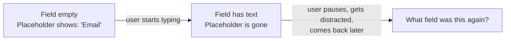

import Scenario from "../../../components/Scenario.astro";
import LevelIntro from "../../../components/LevelIntro.astro";
import Checkpoint from "../../../components/Checkpoint.astro";

<Scenario label="The audit">
  <Fragment slot="facts">
    <p class="not-prose mb-1 text-xs font-semibold tracking-wide text-slate-400 uppercase">4 findings — "Notify me" signup modal</p>
    <div class="not-prose flex flex-col gap-1.5 text-sm text-slate-700 dark:text-slate-300">
      <div>1. Close button — no accessible name (Perceivable)</div>
      <div>2. Modal — no focus trap, no <code>role="dialog"</code> (Operable)</div>
      <div>3. Error text — 2.3:1 contrast, fails AA (Perceivable)</div>
      <div>4. Email field — placeholder used as label (Understandable)</div>
    </div>
    <p class="not-prose mt-3 text-xs text-slate-500 dark:text-slate-400">All four passed visual QA and a mouse-driven manual test. None were caught until an audit specifically tested with keyboard and a screen reader.</p>
  </Fragment>

A product team asks for an accessibility audit of a "Notify me when back in stock" modal before a launch. It looks finished: clean layout, on-brand colors, a close `×` in the corner, a single email field, inline validation. Manual QA — click through it with a mouse, check the layout at a few screen sizes — passed clean.

**The auditor's first move isn't reading the code. It's unplugging the mouse and turning on a screen reader. What does that immediately surface that a visual pass through the same modal never would?**

</Scenario>

Four separate, unrelated failures — each one invisible unless you specifically test the thing it breaks. This level walks each finding the way the audit actually found it: what the auditor experienced, the markup that caused it, and the fix.

<LevelIntro
  items={[
    "Four real findings: name, focus, contrast, and labeling",
    "The exact before/after markup for each fix",
    "How to prioritize when you can't fix everything before launch",
  ]}
/>

## Finding 1: the icon-only close button

The auditor tabs to the modal's close control and hears the screen reader announce a single word: **"button."** Not "close," not "dismiss" — just the fact that some button exists, with nothing about what it does.

```html
<!-- Before: an SVG icon, no text anywhere for the accessible name to fall back to -->
<button onclick="closeModal()">
  <svg viewBox="0 0 24 24"><path d="M6 6l12 12M18 6L6 18" /></svg>
</button>
```

The accessible-name lookup order from L2 explains exactly why this fails: no `aria-label`, no `aria-labelledby`, no associated `<label>` (buttons don't take one anyway), and the element's own text content is empty — an SVG's internal path data isn't text. The lookup runs out of places to look and falls back to nothing, so the browser exposes the bare role with an empty name.

```html
<!-- After: one attribute, and the announcement becomes usable -->
<button onclick="closeModal()" aria-label="Close">
  <svg viewBox="0 0 24 24" aria-hidden="true">
    <path d="M6 6l12 12M18 6L6 18" />
  </svg>
</button>
```

Two changes: `aria-label="Close"` gives it a name, and `aria-hidden="true"` on the decorative SVG stops the screen reader from trying (and failing) to describe the icon's raw path data as if it were meaningful content. Announcement after the fix: **"Close, button."**

<Checkpoint question="The fix used `aria-label='Close'` instead of adding visible text next to the icon that says 'Close.' Both would fix the screen reader announcement — so why might visible text actually be the better fix here, not just an equally valid alternative?">

Because `aria-label` only helps people who can't see the icon in the first place — it does nothing for someone with low vision who can see there's a button but can't tell what a small `×` glyph means, or a new user who simply doesn't recognize the icon convention. Visible text ("Close") fixes the ambiguity for everyone looking at the screen, while an `aria-label` fixes it only for screen reader users, leaving the visual ambiguity untouched for everyone else. `aria-label` is the right tool when space genuinely doesn't allow visible text (a small icon-only toolbar button, say), but it's a narrower fix than it looks — reaching for visible text first, and `aria-label` only when that's truly not an option, closes a wider set of gaps with one change.

</Checkpoint>

## Finding 2: the modal that isn't a real dialog

With the close button fixed, the auditor tries to use the modal by keyboard alone. Tab moves focus _through_ the modal's controls and then out into the page behind it — the modal is still open, but focus has silently left it. Reversing direction, Shift+Tab from the email field jumps backward into page content the modal is supposed to be blocking.

```html
<!-- Before: a positioned div with no role, no focus management -->
<div class="modal">
  <button aria-label="Close">...</button>
  <h2>Get notified</h2>
  <input type="text" placeholder="Email" />
  <button>Notify me</button>
</div>
```

Nothing in this markup tells the accessibility tree "this is a dialog, and everything outside it is currently inert." A sighted mouse user experiences the modal as blocking the page because of an overlay's CSS `z-index` and a semi-transparent backdrop — but a screen reader user, navigating by the accessibility tree rather than by what's visually on top, isn't blocked by CSS at all. This is a **keyboard trap** in reverse: not stuck inside, but able to wander into content that's supposed to be unreachable while the modal is open.

```html
<!-- After: role, modal state, and a labeled dialog -->
<div
  class="modal"
  role="dialog"
  aria-modal="true"
  aria-labelledby="modal-title"
>
  <button aria-label="Close">...</button>
  <h2 id="modal-title">Get notified</h2>
  <input type="text" id="email" />
  <button>Notify me</button>
</div>
```

`role="dialog"` tells the accessibility tree what this element is. `aria-modal="true"` is the signal that everything outside it should be treated as inert while it's open. `aria-labelledby="modal-title"` gives the dialog itself an accessible name, borrowed from its own heading, so a screen reader announces _what_ dialog just opened ("Get notified, dialog") rather than just "dialog."

Markup alone doesn't finish the job — `aria-modal` describes the _intended_ behavior, but the actual behavior still has to be implemented: when the dialog opens, focus needs to move to the first focusable element inside it (here, the close button or the email field); Tab and Shift+Tab need to cycle only among the dialog's own controls, never escaping into the page behind it; and pressing Escape needs to close the dialog and return focus to whatever button originally opened it, so the keyboard user ends up back where they started rather than lost at the top of the page.

## Finding 3: the error text that fails contrast

The auditor submits the form with an invalid email to check the error state, and even with normal vision finds the red error text hard to read against the white background.

| Element             | Foreground | Background | Ratio   | AA (4.5:1)? |
| ------------------- | ---------- | ---------- | ------- | ----------- |
| Error text (before) | `#f28b8b`  | `#ffffff`  | 2.3 : 1 | Fails       |
| Error text (after)  | `#c02626`  | `#ffffff`  | 5.9 : 1 | Passes      |

The fix here isn't a markup change at all — same `<p class="error">`, same DOM structure — it's purely a color value. This is exactly the failure mode L2's visual-design-fundamentals unit walks in detail: a light, "friendly" red can look intentional and on-brand while still being mathematically too close in luminance to white for reliably readable text. Nothing about "this red looks like an error color" catches that on its own — only checking the actual ratio does.

## Finding 4: the label that disappears exactly when it's needed

Look again at the "before" markup from Finding 2: `<input type="text" placeholder="Email" />`. Visually, this looks labeled — the word "Email" sits right there in the field. The problem is _when_ it's there.



A placeholder isn't a label — it's a hint that disappears the instant there's any content in the field, which is precisely when a user (anyone, not only someone with a cognitive or memory-related disability) is most likely to have looked away and need the reminder. It's also invisible to the accessible-name lookup order in a way many people assume it isn't: some screen readers do announce placeholder text, but inconsistently, and it's never a substitute for a real programmatic label.

```html
<!-- Before: a hint, not a label -->
<input type="text" placeholder="Email" />
```

```html
<!-- After: a real label, permanently visible, programmatically associated -->
<label for="email">Email</label>
<input type="text" id="email" placeholder="you@example.com" />
```

The fix keeps a placeholder — placeholders are genuinely useful as _examples_ of expected format — but adds a real `<label for="email">` tied to the input's `id`. Now the label is always visible, and `aria-label`'s fallback chain from L2 finds it directly instead of running out of places to look.

## Prioritizing when you can't fix everything before launch

Not every audit finding can be fixed the same day. Severity — how completely a finding blocks someone, not how easy it looks to fix — is what should drive the order:

| Finding                   | Blocks                                                                  | Severity                                                               | Fix effort                                        |
| ------------------------- | ----------------------------------------------------------------------- | ---------------------------------------------------------------------- | ------------------------------------------------- |
| Close button has no name  | Screen reader users can't tell what the button does                     | High — confusing, not fully blocking (they can still guess or explore) | Trivial — one attribute                           |
| Modal isn't a real dialog | Screen reader users can wander into page content the modal should block | High — breaks the core interaction model                               | Moderate — role, state, and real focus management |
| Error text contrast       | Low-vision users may not perceive the error at all                      | High — can fully block task completion                                 | Trivial — one color value                         |
| Placeholder-as-label      | Anyone who pauses mid-form loses the field's identity                   | Medium — recoverable, but adds real friction                           | Trivial — one `<label>`                           |

Three of these four findings are a single attribute or a single color value — genuinely cheap once found. The expensive part was never the fix; it was that none of the four were caught by a visual pass with a mouse, because none of them are visible that way. That's the real cost of "we'll add accessibility later": not that the fixes are hard, but that finding them requires testing with keyboard and assistive tech specifically, which a deadline-driven visual QA pass simply doesn't do unless someone builds it in from the start.

**This modal is one worked case, not the whole territory.** The same four categories of failure — missing accessible names, broken focus management, insufficient contrast, and labels that vanish — show up constantly in completely different components: a data table with sortable columns, a multi-step wizard, a custom date picker. Before moving on, it's worth asking: if this had been a banking app's password-reset flow instead of a "notify me" signup — used disproportionately by an older population with a higher rate of low vision and reduced fine motor control — would the priority order in the table above change, and which finding would you refuse to ship without first?
