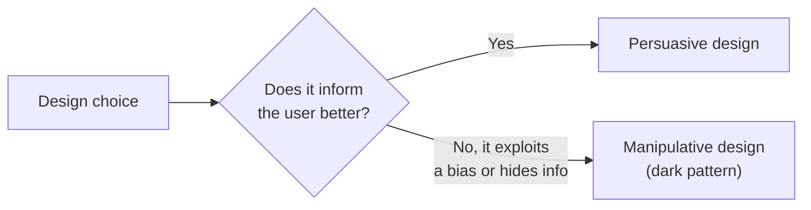

import Scenario from "../../../components/Scenario.astro";
import LevelIntro from "../../../components/LevelIntro.astro";

<Scenario>
  <Fragment slot="facts">
    

      
✍️ Sign-up: 1 field, 1 click, done in 8 seconds

      
🚪 Cancel: 4 pages, 2 confirm-shaming prompts, a hidden link, a phone call

    

    

      
⏱️ Time to sign up: under 10 seconds

      
⏱️ Time to cancel: 11 minutes, reported by real users

    

  </Fragment>

You want to cancel a streaming subscription. The "Cancel" button isn't on the account page — it's three menus deep, under "Manage plan," under "Billing," under a submenu with no obvious name. When you finally find it, a full-screen page appears: **"Wait — are you sure? You'll lose access to everything you've watched."** Two buttons: a huge, bright "Keep my subscription" and a tiny, gray "No thanks, cancel anyway" link in 11px text. Click that, and a second page offers "50% off for 3 months" — declining it routes you to a _third_ page asking you to explain why, in a required text box, before a final "Confirm cancellation" button appears.

Signing up took one field and one click. Canceling took four pages and eleven minutes.

**Nothing on any of those screens was a lie. So is this actually wrong — and if so, exactly which part of it?**

</Scenario>

Every element in that flow is individually defensible — a retention offer is normal marketing, a confirmation step prevents accidental cancellations, asking for feedback is common. The problem isn't any single screen. It's that the _entire flow_ was engineered to be asymmetric: fast in the direction that benefits the company, slow and demoralizing in the direction that benefits the user — while never technically lying to them.

<LevelIntro
  items={[
    "Persuasion vs. manipulation as a spectrum, not a switch",
    "The common families of dark patterns and what each one exploits",
    "Informed consent as the test that tells them apart",
  ]}
/>

## Persuasion and manipulation aren't opposite categories

A "Recommended for you" banner and a fake "Only 2 left in stock!" countdown both try to change what you do next. One is normal design. The other is a dark pattern. What actually separates them?

|                                   | Persuasive design                                         | Manipulative design (dark pattern)                                            |
| --------------------------------- | --------------------------------------------------------- | ----------------------------------------------------------------------------- |
| Information shown                 | True, relevant, helps the decision                        | False, hidden, or irrelevant to the actual decision                           |
| Who benefits if it works          | Both parties, roughly                                     | Mostly the business, at the user's expense                                    |
| Would it survive being disclosed? | Yes — "we highlight best-sellers" is fine to say out loud | No — "we hid the cancel button on purpose" damages trust if said out loud     |
| Effect on future choices          | User still decides freely next time                       | Exploits a bias the user can't easily correct for (urgency, shame, sunk cost) |

The dividing line isn't "does it try to influence someone" — nearly all design tries to influence someone. It's **whether the influence works by informing the user better or by degrading their ability to choose freely.**

## The common families of dark patterns

Most manipulative patterns fall into a small number of recurring shapes. Recognizing the _family_ is more useful than memorizing individual examples, because new instances of each family show up constantly in new products.

| Pattern           | What it does                                       | The streaming-cancel example                                     |
| ----------------- | -------------------------------------------------- | ---------------------------------------------------------------- |
| Roach motel       | Easy to get in, hard to get out                    | Sign-up: 1 step. Cancel: 4 pages                                 |
| Confirmshaming    | Guilt-trips the "no" option's label                | "No thanks, cancel anyway" implies canceling is the wrong choice |
| Forced continuity | Silently renews / charges without a clear reminder | Free trial converts to paid with no advance warning              |
| Hidden costs      | Real cost revealed only at the last step           | Extra fees appear only at final checkout                         |
| Trick questions   | Confusing wording flips the expected answer        | Double-negative checkboxes ("Don't not notify me")               |
| Nagging           | Repeats a request until the user gives in          | Recurring pop-ups asking to enable notifications                 |

## Informed consent is the test

- **Informed consent** in UX means a user's "yes" (to a purchase, a subscription, a data-sharing setting) was given with accurate information, freely, and without engineered friction pushing them one way.
- A design fails the informed-consent test when it makes the "wrong for the user, right for the business" choice the path of least resistance — through hidden information, asymmetric effort, or emotional pressure — rather than through a genuinely better offer.
- This is why dark patterns matter beyond aesthetics: several (forced continuity, hidden costs, deceptive defaults) are now directly regulated — the EU's Digital Services Act and various US state privacy laws both name and prohibit specific dark-pattern categories, because they treat manipulated consent as not being real consent.
- The skill this unit builds is the same for anyone who ships an interface: naming _which_ family a manipulative flow belongs to, and telling it apart from ordinary persuasion — so a design review can catch it before it ships, not after a regulator or a viral complaint does.
