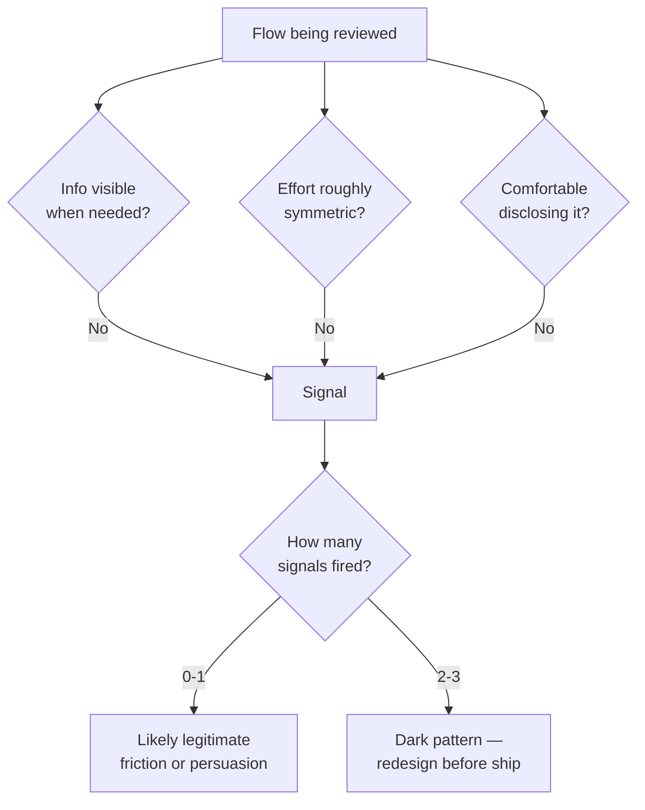

import Scenario from "../../../components/Scenario.astro";
import LevelIntro from "../../../components/LevelIntro.astro";
import Checkpoint from "../../../components/Checkpoint.astro";

L1 named the families of dark patterns and drew a line between persuasion and manipulation. L2 works out how to actually _place_ a design on that line before it ships, instead of only recognizing manipulation after the fact.

<LevelIntro
  items={[
    "The spectrum from disclosure to deception, with real midpoints",
    "A three-question test a design review can actually run",
    "Where 'growth' pressure quietly turns a nudge into a trap",
  ]}
/>

## The spectrum has a messy middle, not two clean bins

<Scenario>
  <Fragment slot="facts">
    

      
🏋️ Gym app: 7-day free trial, card required up front

      
📧 Reminder email: sent, but 40 minutes before the trial ends

      
💳 First charge: full annual price, $287, no partial-refund window

    

  </Fragment>

A fitness app offers a "free" 7-day trial. It asks for a card up front — reasonable, that's how trials usually work. On day 7, it sends exactly one reminder email, timed to arrive 40 minutes before the trial converts, worded as a generic "your trial is ending soon!" newsletter rather than a billing notice, and lands in most inboxes' promotions tab. The card is then charged the _full annual price_ — $287 — not a monthly rate, with no partial-refund window if the user notices within the hour.

**Every individual piece has a legitimate justification on its own — a reminder was sent, the pricing was disclosed somewhere in the terms. So why does this still feel like it crossed a line?**

</Scenario>

The reminder technically exists — so this isn't the same as silent, undisclosed billing. But timing it to be easy to miss, wording it to not read as a billing notice, and picking the least refundable moment to charge the largest possible amount are all choices, and each one was optimized in the same direction: away from the user noticing in time. A single borderline choice might be an oversight. A cluster of borderline choices that all lean the same way is a strategy.

## A design review question, not just a definition

<Checkpoint question="Is the fitness app's single reminder email, sent 40 minutes before the charge, enough on its own to call this flow ethical, since a reminder did technically go out?">

No, and the reason is what the reminder was optimized to accomplish rather than whether one existed at all. A reminder sent with enough lead time, worded plainly as "you will be charged $287 tomorrow," landing in the primary inbox, would satisfy the same "we told them" requirement while actually letting most users act on it. The 40-minute window, vague subject line, and promotions-tab placement are all choices that keep the technical disclosure while minimizing the odds anyone reads it in time — which is the same move as no disclosure at all, just with a legal alibi attached. The test isn't "did a notice exist," it's "was the notice built to be seen and acted on, or built to be missable."

</Checkpoint>

Naming a pattern after the fact is easy in hindsight. What a design review actually needs is a test to run _before_ shipping. Three questions, asked of any flow that asks a user to say yes, no, pay, share data, or leave:

1. **Is the information the user needs to decide actually visible, at the moment they need it** — not buried in terms, not timed to arrive after the decision window closes?
2. **Is the effort required roughly symmetric** between the choice that benefits the business and the choice that benefits the user — or is one path one click and the other four screens?
3. **Would the team be comfortable disclosing the mechanism out loud** — "we time the reminder to arrive 40 minutes before charging" — to the users it's aimed at, without it sounding like an admission?

A "no" on any one question is a signal, not automatically a verdict — some friction is legitimate (a delete confirmation protects users from mistakes; that's _not_ the same shape as a cancel flow with a confirmshame button and three retention screens). A "no" on **two or three** at once is where a design has crossed from a debatable nudge into a dark pattern.

## Where growth pressure turns a nudge into a trap

<Checkpoint question="A product team under pressure to hit a monthly 'retained subscribers' target proposes making the cancel flow '3 screens instead of 1, to give people a chance to reconsider.' Using the three-question test, what's the actual concern with framing it that way?">

The framing of "a chance to reconsider" quietly assumes the extra screens are informing the user better, but run the test and that assumption doesn't hold up on its own — it depends entirely on what those screens do. If the added screens present genuinely new, true information the user didn't have (an accurate reminder of unused entitlements, a real cheaper plan they qualify for), that's question 1 being satisfied and it's legitimate persuasion. If instead they mostly restate the same "are you sure?" with escalating discouragement and no new facts, effort has become asymmetric relative to the one-click sign-up (question 2 fails) purely to suppress the cancellation count the team is measured on — and a team that wouldn't want to say "we added friction to hit our retention number" out loud (question 3 failing too) is describing a dark pattern wearing a legitimate-sounding name. The metric pressure itself is the mechanism worth watching for: a retention target rewards _any_ reduction in cancellations, whether it comes from a genuinely better offer or from friction, and only the three-question test tells those two apart — the target alone can't.

</Checkpoint>

This is the recurring failure mode behind most real-world dark patterns: not a designer setting out to deceive, but a legitimate business metric (retention, sign-ups, opt-in rate) that doesn't distinguish _how_ the number improved. A design review that only asks "did the metric move" will wave through anything that moves it. A review that runs the three-question test catches the difference between a metric that moved because the offer got better and one that moved because leaving got harder.
