import Scenario from "../../../components/Scenario.astro";
import LevelIntro from "../../../components/LevelIntro.astro";
import Checkpoint from "../../../components/Checkpoint.astro";

L1 and L2 built the vocabulary and the three-question test. L3 applies both to three real, well-documented dark-pattern flows — described plainly so they can be recognized and avoided, not as a blueprint for building one — and walks through how each gets redesigned once it fails the test.

<LevelIntro
  items={[
    "Three documented dark-pattern flows and what each exploits",
    "How each gets redesigned once it fails the three-question test",
    "The regulatory line: when a dark pattern becomes a legal violation",
  ]}
/>

## Case 1: the cancellation flow built to be found last

<Scenario>
  <Fragment slot="facts">
    

      
🖱️ Sign-up: 2 clicks, no page reload

      
🧭 Cancel: buried under account → settings → membership, unlinked from the nav

      
🔀 Cancel button routes through 4 separate confirmation/offer screens

    

  </Fragment>

In 2023, the US Federal Trade Commission sued a major online retailer over its subscription-membership cancellation flow, alleging the company's own internal name for the flow referenced a famously long siege — because it was deliberately engineered to be long. According to the complaint, canceling required navigating a maze of screens, each offering a discount or asking the user to reconsider, with the actual "cancel" option worded ambiguously and placed last. Signing up, by contrast, took two clicks from any page on the site.

**The company's defense was that every screen offered users real information — discounts, reminders of benefits they'd lose. If the information was true, is the flow actually a dark pattern, or just aggressive retention marketing?**

</Scenario>

Run the three-question test from L2 on this flow:

| Question                                | This flow                                                                                                                                 |
| --------------------------------------- | ----------------------------------------------------------------------------------------------------------------------------------------- |
| Is the needed info visible when needed? | Partially — discounts are real, but the actual "cancel" control is worded ambiguously and placed after four screens, not visible up front |
| Is effort symmetric?                    | No — 2-click sign-up vs. a multi-screen maze to cancel                                                                                    |
| Would the team disclose the mechanism?  | No — an internal code name referencing a legendarily long siege is itself evidence the friction was intentional, not incidental           |

Two of three fail, one partially fails — this is a dark pattern by the test's own criteria, not merely "aggressive marketing." The retention offers being individually true doesn't rescue the flow, because question 2 and question 3 are about the _structure_ around those true offers, not their content. A true offer wrapped in engineered friction still fails the test — this is exactly the "cluster of individually-defensible choices, all leaning the same direction" pattern named in L2.

**Redesign, in plain terms:** cancel gets a single, clearly labeled control reachable in the same number of clicks as sign-up. A retention offer can still appear — once, clearly labeled as an offer, with a real "no thanks" that isn't shamed or shrunk. The user reaches "canceled, confirmed" in roughly the same effort it took to reach "subscribed, confirmed."

## Case 2: the trial that becomes a bill

<Scenario>
  <Fragment slot="facts">
    

      
💳 Card required before trial starts, "no charge for 14 days"

      
📅 Renewal date: written only in the original sign-up confirmation email

      
❓ No reminder before the first charge

    

  </Fragment>

A software tool offers a 14-day free trial. Signing up asks for a card "to prevent abuse — you won't be charged during the trial." The only mention of the renewal date is a single line in the original welcome email, sent day one, when the user has no reason yet to be looking for it. No second reminder is sent. On day 15, the full subscription price is charged automatically. Refund requests are handled through a support ticket queue with a stated 5–7 business day response time — well past most banks' dispute windows for a "recognized" charge.

</Scenario>

This is **forced continuity** — L1's pattern of silently converting a free offer into a paid one — combined with a hidden cost in the sense that the _timing_ of the cost, not its amount, is what's obscured. Nothing here is false: the terms did state a renewal date, technically. But recall the fitness-app example from L2: a disclosure that exists but is engineered to be missed satisfies the letter of "we told them" while failing its purpose.

<Checkpoint question="If this company added a second reminder email on day 13, worded plainly ('Your trial ends in 24 hours — you'll be charged $49 unless you cancel'), sent to the primary inbox, would that alone bring the flow back across the line into legitimate?">

Mostly, yes, on the specific complaint of missable disclosure — a clear, well-timed, plainly worded reminder directly answers question 1 from the three-question test (is the info visible when the user needs it), which was the flow's core failure. It wouldn't automatically clear every other part of the design, though: if canceling still required navigating to a hard-to-find setting or contacting support while accepting the charge stayed one click away, question 2 (symmetric effort) would still fail, and the flow would still be a dark pattern, just missing a different piece. Fixing one failed question is real progress, not a full pass — the three questions are independent checks, and a flow needs to clear all of them, not just the one that happens to be easiest to patch.

</Checkpoint>

**Redesign, in plain terms:** the renewal date and price appear inside the product itself (a persistent, dismissible banner), not only in an email sent on day one. A reminder goes out 2–3 days before the charge, worded as a billing notice, not a marketing email. Refunds requested within a short window after the charge (24–48 hours) are automatic, not routed through a multi-day ticket queue — because the whole point of a trial is that the user hasn't yet had a real chance to decide, and a slow refund process quietly bets on that gap.

## Case 3: the loyalty program that's harder to leave than to join

A retail chain's "rewards" signup is a single tap at checkout — no email confirmation needed, discount applied instantly. Deleting the account requires calling a phone number, available only during weekday business hours, and providing a "member ID" that's never shown anywhere in the app the user actually uses day to day.

| Pattern family (from L1) | Where it shows up here                                                  |
| ------------------------ | ----------------------------------------------------------------------- |
| Roach motel              | 1-tap in, phone-call-only out                                           |
| Hidden cost              | Not price — _information_ the user needs (member ID) is the hidden cost |
| Asymmetric effort        | Self-serve entry, human-mediated, business-hours-only exit              |

This is the same shape as Case 1 (fast in, slow out) applied to personal data rather than money — and it's the shape regulators have increasingly targeted directly, rather than leaving it to case-by-case complaints.

```mermaid
xychart-beta
    title "Steps required: joining vs. leaving, by case"
    x-axis ["Case 1: cancel", "Case 2: trial exit", "Case 3: rewards program"]
    y-axis "Steps required" 0 --> 6
    bar [2, 1, 1]
    bar [5, 3, 4]
```

## Where this becomes a legal question, not just an ethical one

<Checkpoint question="A team argues 'we're not lawyers, ethics is subjective, so as long as legal hasn't told us to stop, the flow is fine.' What's the flaw in treating 'not yet flagged by legal' as equivalent to 'acceptable'?">

The flaw is timing, not the substance of the concern — regulators like the FTC and the EU have moved from treating dark patterns as a vague ethical gray area to naming specific mechanisms (forced continuity, disproportionate cancellation friction, confirmshaming) as directly actionable, which means "not yet flagged" often just means "not yet caught," not "actually compliant." The three-question test exists precisely so a team can catch this before a regulator or a lawsuit does — waiting for legal to react treats enforcement as the detection mechanism instead of design review, which is backwards: enforcement is slow, reputational damage and user harm happen immediately, and by the time legal does flag it, the flow has already been live and shipping harm the whole time. Ethics not yet being tested in court for this specific flow says nothing about whether the flow is actually fine; it only says nobody with the power to force a change has looked yet.

</Checkpoint>

The regulatory trend, concretely:

| Rule / regulation                              | What it targets                                                                                         |
| ---------------------------------------------- | ------------------------------------------------------------------------------------------------------- |
| FTC "click-to-cancel" rule (US, 2024)          | Cancellation must be at least as easy as sign-up — directly targets Case 1's shape                      |
| EU Digital Services Act, Art. 25               | Bans "dark patterns" that materially distort a user's ability to make free, informed decisions          |
| State privacy laws (e.g. California, Colorado) | Specifically prohibit dark patterns used to obtain consent for data collection — targets Case 3's shape |

None of these laws require reading minds about intent — they look at the _shape_ of the flow: is exiting harder than entering, is the disclosure timed to be missed, is consent obtained through confusion rather than clarity. That's the same shape the three-question test checks for, which is exactly why running it during design review catches the same things a regulator would later flag — just before shipping instead of after.

**Before moving on:** every case above involved a subscription or a loyalty program. What would change about applying the three-question test if the flow instead asked someone to leave a _support group, a mental-health app, or a political-opt-in list_ rather than a paid service — where the harm of "hard to leave" isn't a wasted charge but something the user can't easily undo the effect of at all? Would the same three questions still be sufficient on their own, or would a flow like that deserve a stricter bar before it ships?
