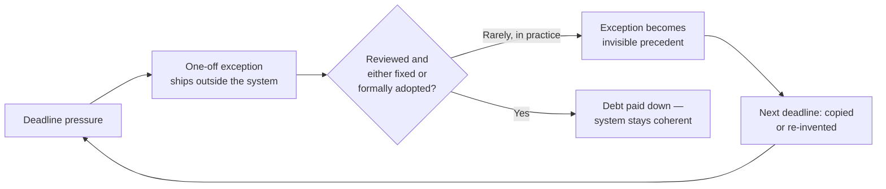
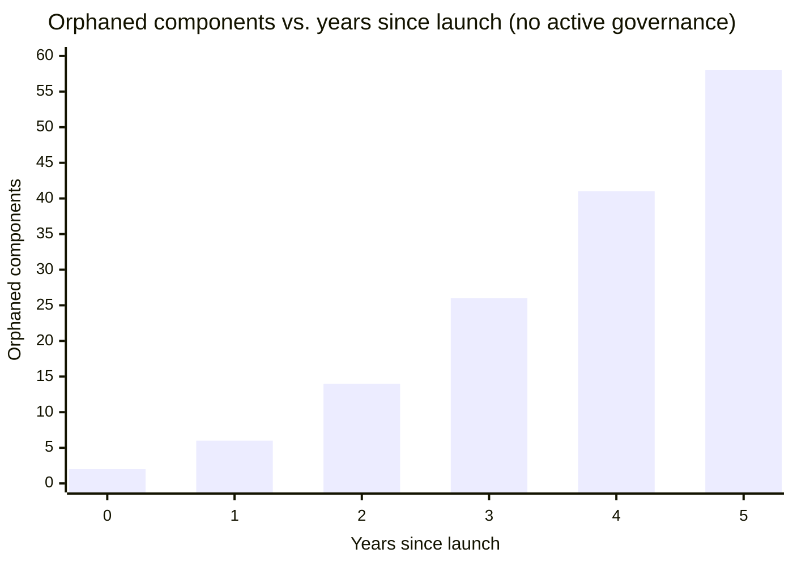

import Scenario from "../../../components/Scenario.astro";
import LevelIntro from "../../../components/LevelIntro.astro";

<Scenario>
  <Fragment slot="facts">
    

      

        37
        one-off button variants in the codebase
      

      

        

      

    

    

      
🗓️ Design system shipped 4 years ago, well adopted at first

      
🧩 37 button variants now exist; official spec still lists 3

      
👻 11 of them: nobody on the current team knows why they exist

    

    
Who's affected

    

      
🎨 Designers — unsure which button is "the real one"

      
💻 Engineers — afraid to delete unused variants, might break something

      
🧭 New hires — no map of what's canonical vs. leftover

    

  </Fragment>

Northwind Retail's design system launched four years ago with three
button variants — primary, secondary, destructive — each backed by one
token set and one component. It was a genuine success: the checkout
inconsistency bugs from year one disappeared within months. Today, a
new designer runs a component audit and finds **37 distinct button
implementations** living in the codebase. The official spec still
says three. Eleven of the extra thirty-four have no comment, no ticket
link, and nobody currently on the team remembers who added them or why.

**The system didn't fail on day one — everyone agreed it worked. So how
does a system that worked get to 37 buttons four years later, with no
single moment anyone would point to as "where it broke"?**

</Scenario>

Nothing about this happened all at once. A launch deadline needed a
button that was "the primary button, but taller, just for this one
banner." A different squad, eighteen months later and never having seen
that banner, needed something similar and built their own rather than
searching a component library nobody had told them existed. Each
individual exception was small, reasonable in the moment, and shipped
under real pressure — the accumulation is the story, not any single
decision.

<LevelIntro
  items={[
    "What design debt is, and how it differs from visual drift",
    "The four ways debt accumulates over years, not days",
    "What governance means once a system has real scale",
  ]}
/>

## Design debt is drift's older, harder-to-fix sibling

`design/design-systems` covered how a system stops _accidental_
inconsistency — different teams reinventing the same button by
accident, with no shared source of truth. **Design debt** is a
different problem: it's what accumulates _inside_ a system that already
exists and is already the source of truth, through hundreds of small,
individually-justified departures from it over years.

| Term               | What it is                                                                                        | When it shows up                                              |
| ------------------ | ------------------------------------------------------------------------------------------------- | ------------------------------------------------------------- |
| Visual drift       | Teams reinventing the same thing slightly differently because no shared system exists yet         | Before a design system, or where one hasn't reached a screen  |
| Design debt        | Deliberate one-off exceptions and unmaintained leftovers accumulating _inside_ an existing system | Years into a mature system, under sustained deadline pressure |
| Orphaned component | A component still in the library or codebase that nothing (or almost nothing) still needs         | Late-stage debt — the byproduct of debt left unaddressed      |

## Debt compounds like the metaphor suggests

Each "just this once" exception is small on its own — a taller button,
a special-case card radius, a color that "matches the client's brand
just for this partner page." None of those individually breaks
anything. What breaks the system is that they don't get paid down:
each exception either gets forgotten (no one revisits it once the
deadline passes) or gets copied (the next person under deadline
pressure searches the codebase, finds the exception, and assumes it's
sanctioned).

## Four ways design debt actually accumulates

1. **One-off exceptions that never get reconciled** — a component built "just for this campaign" that outlives the campaign because nobody owns removing it.
2. **Orphaned components** — pieces still in the library that shipped features have long since replaced, but nothing forces their removal, so they sit as false options for the next search.
3. **Governance decay** — the review process that used to catch exceptions (a design-system team, a linting rule, a required sign-off) quietly stops being enforced as the org reorganizes, people leave, or the team is deprioritized.
4. **Silent forking** — a squad copies a component into their own codebase to move faster, intending to reconcile later; "later" doesn't arrive, and now two versions drift independently.

## What governance means once a system has scale

For a small system, "governance" can just mean the person who built it
still remembers every decision. That doesn't scale. At scale, governance
is a **standing process**: someone (or some rotating role) owns
reviewing new components and exceptions, a documented threshold decides
when an exception should become a first-class variant instead of staying
a one-off, and there's a regular audit that finds and retires orphaned
components before they become invisible precedent for the next
deadline-driven copy.

Design debt isn't a sign a design system failed — every system under
real deadline pressure for multiple years accumulates some. The
difference between a system that stays coherent and one that decays into
a patchwork of unexplained exceptions is whether anything is actively
paying that debt down, on purpose, on a schedule — not whether debt
appeared in the first place.
