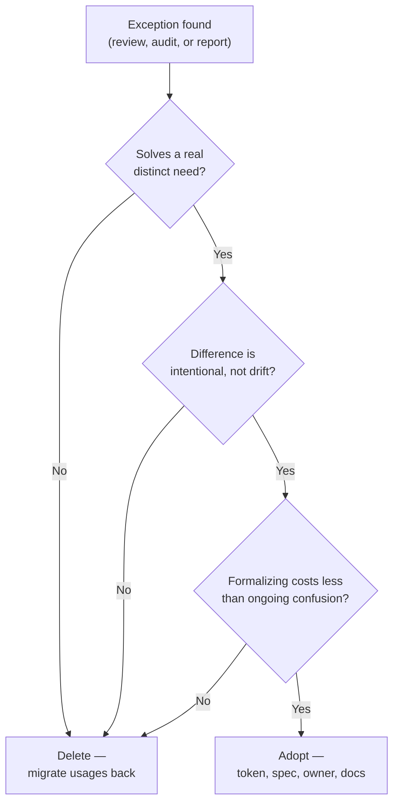

import Scenario from "../../../components/Scenario.astro";
import LevelIntro from "../../../components/LevelIntro.astro";
import Checkpoint from "../../../components/Checkpoint.astro";

L1 named the four ways debt accumulates and established that governance
is what keeps it from compounding unchecked. L2 works out what a
governance process actually needs to _decide_ — because "review every
exception" isn't a real answer until there's a repeatable way to sort
exceptions into "adopt this" vs. "delete this."

<LevelIntro
  items={[
    "The adopt-vs-delete decision, and a real test for it",
    "Three governance models and their real trade-offs",
    "Why orphaned components survive audits that should catch them",
  ]}
/>

## Every exception needs one of two endings, not neither

<Scenario>
  <Fragment slot="facts">
    

      
🏷️ "Compact card" built for one promo, 14 months ago

      
📈 Now used on 9 screens across 3 squads

      
📋 Still has zero entry in the design system spec

    

  </Fragment>

A designer at Northwind, under deadline pressure fourteen months ago,
built a "compact card" variant for a single promotional banner — smaller
padding, no image, a different shadow. It was never added to the design
system spec because the plan was to remove it after the promo ended.
The promo ended. The card didn't. Today it's used on nine screens across
three squads, each of whom found it by searching the codebase, saw it
already in use elsewhere, and assumed it was sanctioned.

**The card wasn't hidden — it's right there in the codebase, actively
used by real teams. So why is "just leave it, it's clearly useful"
still the wrong instinct here?**

</Scenario>

Because usage alone doesn't tell you whether something is a good
addition to the system or a debt that's spread. Nine screens using an
unreviewed component isn't evidence the component is well-designed —
it's evidence that unreviewed components get copied exactly like
reviewed ones do, which is precisely the silent-forking failure mode
from L1. The card needs a decision, not more time to keep spreading
undecided.

## The adopt-vs-delete test

Every exception a governance process finds — through code review, a
periodic audit, or someone simply noticing — resolves to exactly one of
two outcomes. There is no third "leave it as is" option; "leave it"
without a decision is what produced the nine-screen spread in the first
place.

| Question                                                                                                    | If yes | If no                                              |
| ----------------------------------------------------------------------------------------------------------- | ------ | -------------------------------------------------- |
| Does it solve a real, recurring need distinct from what already exists?                                     | →      | delete, replace usages with the existing component |
| Is its difference from the existing component intentional, not accidental drift?                            | →      | delete, replace usages with the existing component |
| Would formalizing it (tokens, docs, ownership) cost less than the ongoing confusion of leaving it informal? | Adopt  | delete, replace usages with the existing component |

All three "yes" answers → **adopt**: give it a token-backed spec, a
name, an owner, and documentation, exactly like an originally-planned
component. Any "no" → **delete**: migrate its usages back to the
existing component and remove it, however many screens currently use
it. The number of screens using an unreviewed exception is not itself
a reason to adopt it — it's a reason the decision is overdue.

<Checkpoint question="Northwind's compact card passes the first two questions of the test — it solves a real, recurring 'less visual weight' need, and the difference from the standard card is intentional. But formalizing it would mean writing new tokens, documenting when to use it vs. the standard card, and assigning an owner, which the team estimates at two days of work. Is that alone a reason to delete it instead?">

Not on its own — the third question isn't "is formalizing free," it's whether formalizing costs less than the alternative of leaving it informal. Two days of work has to be weighed against what leaving it undecided has already cost: nine screens quietly relying on a component three different squads independently decided was safe to reuse, with no spec telling the next squad when to reach for it versus the standard card, and no owner to update it if the standard card's tokens ever change. If the card keeps solving a real, recurring need, that ongoing confusion is a cost that compounds every time another screen adopts it unreviewed, while the two days of formalizing work is a one-time cost. The question only points to delete when the formalizing cost is high relative to a need that's marginal or rare — a two-day cost against a nine-screen, recurring need points toward adopt.

</Checkpoint>

## Governance models: who runs this test, and how often

<Checkpoint question="A design system's original three-person team was disbanded eighteen months ago in a reorg; nobody currently owns running the adopt-vs-delete test. New exceptions still get built under deadline pressure, same as always. What happens to the system's coherence between now and whenever governance is restored?">

Nothing stops the exceptions from being built — deadline pressure is constant, and building a one-off is always faster in the moment than searching for and reusing the sanctioned component, so exceptions keep appearing at the same rate as before. What stops is the mechanism that used to resolve each one into "adopt" or "delete." Every exception built in that gap defaults to neither outcome — it just sits, gets found by search, and gets copied by the next deadline-pressured engineer exactly like the compact card was, compounding for as long as the gap lasts. The system doesn't visibly break during this period, which is part of what makes it dangerous: nothing crashes, no screen looks obviously wrong, and the debt is invisible until someone eventually runs an audit and finds the same 37-button outcome L1 opened with.

</Checkpoint>

Three real models exist for who runs the adopt-vs-delete test, and they
trade off differently:

| Model                      | How it works                                                                               | Strength                                                           | Weakness                                                        |
| -------------------------- | ------------------------------------------------------------------------------------------ | ------------------------------------------------------------------ | --------------------------------------------------------------- |
| Centralized team           | A dedicated design-system team reviews and decides every exception                         | Consistent decisions, clear ownership                              | Becomes a bottleneck; first team cut under budget pressure      |
| Federated stewardship      | Each product area has a designated owner who runs the test for their domain                | Scales with the org; survives a single reorg                       | Owners drift out of sync with each other without a shared forum |
| Community + automated gate | Anyone can propose; a lint rule or CI check flags undocumented new components before merge | Catches exceptions at the moment they're created, not months later | Needs tooling investment; catches code, not judgment            |

No model eliminates the need for the test itself — they only change who
runs it and when. A federated model with no shared forum will produce
three product areas quietly adopting three slightly different "compact
card" solutions to the same need, which is drift again, just one layer
up. An automated gate with no human judgment behind it will either block
legitimate new components forever or get bypassed entirely the first
time someone finds it inconvenient under deadline pressure.

## Why orphaned components survive audits meant to catch them

The fourth failure mode from L1 — orphaned components — is the one an
adopt-vs-delete test doesn't automatically catch, because that test
runs on _new_ exceptions being created, not on old components quietly
becoming unused. A component adopted correctly, with a spec and an
owner, five years ago can still become an orphan if the feature it
served gets redesigned and nothing ever removes the now-unused
component from the library. An audit needs a second, separate question
running on a schedule, independent of new-exception review: for every
component currently in the library, is it still referenced by anything
shipping — and if not, who's responsible for retiring it?
