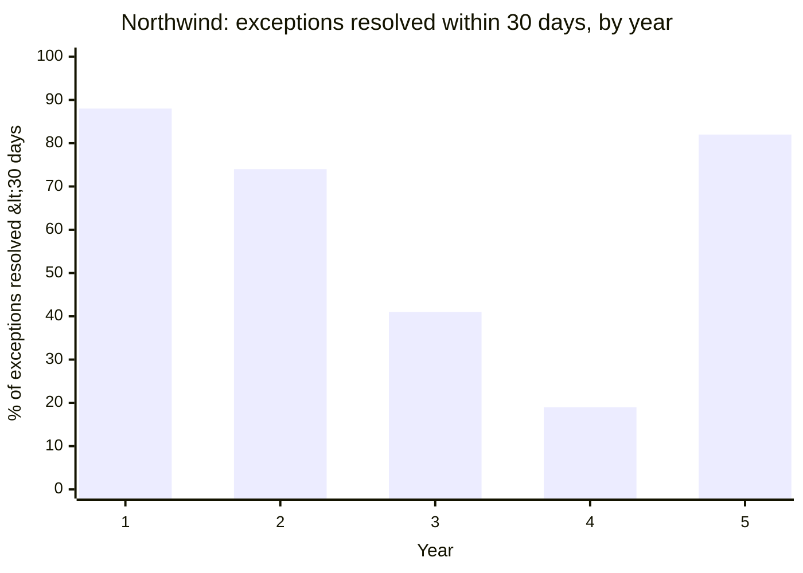

import Scenario from "../../../components/Scenario.astro";
import LevelIntro from "../../../components/LevelIntro.astro";
import Checkpoint from "../../../components/Checkpoint.astro";

L2 gave the adopt-vs-delete test and three governance models in the
abstract. L3 walks through what actually happened at Northwind Retail
over five real years — where the test was applied well, where
governance quietly lapsed, what that cost in a real incident, and the
concrete audit-and-remediation plan that paid the debt back down. This
is one company's case, not the only way debt plays out — the closing
section asks you to reason about a different shape of pressure.

<LevelIntro
  items={[
    "The five-year timeline: launch, growth, reorg, incident, recovery",
    "The incident where an orphaned component caused real customer harm",
    "The remediation playbook, and what it cost to run",
  ]}
/>

## Year 0–1: launch, and governance that actually worked

<Scenario>
  <Fragment slot="facts">
    

      
👥 Design system team: 3 people, centralized model

      
✅ Year 1: 22 exceptions raised, 22 resolved (adopt or delete) within 2 weeks each

      
📉 Year 3: same 3-person team, 340 screens, no headcount change

    

  </Fragment>

Northwind launched its design system with a three-person centralized
team: one designer, two engineers, explicitly resourced to run the
adopt-vs-delete test on every exception. In year one, across 40 screens,
they caught and resolved 22 exceptions — 14 deleted (migrated back to
the existing component), 8 adopted (given specs, tokens, and owners).
Median time to resolution: eleven days. The system that L1 described as
"a genuine success" was genuinely working, and the reason was mundane:
someone's job was specifically to run the test, and they had time to do
it.

**By year three, Northwind had grown to 340 screens across eleven
squads — the design system team was still three people. What does that
growth do to a process that depended on those three people having time
to review every exception?**

</Scenario>

Nothing about the process itself changed. The team still tried to
review every exception the same way. What changed was throughput: eleven
squads generating exceptions at a rate three reviewers couldn't keep up
with turned an eleven-day median resolution time into a growing backlog,
and a growing backlog is functionally the same as no governance at all
for whatever's sitting in it — every exception waiting in the queue is
available to be found and copied by the next squad, unreviewed, exactly
as in L2's compact-card story.

## Year 3: the reorg that quietly disbanded governance

The company reorganized around eleven product squads, each now owning
its own roadmap and headcount. The design-system team's three members
were redistributed — one into a squad, one to a different initiative,
one left the company and wasn't backfilled. No one made an explicit
decision to stop running the adopt-vs-delete test. The org chart simply
no longer had a role whose job it was.

This is the federated model's weakness from L2's table, but arrived at
by accident rather than by design: eleven squads, each with their own
priorities, none of them formally designated as stewards of the shared
system. A few senior designers kept informally flagging exceptions in
code review out of habit, but with no shared forum, no documented
threshold, and no time carved out for it, "informal" reliably lost to
deadline pressure within a couple of quarters.

## Year 4: the incident

<Checkpoint question="Eighteen months after the reorg, an orphaned 'urgent-banner' component — originally adopted for a one-time site outage notice, never retired after the outage ended — got reused by a new squad for a flash-sale promotion, because it was the first visually 'urgent-looking' component they found in the codebase. It still carried its original hardcoded copy pattern assuming a temporary, site-wide, non-dismissible message. What's the likely failure here, reasoning only from what the component was actually built for?">

A component built for a rare, temporary, site-wide outage notice was never designed with the assumptions a recurring promotional banner needs — dismissibility, personalization per user segment, an expiry that doesn't require an engineer to manually remove it. Because none of that was documented (the component had no spec explaining what it was for or when to use it, since it predated the adopt-vs-delete process being restored), the new squad had no way to know they were reusing an outage-notice component for a fundamentally different job. The likely failure is exactly the assumptions mismatch: a banner built to be non-dismissible because an active outage genuinely shouldn't be dismissed became a non-dismissible flash-sale banner that customers couldn't close, on every page, until an engineer noticed and shipped a manual fix.

</Checkpoint>

That is what actually happened. The flash-sale banner used the
urgent-banner component's non-dismissible-by-design behavior, unchanged,
because nothing about the component's origin was documented anywhere
the new squad could have found it. For six hours, every customer on
every page saw a promotional banner they could not close, stacked above
the actual page content on smaller screens. Customer support tickets
about "the site is broken, I can't get rid of the banner" spiked
sharply; the fix, once found, took eleven minutes to ship — the entire
cost was in the time between the banner going live and someone noticing
it wasn't behaving like a normal promo.

The postmortem's finding wasn't "an engineer made a bad choice." It was
that the component library had no reliable way to tell a component built
for a narrow, one-time purpose apart from one meant for general reuse —
because the governance step that would have caught an orphaned,
undocumented, ill-suited-for-reuse component sitting in the library had
quietly stopped running eighteen months earlier, and nobody had noticed
its absence because nothing visibly broke in the meantime, exactly as
L2's Checkpoint on the disbanded team predicted.

## Year 4–5: the remediation playbook

Northwind's response, once leadership funded it, had three parts run in
sequence rather than all at once — a full inventory before triage,
because triage without an inventory just repeats the informal,
whoever-notices-first process that failed:

1. **Full inventory first.** Every component in the codebase was
   catalogued against actual usage — not the spec, which was known to be
   stale, but a scripted search of what was really imported where. This
   surfaced 61 components with zero current usages (pure orphans), 34
   with usage but no spec entry (undocumented exceptions, the
   compact-card shape from L2), and the urgent-banner component,
   documented but used for something its spec never anticipated.
2. **Triage using the adopt-vs-delete test, in priority order.** Rather
   than working through 95 items in discovery order, the team
   prioritized by usage count and by whether a component handled
   anything user-facing and high-traffic — the urgent-banner-shaped risk
   (wrong assumptions baked into something now widely reused) mattered
   more than a zero-usage orphan sitting harmlessly unused. High-usage,
   undocumented components got adopted with specs within the first two
   weeks; the 61 true orphans were deleted in a single batched cleanup
   once each was confirmed to have no remaining references.
3. **Restore a governance model sized to the org's actual shape**, not
   the year-one org. A return to a single centralized team of three was
   rejected — the same throughput mismatch that caused the year-three
   backlog would just recur as the company kept growing. Northwind
   adopted the federated-plus-gate hybrid from L2's table instead: one
   designated steward per product area (federated), plus an automated
   CI check that flags any new component with no linked spec entry
   before it can merge (the automated gate), with a shared monthly forum
   where stewards reconcile anything that's drifted between their areas.

<Checkpoint question="The automated CI gate blocks any new component that has no linked spec entry. A squad under a hard launch deadline needs to ship a genuine one-off — something that, per the adopt-vs-delete test, will very likely be deleted within the month once the launch campaign ends. Should the gate block them from shipping it at all?">

Blocking it outright would just push the squad back toward the silent-forking failure from L1 — copying an existing component into their own code to route around the gate, which produces exactly the undocumented, ungoverned exception the gate exists to prevent, just relocated somewhere the gate can't see it. The better design, and what Northwind's gate actually does, is not "no spec, no merge" as an absolute rule but "no spec, no merge without an explicit, time-boxed exception flag" — the squad can still ship on deadline by marking the component as a known, temporary one-off, which satisfies the gate while creating a visible, dated record instead of an invisible one. That record is what turns "we'll deal with it later" from a hope into something a monthly steward forum can actually act on — the component shows up on a list of exceptions due for the adopt-vs-delete test by a specific date, rather than disappearing into the codebase the way the original urgent-banner component did.

</Checkpoint>

## What it cost, and what it bought

The year-4/5 remediation took roughly nine person-weeks spread across
the inventory, triage, and governance-restoration phases — non-trivial,
but a fraction of the cost of the six-hour incident's support load, the
postmortem, and the reputational cost of a customer-visible bug that ran
for hours before anyone caught it. The following year's exception
resolution rate (82% within 30 days, per the chart above) approached the
year-one number — not because the federated-plus-gate model is
inherently better than the original centralized team, but because it was
sized to eleven squads' actual exception volume instead of three
people's fixed capacity.

**This was one company's shape of pressure — a hard reorg, then a
single dramatic incident that forced the fix.** Design debt doesn't
always resolve that cleanly. What would you expect to change about the
remediation priorities if, instead of one visible six-hour incident,
Northwind's debt had stayed invisible for years, with no single incident
ever severe enough to get leadership to fund an inventory — just a slow,
never-quite-urgent drag on every new designer's onboarding time and every
engineer's "which component do I actually use" search? The playbook's
three steps would likely stay the same, but what would have to change
about how the case for funding step one gets made, with no incident
report to point to?
