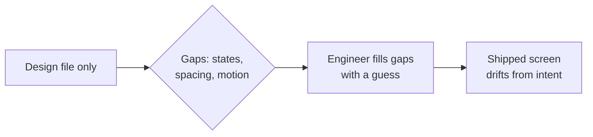

import Scenario from "../../../components/Scenario.astro";
import LevelIntro from "../../../components/LevelIntro.astro";

<Scenario>
  <Fragment slot="facts">
    

      

        3 of 5
        states shipped correctly
      

      

        

      

    

    

      
✅ Default, loading, error — shipped as designed

      
❌ Empty state — never built, nobody knew it existed

      
❌ Success animation — replaced with a plain checkmark

      
📏 Spacing shipped at 16px, designed at 24px

    

    
What was handed off

    

      
🖼️ One Figma frame, no annotations

      
💬 A Slack message: "checkout redesign, ready to build"

    

  </Fragment>

Priya designed a checkout confirmation screen with five states: default, loading, success, error, and empty (for when a cart somehow arrives empty at checkout). She sent one Figma frame link to the engineering channel with "checkout redesign, ready to build" and moved on to her next project.

A week later, the feature shipped. It looked right in the screenshot Sam posted — but only because that screenshot happened to show the default state. The success state's animation had become a static checkmark. The empty state didn't exist at all; nothing appeared instead of it, the cart just silently rendered as if it had one item. The spacing around every button was two-thirds of what Priya had specified.

**Before reading on: nobody on the engineering side did anything careless. Sam built exactly what he could see. So where did the screen actually go wrong?**

</Scenario>

It went wrong before Sam ever opened Figma — at the moment a finished-looking design got treated as a finished specification.

<LevelIntro
  items={[
    "Why a pretty file isn't the same as a buildable spec",
    "The handoff artifacts that actually prevent reinterpretation",
    "What design QA catches that code review can't",
  ]}
/>

- A **design file** shows what one state looks like when everything goes right. A **spec** tells an engineer what to build for every state, every edge case, and every measurement — a file alone is a snapshot, not an instruction set.
- Reinterpretation isn't usually sabotage or laziness. It's an engineer filling in a genuine gap the only way they can: with a guess, made under a deadline, using whatever's visible.
- What silently gets lost in a plain-file handoff:

| Missing from the file           | What an engineer does instead                                         |
| ------------------------------- | --------------------------------------------------------------------- |
| States not shown (empty, error) | Skips them, or invents a plausible-looking fallback                   |
| Exact spacing/sizing values     | Eyeballs it from the screenshot, off by however much they're off      |
| Motion and transitions          | Ships a static equivalent, or nothing                                 |
| Why a choice was made           | Can't tell if a detail is load-bearing or just how it looked in Figma |

- Four things actually close the gap between a design and what ships:
  1. **Every state specified**, not just the happy path — loading, empty, error, success, and anything in between.
  2. **Annotations**, not just visuals — spacing, sizing, and interaction notes attached directly to the file.
  3. **Design tokens**, not eyeballed pixels — a named value (`spacing-lg = 24px`) that can't silently drift to 16px because it's read from a value, not measured off a screenshot.
  4. **Design QA before launch**, not after — someone with the original intent actually checking the built screen against the spec while there's still time to fix it cheaply.

A spec doesn't remove the engineer's judgment — it removes the guessing that happens when judgment has nothing to work from.

| Handoff artifact | Answers                                                   |
| ---------------- | --------------------------------------------------------- |
| All states shown | "What does this look like when it's NOT the happy path?"  |
| Annotations      | "What are the exact spacing, sizing, and copy rules?"     |
| Design tokens    | "What named value do I read instead of measuring pixels?" |
| Design QA pass   | "Does what shipped actually match what was specified?"    |

Getting this right isn't about writing more — Priya's five-state file already existed in her head. The gap was that only the default state ever left it.
