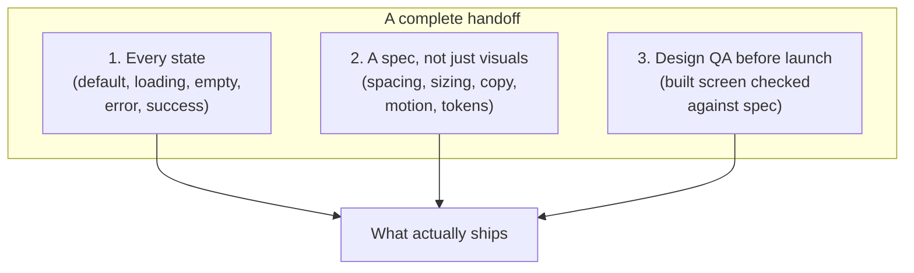
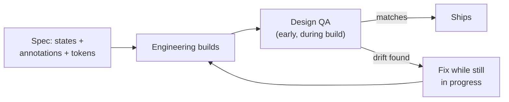

import Scenario from "../../../components/Scenario.astro";
import LevelIntro from "../../../components/LevelIntro.astro";
import Checkpoint from "../../../components/Checkpoint.astro";

<Scenario label="Same scenario, one level deeper">
  <Fragment slot="facts">
    

      
🖼️ Handed off: 1 Figma frame, 0 annotations

      
📋 Needed: 5 states, spacing tokens, motion notes, edge cases

      
🔁 Result: 3 of 5 states shipped, spacing drifted 24px→16px

    

    
Gap = what a spec would have carried

    

      
❓ Which states exist and what triggers each

      
❓ Exact spacing/sizing as named values, not pixels read off a screen

      
❓ What's load-bearing vs. incidental about the layout

    

  </Fragment>

Priya's file was accurate — every pixel in it was exactly what she intended. The problem is that a file only ever shows the states someone thought to draw, at the one moment someone thought to draw them. Sam didn't misread anything visible; he was missing everything invisible.

</Scenario>

<LevelIntro
  items={[
    "The three-part model: states, specs, and design QA",
    "Design tokens as the fix for pixel drift",
    "Where a handoff should sit in the actual workflow",
  ]}
/>

## What makes a handoff complete, not just pretty?

A handoff is complete when an engineer could build every state correctly **without asking a follow-up question** — not when the file looks finished. Three things determine whether that's true:

**States** answer "what does this look like in every situation," not just the one the designer happened to screenshot. **Spec** answers "what are the exact rules," not "what can be estimated by eye." **Design QA** answers "did what got built actually match," caught while it's still cheap to fix.

<Checkpoint question="Priya's file was pixel-accurate for the default state. Using the three-part model above, which of the three things was actually missing, and why does 'the file was accurate' not contradict that?">

What was missing was the second and first parts of the model, not accuracy in the part that existed. The default state's pixels were correct — but "states" requires every state to be shown, and only one of five was, and "spec" requires the _why_ and the _exact values_ to be attached, not just implied by a single correct-looking screenshot. A file can be perfectly accurate about the one thing it shows and still be an incomplete handoff, because completeness is measured by what an engineer needs across every situation, not by the fidelity of what happens to be drawn.

</Checkpoint>

## Why pixels drift even when nobody's careless

Sam didn't decide to ship 16px instead of 24px. He opened the Figma frame, hovered over the spacing, and Figma's inspector rounded to the nearest value the layer's auto-layout happened to compute — which wasn't the value Priya actually intended, just the value that frame's structure produced. Reading a pixel value off a visual is measurement, and measurement drifts. A **design token** — a named, shared value like `spacing-lg = 24px` — removes the measurement step entirely: the engineer reads the token's definition, not the screen.

| Approach                 | What the engineer does             | Failure mode                                                                           |
| ------------------------ | ---------------------------------- | -------------------------------------------------------------------------------------- |
| Eyeball the screenshot   | Estimates spacing/size by looking  | Drifts silently, no way to catch it without re-measuring                               |
| Read the Figma inspector | Measures the actual layer          | More accurate, but measures _this_ layer's accident, not the intended rule             |
| Read a design token      | Looks up a named, documented value | Can't drift — the same token used elsewhere in the product stays in sync automatically |

Tokens don't just prevent one bug. They mean a hundred buttons across the product share one true spacing value instead of a hundred independent measurements that can each drift a little differently.

## Where design QA actually sits in the process

<Checkpoint question="If design QA happens the day before launch instead of during the build, what specifically gets more expensive — the number of bugs found, or something else?">

Not necessarily the number of bugs found — the same drift (missing empty state, wrong spacing) would likely be caught either way, since it's the same gap in the handoff regardless of when someone looks. What gets more expensive is the _cost of fixing_ each one: a missing state caught mid-build is an unfinished component someone was already going to touch again; the same gap caught the day before launch means re-opening code that's already been reviewed, merged, and scheduled, often under a deadline that makes "quick, ugly fix" the only realistic option. The bug count doesn't scale with lateness — the rework cost does.

</Checkpoint>

The workflow that keeps a handoff from silently drifting runs in a loop, not a straight line — design QA isn't a final gate, it's a checkpoint that happens early enough to feed back into the same build:

The loop only works if design QA happens while `Build` is still open — a QA pass that only exists after the code is merged and scheduled has nowhere cheap to route a "fix" back to.

## A completeness checklist, not a completeness feeling

"Ready to build" is a feeling; a checklist is checkable by someone other than the designer who wrote it:

| Item                                                       | Present in Priya's handoff?               |
| ---------------------------------------------------------- | ----------------------------------------- |
| All states shown (default, loading, empty, error, success) | No — only default                         |
| Spacing/sizing as named tokens, not raw pixels             | No — raw Figma layer values               |
| Motion/transition notes                                    | No — success animation undocumented       |
| Copy for every state, including edge cases                 | Partial — only default state's copy shown |
| A design QA pass scheduled before launch                   | No                                        |

Five items, one checked. Not because Priya skipped a step out of neglect — the five-state design existed in her head the whole time. The handoff just never carried four of the five states out of it.
