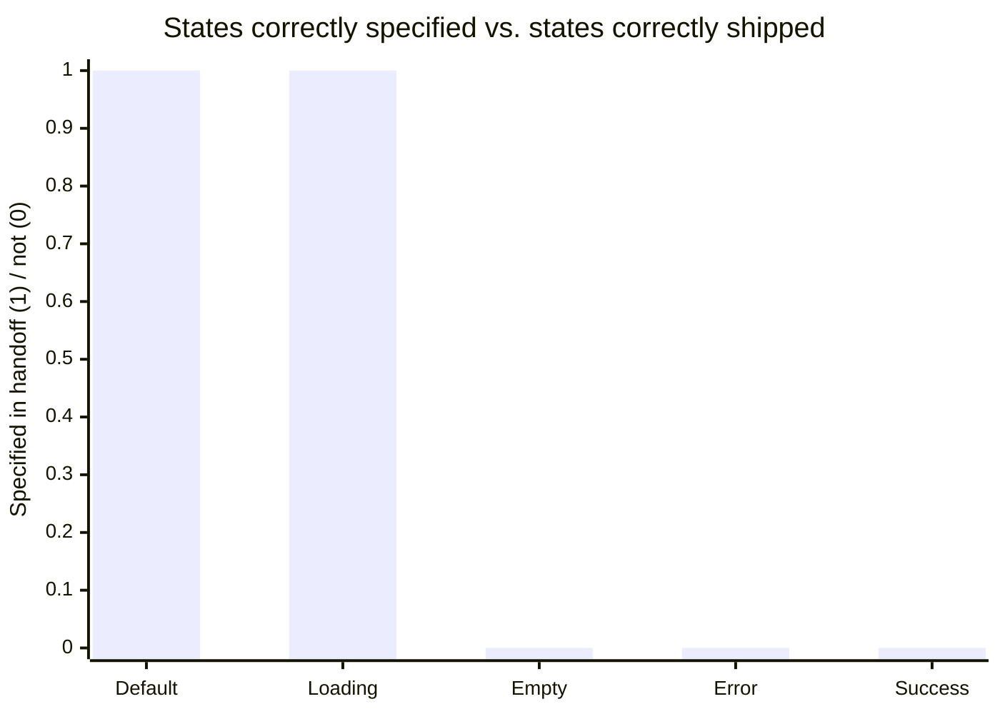
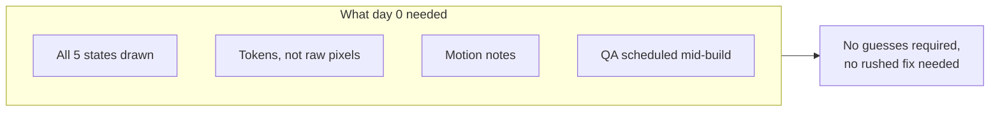

import Scenario from "../../../components/Scenario.astro";
import LevelIntro from "../../../components/LevelIntro.astro";
import Checkpoint from "../../../components/Checkpoint.astro";

<Scenario label="The full incident">
  <Fragment slot="facts">
    

      

        2 days
        before launch when drift was found
      

      

        

      

      
93% of the way through a 30-day build cycle

    

    
Timeline

    

      
📤 Day 0 — one Figma frame, no annotations, "ready to build"

      
🛠️ Day 1–27 — Sam builds against the visible default state

      
🔎 Day 28 — design QA finds 3 gaps

      
🚑 Day 29–30 — rushed fixes, one shipped wrong anyway

    

  </Fragment>

Priya's checkout redesign shipped two days late and one bug short of right. This is the full trace of how a five-state design became a three-state build, why the fix that finally shipped was itself a guess, and what would have made every step of this trace unnecessary.

</Scenario>

<LevelIntro
  items={[
    "The five gaps traced from handoff to hotfix",
    "Why late design QA produces worse fixes, not just costlier ones",
    "Calibrating spec detail so it doesn't become its own failure mode",
  ]}
/>

## Day 0: what the handoff actually transmitted

Priya posted a link to one Figma frame in the `#eng-checkout` channel: "Checkout redesign, ready to build — lmk if questions." The frame showed the default state: an itemized cart, a total, and a confirm button with 24px of padding around it, generated by an auto-layout structure Priya had set up months earlier and never revisited.

What that frame did _not_ carry, because a single static frame structurally cannot carry it: the four other states Priya had sketched on paper during design review but never rebuilt in Figma once the direction was approved, the reasoning behind the 24px spacing (it matched a token used on the two screens before checkout, for visual continuity across the flow), and the fact that the success state was supposed to include a brief checkmark animation she'd described verbally in a design review three weeks earlier — to five people, one of whom was Sam.

<Checkpoint question="Sam was in the design review where Priya verbally described the success animation. Three weeks later he built a static checkmark instead. Why doesn't 'he was told' close this gap the way a written spec would?">

Being told something once, verbally, in a meeting three weeks before you act on it is not a durable handoff artifact — it depends entirely on unaided memory surviving three weeks of unrelated work, with nothing to check against when memory inevitably degrades or gets crowded out. A spec is durable specifically because it doesn't rely on anyone's memory: it's still sitting there, unchanged, on day 27 exactly as it was on day 0. "He was told" shifts the failure from "the handoff didn't carry this" to "a person's memory didn't retain this," which is a much less fixable problem — you can improve a spec's completeness on purpose; you can't reliably improve how well someone remembers a throwaway verbal detail from a meeting weeks earlier.

</Checkpoint>

## Day 1–27: five gaps, five independent guesses

Sam built against what the frame showed him, and where it showed nothing, he made a reasonable call each time — reasonable individually, and wrong in aggregate:

| Gap               | What the frame showed                              | What Sam built                                                                                 | Was it a bad guess?                                           |
| ----------------- | -------------------------------------------------- | ---------------------------------------------------------------------------------------------- | ------------------------------------------------------------- |
| Empty-cart state  | Nothing — never designed                           | Cart silently renders as if it has one item                                                    | Not really — there was nothing to build from                  |
| Success animation | Nothing — described verbally, weeks earlier        | Static checkmark                                                                               | Reasonable, given zero durable reference                      |
| Error state       | A rough sketch in an old file Sam happened to find | Close, but used the wrong red (a hex value, not a token)                                       | Partially — right instinct, no token to check against         |
| Spacing           | 24px, readable only by hovering the layer          | 16px — Figma's inspector rounded to the auto-layout's computed gap, not Priya's intended token | Not really — this is a measurement error, not a judgment call |
| Loading state     | Shown correctly in the frame                       | Shipped correctly                                                                              | N/A — the one state the file actually carried                 |

Five gaps, one shipped correctly. Not because Sam was inattentive — the one state the file actually specified is the one state that shipped right.

The two "unspecified but attempted" states — error and the checkmark — aren't in that chart's zero column by accident of effort; Sam tried both. What separates "shipped correctly" from "shipped as a guess" isn't engineer effort, it's whether a durable, checkable reference existed at all.

## Day 28: what design QA actually found, and why it found it late

Design QA wasn't skipped — it was scheduled, but scheduled for the week before launch instead of built into the sprint. By day 28, the checkout flow had already been code-reviewed, merged to the release branch, and put on the release manager's checklist. Priya opened the built flow, tried triggering an empty cart, and found nothing happened — the "confirm" button submitted an order for an item that wasn't there.

<Checkpoint question="The empty-cart bug and the spacing bug were both 'found' on day 28. Why did fixing the spacing bug take twenty minutes, while fixing the empty-cart bug required a rushed, one-day patch that itself shipped with a new problem?">

The spacing bug was a value substitution — swap 16px for the correct token, no logic to rewrite, no new code paths to add, low risk to touch two days before launch. The empty-cart bug required actual new logic: detecting the empty-cart condition, deciding what should render instead, and wiring that into a checkout flow that had already been built, reviewed, and merged around the assumption that a cart always has items — meaning the fix wasn't a tweak to existing code, it was new functionality retrofitted under a two-day deadline with much less scrutiny than the original build got. Lateness doesn't just add stress; it changes the _category_ of fix a gap requires, from adjusting a value to writing and shipping new logic with a fraction of the normal review time.

</Checkpoint>

## Day 29–30: the fix that was itself a guess

Under the two-day deadline, the empty-cart fix that shipped was: if the cart is empty, disable the confirm button and show "Your cart is empty." Nobody on the team disagreed this was reasonable — but nobody had time to check it against what Priya had actually designed weeks earlier for this exact case, which turned out to be different: a full illustrated empty state with a "browse products" link, not a disabled button. The rushed fix wasn't wrong on its face. It was a second, smaller version of the exact same failure that caused the original bug — a gap filled with a guess instead of a spec, just compressed into a one-day window instead of a four-week one.

## What would have made every one of these five gaps not happen

None of the five gaps required more design skill from Priya or more care from Sam. Each maps to one specific missing artifact:

| Gap                 | Missing artifact                                              | What it would have carried                                        |
| ------------------- | ------------------------------------------------------------- | ----------------------------------------------------------------- |
| Empty-cart state    | The state itself, drawn                                       | A frame Sam could build from instead of guess                     |
| Success animation   | A motion spec (even a one-line note + a Lottie/GIF reference) | A durable reference instead of a three-week-old memory            |
| Error state color   | A design token reference                                      | `color-error = #DC2626`, not "the red from that other file"       |
| Spacing             | A design token reference                                      | `spacing-lg = 24px`, read instead of measured                     |
| Timing of design QA | A scheduled mid-build check-in, not a pre-launch gate         | Gaps caught while still cheap to fix as adjustments, not rewrites |

## Calibrating spec detail — more isn't automatically better

It would be a mistake to read this incident as "spec everything, exhaustively, always." A spec that documents the padding of every internal wrapper `
`, states a rule for pixel-level hover shadows nobody asked about, and annotates decisions with no ambiguity to resolve costs real designer time and produces a document engineers stop reading closely, because it can't be skimmed for what actually matters. The useful question isn't "did I document everything" — it's **"is there a real decision here an engineer could reasonably make differently than I intend?"** Spacing between the two of the most-visited screens in the product, genuinely ambiguous: yes. The exact padding on a tooltip nobody will scrutinize: probably not worth a dedicated annotation.

| Signal it needs a token/annotation                                                    | Signal it doesn't                                                  |
| ------------------------------------------------------------------------------------- | ------------------------------------------------------------------ |
| Value repeats across multiple screens (consistency matters)                           | Value is local and one-off                                         |
| Getting it wrong changes behavior, not just appearance (a disabled vs. hidden button) | Getting it "close enough" is genuinely invisible to a user         |
| It's a state nobody will think to ask about (empty, error)                            | It's the state already shown and obvious from the frame            |
| It was discussed once, verbally, and never written down                               | It's self-evident from the visual with no real alternative reading |

## Beyond this incident

The checkout flow is one incident, not the whole territory. A few ways to test whether the model actually transferred, rather than just the specific five gaps above:

- If the audience for this handoff were a _contract_ engineering team working async, in a different timezone, with no shared Slack channel for "quick questions" — which of the five gaps gets _more_ costly, and does the fix change, or just how urgently it's needed?
- If the news from design QA had been worse — not five gaps but a fundamental misread of the whole flow's structure — would the fix still be "add the missing artifact," or does a bigger gap call for a different response than a bigger version of the same fix?
- Priya's five-item checklist from L2 caught these gaps in hindsight. Which of the five items, if checked _before_ day 0's handoff message was sent, would have caught the most gaps for the least added work — and is that the same item that would matter most for a different kind of screen, like a data-heavy dashboard instead of a five-state checkout flow?

<Checkpoint question="A teammate says 'this incident proves designers should just learn to code so nothing gets lost in translation.' Using the calibration section above, what's the actual gap this incident traces, and does that proposed fix address it?">

The actual gap wasn't a translation-skill gap between two disciplines — it was a specific, nameable set of missing artifacts: undocumented states, unlabeled tokens, an undocumented motion note, and design QA scheduled too late to be cheap. Every one of those is fixable by changing _what gets handed off and when_, without either person acquiring a new skill. "Designers should code" doesn't target any of the five gaps directly — Priya coding the checkout flow herself wouldn't have made her draw the empty state any sooner, and it removes the second set of eyes that design QA specifically provides. The fix that actually matches the failure is a more complete handoff and an earlier check, not a change in who holds which skill.

</Checkpoint>
