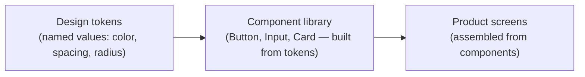

import Scenario from "../../../components/Scenario.astro";
import LevelIntro from "../../../components/LevelIntro.astro";

<Scenario>
  <Fragment slot="facts">
    

      

        6
        shades of "primary blue" found
      

      

        

      

    

    

      
📱 40 screens, 3 squads, 2 years, no shared library

      
📐 4 different corner-radius values on "the same" button

      
🛒 Checkout bug: wrong disabled style, lost carts

    

    
Who's affected

    

      
🎨 Designers — redrawing the same button per file

      
💻 Engineers — guessing which blue is "correct"

      
🛍️ Shoppers — confused by an inconsistent checkout

    

  </Fragment>

Northwind Retail's shopping app started two years ago as three screens
built by one designer and one engineer. It's now 40 screens, built by
five designers and twelve engineers split across three squads, none of
whom talk to each other daily. Ahead of a rebrand, someone runs a visual
audit and screenshots every "primary" button in the app side by side.

| Screen                       | Button color | Corner radius | Disabled style              |
| ---------------------------- | ------------ | ------------- | --------------------------- |
| Home → "Shop now"            | `#2563EB`    | 8px           | 60% opacity                 |
| Product page → "Add to cart" | `#1D4ED8`    | 6px           | grey fill                   |
| Checkout → "Buy now"         | `#3B82F6`    | 4px           | grey fill, no cursor change |
| Account → "Save changes"     | `#2452C7`    | 8px           | 60% opacity                 |

</Scenario>

No single screen looks broken on its own — a shopper looking only at the
checkout page has no idea the home page uses a different blue. **So if
nothing looks wrong in isolation, why does the audit feel like a real
problem?**

Because the checkout bug is a symptom, not a coincidence: the "Buy now"
button's disabled state was rebuilt from scratch by an engineer who had
never seen the account page's version, so it dropped the cursor change
that told shoppers the button was still loading. Four teams reinvented
the same four components, and one of the reinventions shipped a bug that
looks exactly like a broken checkout.

<LevelIntro
  items={[
    "Why consistency breaks down as screens multiply",
    "Design tokens, components, and the difference",
    "What a design system actually is (and isn't)",
  ]}
/>

- A **design system** is the answer to "how do we build the four hundredth screen without redrawing the button" — a shared, named, versioned set of visual decisions and the reusable components built on them, so no one has to reinvent "what blue is our primary blue" per screen.
- It has three layers, from raw value to reusable UI:

- A **token** is a named value, not a hardcoded one: instead of an engineer typing `#2563EB` from memory (or copying it wrong), the code references `color.primary.500`, and that name is defined exactly once.
- A **component library** is the layer above tokens: a `Button` component that already knows its own color, radius, and disabled state, built once from tokens, reused everywhere — so "add to cart" and "buy now" share code, not just an intent to look similar.
- What a design system is **not**: a static style guide PDF nobody opens, a Figma file that drifts out of sync with the real code, or a rule enforced only by memory and good intentions. If it isn't the thing engineers actually import, it isn't a design system yet — it's documentation of one.

| Term                   | Simple meaning                                                                        |
| ---------------------- | ------------------------------------------------------------------------------------- |
| Design token           | A named, reusable value (a color, a spacing unit, a radius) defined once              |
| Component library      | Reusable, pre-built UI pieces (Button, Input, Card) built from tokens                 |
| Design system          | Tokens + components + the rules and process that keep them the single source of truth |
| Visual drift           | Small, uncoordinated deviations that accumulate into visible inconsistency            |
| Single source of truth | The one place a value is defined; everything else references it, nothing redefines it |

- The audit above found drift in a two-year-old app with three squads. The relationship isn't a coincidence: more screens and more people touching them, with no shared source of truth, reliably produces more drift — that relationship is worth building intuition for, not just accepting as a fact (see the interactive demo on the concept page).
- A design system doesn't eliminate design decisions — it moves them upstream, from "pick a blue for this one button" (repeated 40 times, with drift) to "pick the primary blue once" (referenced 40 times, with none).
