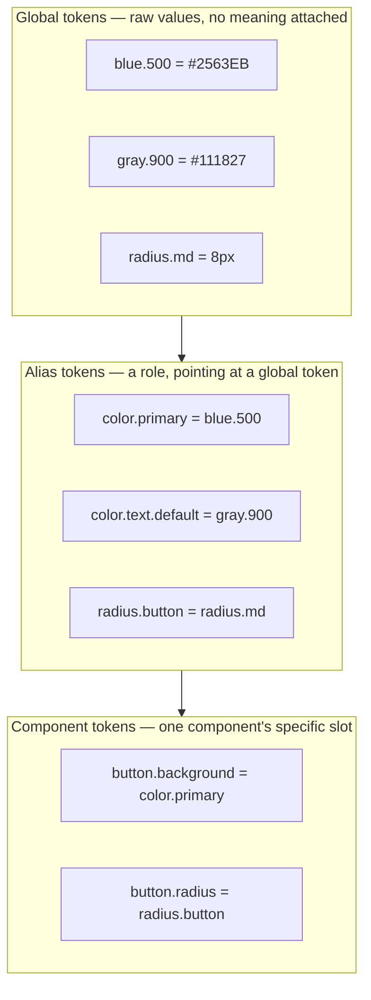

import Checkpoint from "../../../components/Checkpoint.astro";
import LevelIntro from "../../../components/LevelIntro.astro";

L1 showed that Northwind's 40 screens accumulated six shades of "primary
blue" because no one referenced a single shared value. L2 opens up what
"a single shared value" actually looks like in practice: tokens aren't
one flat list — they're layered, and the layering is what makes a
rebrand or a dark mode possible without touching every component.

<LevelIntro
  items={[
    "The three token layers and why each exists",
    "Real token syntax: JSON and CSS custom properties",
    "How a rebrand or dark mode flows through the layers",
  ]}
/>

## Why isn't one flat list of colors enough?

Suppose Northwind fixes the audit the crude way: everyone agrees the
primary button is exactly `#2563EB`, and every component hardcodes that
hex value. Six months later, marketing rebrands to a warmer blue. What
has to happen now?

Every file that hardcoded `#2563EB` has to be found and changed by hand
— across 40 screens, three squads, components, and CSS. A single flat
list of colors doesn't fix drift, it just centralizes the _value_ while
leaving the _reference_ problem untouched: nothing stops a sixth
component from hardcoding the hex again next sprint.

The fix is a naming layer between "the raw value" and "where it's used,"
and in practice that layer itself splits into three:



**Global tokens** hold the raw palette — plain values with no opinion
about where they're used. **Alias tokens** attach a _role_ to a global
value: `color.primary` doesn't say "this hex," it says "whatever we've
decided primary means right now." **Component tokens** point a specific
component slot (this button's background) at an alias, not at a raw
value directly.

<Checkpoint question="Marketing wants to rebrand the primary blue to a warmer shade. In a system with all three layers, which single line changes?">

Only the global token's raw value changes — `blue.500` gets a new hex.
Nothing else in the system needs to be touched, because every alias and
component token downstream is a reference to `blue.500`, not a copy of
its value. `color.primary` still points at `blue.500`, `button.background`
still points at `color.primary`, and both now resolve to the new hex
automatically. This is the entire payoff of the layering: a rebrand
becomes a one-line edit instead of a find-and-replace across 40 screens,
because nothing downstream ever hardcoded the old value in the first
place.

</Checkpoint>

## What this looks like as real tokens

Design tokens are usually authored as JSON (tool-agnostic, exportable
from Figma, consumable by any platform) and consumed in code as CSS
custom properties, or platform-native equivalents for iOS/Android. Here
is Northwind's actual button color chain, end to end:

```json
{
  "color": {
    "blue": { "500": { "value": "#2563EB" } },
    "gray": { "900": { "value": "#111827" } }
  },
  "alias": {
    "color": {
      "primary": { "value": "{color.blue.500}" },
      "text-default": { "value": "{color.gray.900}" }
    }
  },
  "component": {
    "button": {
      "background": { "value": "{alias.color.primary}" },
      "background-disabled": { "value": "{color.gray.900}", "opacity": 0.4 }
    }
  }
}
```

That JSON compiles (via a tool like Style Dictionary) into the CSS
custom properties engineers actually import:

```css
:root {
  --color-blue-500: #2563eb;
  --color-primary: var(--color-blue-500);
  --button-background: var(--color-primary);
  --button-radius: 8px;
}

.button--primary {
  background-color: var(--button-background);
  border-radius: var(--button-radius);
}
```

Notice the four screens from L1's audit never appear here at all —
that's the point. `.button--primary` is defined once, and every screen
that needs a primary button imports the same class instead of writing
its own `background-color: #1D4ED8` from memory.

## Tokens alone don't stop drift — components do

A token catalog with no component library still leaves engineers free
to assemble `background-color: var(--button-background)` by hand on
every screen, get the border-radius token right on three screens and
forget it on a fourth, and skip the disabled-state token entirely under
deadline pressure — exactly what happened to Northwind's checkout
button in L1. Tokens are the _values_; a component library is what
forces every screen to _consume the whole set together_, correctly, by
construction.

| Layer            | What it defines                                    | Who owns it                                    | Changes how often                   |
| ---------------- | -------------------------------------------------- | ---------------------------------------------- | ----------------------------------- |
| Global tokens    | Raw palette, spacing scale, radii, type scale      | Design system team, with design lead sign-off  | Rarely (rebrand, major refresh)     |
| Alias tokens     | Named roles (primary, danger, text-default)        | Design system team                             | Occasionally (new use case emerges) |
| Component tokens | One component's specific visual slots              | Component owner, following alias tokens        | Whenever that component is revised  |
| Components       | Assembled, reusable UI built from the tokens above | Design system team, consumed by product squads | On a versioned release cadence      |

A dark mode works the same way as the rebrand did: a second global
palette (`color.gray.900` becomes a light value instead of a dark one)
is swapped in, and every alias and component token that referenced it
resolves differently — again, without a single component's code
changing. That's the entire architectural bet of layering tokens: push
every decision that's likely to change (a color, a spacing unit) as far
upstream as possible, so the number of places that must change when it
does change is exactly one.
