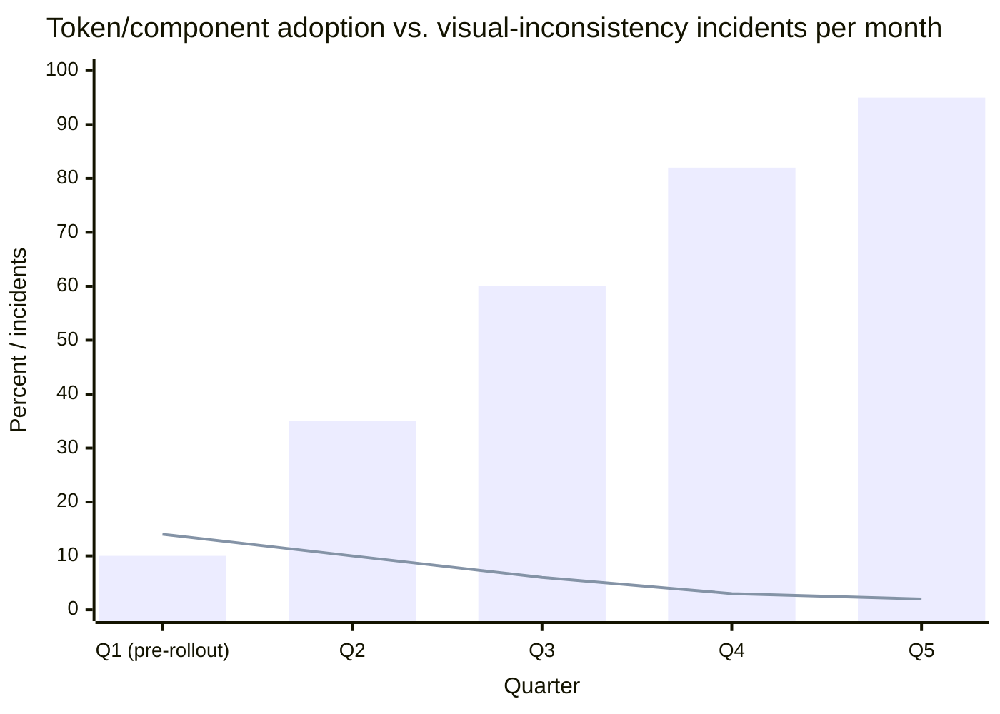

import Scenario from "../../../components/Scenario.astro";
import LevelIntro from "../../../components/LevelIntro.astro";
import Checkpoint from "../../../components/Checkpoint.astro";

<Scenario label="The post-mortem">
  <Fragment slot="facts">
    <div class="not-prose">
      <div class="mb-1 flex items-baseline justify-between">
        <span class="text-lg font-bold text-slate-800 dark:text-slate-100">+9%</span>
        <span class="text-xs text-slate-400">cart abandonment, 2 weeks</span>
      </div>
      <div class="h-2 w-full overflow-hidden rounded-full bg-slate-200 dark:bg-slate-700">
        <div class="h-full rounded-full bg-red-500 animate-fill-bar" style="--target-width: 90%"></div>
      </div>
    </div>

    <div class="not-prose mt-3 flex flex-col gap-1 text-sm text-slate-700 dark:text-slate-300">
      <div class="flex items-center gap-1.5"><span>🔘</span> "Buy now" disabled style: grey fill, no cursor change</div>
      <div class="flex items-center gap-1.5"><span>🕵️</span> Root cause: rebuilt from scratch, no shared Button</div>
      <div class="flex items-center gap-1.5"><span>💸</span> Estimated cost: ~$60k in abandoned carts</div>
    </div>

    <p class="not-prose mt-3 mb-1 text-xs font-semibold tracking-wide text-slate-400 uppercase">Fix scope</p>
    <div class="not-prose flex flex-col gap-1 text-sm text-slate-700 dark:text-slate-300">
      <div class="flex items-center gap-1.5"><span>🧱</span> Tokens: color, radius, spacing (Style Dictionary)</div>
      <div class="flex items-center gap-1.5"><span>🧩</span> Components: Button, Input, Card (v1)</div>
      <div class="flex items-center gap-1.5"><span>📜</span> Governance: RFC process, deprecation policy</div>
    </div>

  </Fragment>

Three weeks after the L1 audit shipped, checkout's "Buy now" button quietly
lost its cursor-change and loading-spinner cues when disabled — because
whoever built it never saw the version on the account page and rebuilt the
disabled state from memory. For two weeks, shoppers whose carts were
still processing saw a greyed-out button that looked identical to
"broken," and cart abandonment rose 9% before anyone connected the dots.
The fix for _this_ button took an afternoon. The real question the
post-mortem has to answer is bigger: **how does Northwind stop the next
three squads from rebuilding the next four components from memory?**

</Scenario>

<LevelIntro
  items={[
    "Diagnosing drift as a process failure, not a taste failure",
    "Rolling out tokens and components without a big-bang rewrite",
    "Governance: versioning, deprecation, and who owns what",
  ]}
/>

## What the post-mortem actually found

The easy, wrong conclusion is "the engineer who built checkout should
have looked harder." The post-mortem instead asked a structural
question: **before this bug, was there any single place in the codebase
where "what does a disabled button look like" was defined once?** There
wasn't. Four teams had four `Button` implementations, none importing
from a common source, so "looked harder" would have meant manually
cross-referencing three other codebases under a sprint deadline — a
process failure, not a diligence failure, and the fix has to be
structural too.

| Symptom                     | What it looks like                      | What it's actually evidence of                            |
| --------------------------- | --------------------------------------- | --------------------------------------------------------- |
| 6 shades of "primary blue"  | Cosmetic inconsistency, easy to dismiss | No single source of truth for the value                   |
| 4 corner-radius values      | Cosmetic inconsistency                  | Same — components not built from shared tokens            |
| Checkout disabled-state bug | A real, costly functional bug           | Components rebuilt from memory, not from a shared library |

The first two rows look like a design nitpick. The third row is what
they were always one missed detail away from becoming — the checkout
bug is what happens when the same root cause (no shared source of
truth) hits a component whose correctness, not just its color, depends
on consistency.

<Checkpoint question="A teammate argues: 'the real fix here is just a stricter code review checklist for disabled states.' What does a checklist fix, and what does it leave exactly as fragile as before?">

A checklist can catch this specific failure mode — a reviewer who
remembers to ask "does the disabled state match the other three
screens?" might catch it before merge. But it leaves the underlying
condition untouched: there are still four independent `Button`
implementations, so the checklist has to be re-run, correctly, by a
human, on every future change to every one of them, forever, and it
only prevents the failure modes someone thought to write down. A shared
component removes the need for the checklist on this axis entirely,
because there's only one implementation left to get right — the fix
that scales is the one that makes the mistake structurally harder to
make, not the one that asks people to remember not to make it.

</Checkpoint>

## Rolling it out without freezing the roadmap

Northwind can't pause all three squads for a rewrite — the fix has to
land incrementally, alongside normal feature work. The rollout that
worked:

1. **Extract tokens first, from the values already in use.** The design
   system team audited all six blues, picked the one closest to brand
   guidelines as `color.blue.500`, and shipped it as a published token
   package before touching a single component. This step alone is
   low-risk: nothing consumes the tokens yet, so nothing can break.
2. **Build and publish the highest-collision components first.**
   `Button`, `Input`, and `Card` accounted for the most duplicated,
   drifted code, so they became v1.0.0 of the component library —
   versioned and published like any other internal package, not copied
   into each squad's repo.
3. **Migrate opportunistically, not all at once.** Squads adopted the
   new `Button` whenever they were already touching a screen for
   unrelated feature work, rather than being assigned a dedicated
   migration sprint. New screens were required to use it from day one;
   old screens migrated on contact.
4. **Track adoption and incidents together**, so the design system team
   could show, not just claim, that the investment was paying off.



The bars are token/component adoption across screens; the line is
inconsistency incidents logged per month. Adoption climbing and
incidents falling in the same window is the actual argument for the
system's value — a rebrand or a design refresh is a nice-to-have pitch,
a measurable drop in incidents like the checkout bug is what got
leadership to fund a dedicated design-system headcount for year two.

## Governance: who's allowed to change what

A component library with no ownership model just becomes a second place
to drift — five squads editing the shared `Button` directly reproduces
exactly the problem it was built to solve, one repository later instead
of forty screens later. Northwind's governance settled on three rules:

- **Global and alias tokens are owned by the design system team**,
  changed only through a lightweight RFC: a short written proposal,
  visible to every squad, before a rebrand-scale change ships. This is
  deliberately slow, because a global token change is the one-line edit
  that fans out to everything.
- **Component tokens and new components can be proposed by any squad**,
  but merged by the design system team — the same review gate a shared
  library needs for any breaking change, just scoped to the visual
  layer instead of the logic layer.
- **Breaking changes are deprecated, never silently swapped.** When the
  `Button` API changed to add a required `loadingState` prop, the old
  prop shape kept working (with a console warning) for one full
  release cycle before removal — mirroring how a public library
  handles a major version bump, because from each squad's point of
  view, the internal component library _is_ a dependency they didn't
  choose to break.

<Checkpoint question="Why does 'component tokens can be proposed by any squad, but merged by the design system team' avoid recreating the original drift problem, instead of just moving it?">

Because the drift problem was never about who has an opinion — it was
about there being no single place those opinions land. Letting any
squad propose a change keeps the system responsive to real product
needs (a squad closest to the problem often has the best fix), while
routing every merge through one team preserves exactly the property
that was missing before: a single owner who can see every change in
context and catch the sixth blue before it ships, instead of after an
audit finds it. The bottleneck is intentional — it's the same job the
missing shared `Button` was supposed to do, just performed by a review
gate instead of a component boundary.

</Checkpoint>

## Extending the system: a worked example

Six months in, the checkout squad needs a "delete this saved address"
confirmation button that should look urgent — red, not blue. Tracing it
through the layers from L2:

```json
{
  "color": {
    "red": { "500": { "value": "#DC2626" } }
  },
  "alias": {
    "color": {
      "danger": { "value": "{color.red.500}" }
    }
  },
  "component": {
    "button": {
      "background-danger": { "value": "{alias.color.danger}" }
    }
  }
}
```

No existing token was edited — `color.red.500` and `color.danger` are
additions, and `Button` gains a `variant="danger"` prop that resolves
to `background-danger` instead of the default `background`. The
checkout squad didn't invent a new red from scratch, didn't touch
`color.primary`, and every other screen using `Button` is completely
unaffected — extension, not modification, is what makes the system safe
to grow without re-triggering the original audit.

**Before moving on:** this example added one new alias token for one
new use case. What would change if, instead, Northwind acquired a
sister brand that needed its own primary color while sharing every
component and every alias _name_ — would `color.primary` still be able
to point at a single global token, or does the alias layer itself need
to become brand-aware? (It's the latter — this is exactly what
multi-brand design systems solve by making the alias layer resolve
differently per brand context, while every component and every alias
_name_ stays identical. The worked example above is one case of the
token hierarchy earning its keep; a rebrand, a dark mode, and a second
brand are three more, and none of them require touching a component.)
