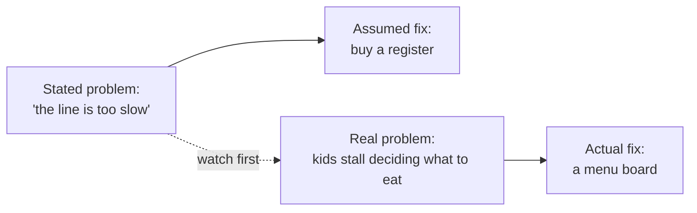

import Scenario from "../../../components/Scenario.astro";

<Scenario>
  <Fragment slot="facts">
    

      

        24 min
        to serve one lunch wave, 20-min period
      

      

        

      

    

    
The five stages, as they actually happened

    

      
👀 Empathize — watched the line for 10 minutes

      
🎯 Define — the real stall is deciding, not paying

      
💡 Ideate — a dozen ways to help kids decide faster

      
🧻 Prototype — a taped-up paper menu board, day one

      
⏱️ Test — line re-timed with the board up

    

  </Fragment>

The cafeteria line at Jefferson Middle School takes 24 minutes to get
through — for a 20-minute lunch period. Some kids get 6 minutes to eat;
some don't sit down at all. The principal's first instinct: buy a second
register and hire a second cashier.

The 24-minute number assumes the cafeteria already has two parallel food
lanes feeding the register area: `60 students * 40 decision seconds / 2`
is 20 minutes of decision bottleneck, plus about 4 minutes of checkout.
That matters because adding a register only attacks the 4-minute part;
helping students decide sooner attacks the 20-minute part.

Before spending the budget, a student council rep asks to just watch the
line for ten minutes first, stopwatch in hand.

| What the stopwatch shows                            | Seconds per student |
| --------------------------------------------------- | ------------------- |
| Standing at the register, paying                    | 8                   |
| Standing at the food station, deciding what to take | 40                  |

**Before reading on: if almost all the wait is at the food station, not the register — what happens if the school buys a second register anyway?**

</Scenario>

Almost nothing. A second register speeds up a step that was never the
bottleneck — the line would still stall at the food station, just with an
extra idle cashier standing next to it.

- Design thinking is a five-stage method for making sure the thing you build actually addresses the problem people have — not just the first idea anyone reaches for: **Empathize → Define → Ideate → Prototype → Test.**
- It's a loop, not a checklist completed once. A Test finding routinely sends you back to **Define** ("we had the wrong problem") or even back to **Empathize** ("we're missing a whole group's experience") — not just back to tweaking the same Prototype.
- **Empathize**: directly observe and talk to the people who have the problem — not asking around, not guessing from your own experience, not trusting a survey question that got written before anyone watched what actually happens.
- **Define**: turn raw observations into one specific, human-centered problem statement that names no solution. "Kids stall deciding what to eat" is a Define statement. "We need a second register" already assumes an answer — it's a solution wearing a problem's clothes.
- **Ideate**: generate a wide range of candidate solutions before judging any of them — quantity first, judgment later. A menu board is one idea among many, not the first one anyone reached for.
- **Prototype**: build the cheapest, roughest version that can test your riskiest assumption — a taped-up sheet of paper, not a finished laminated sign.
- **Test**: put that rough version in front of real people and watch what they actually do — not ask "would a menu board help?" and trust the answer.
- The single most common way teams skip design thinking without noticing they've skipped it: treating the first proposed fix as if it were already the defined problem, and jumping straight to building it.

The stated problem and the assumed fix arrive together, in the same
breath, before anyone has looked at what's actually happening — that's the
trap. The real problem only shows up on the branch that goes through
watching first.

| #   | Stage     | One question it answers                            |
| --- | --------- | -------------------------------------------------- |
| 1   | Empathize | What are people actually experiencing?             |
| 2   | Define    | What's the real, human-centered problem?           |
| 3   | Ideate    | What are many possible ways to solve it?           |
| 4   | Prototype | What's the cheapest way to test the riskiest idea? |
| 5   | Test      | What do real people actually do with it?           |
