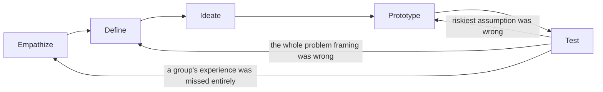
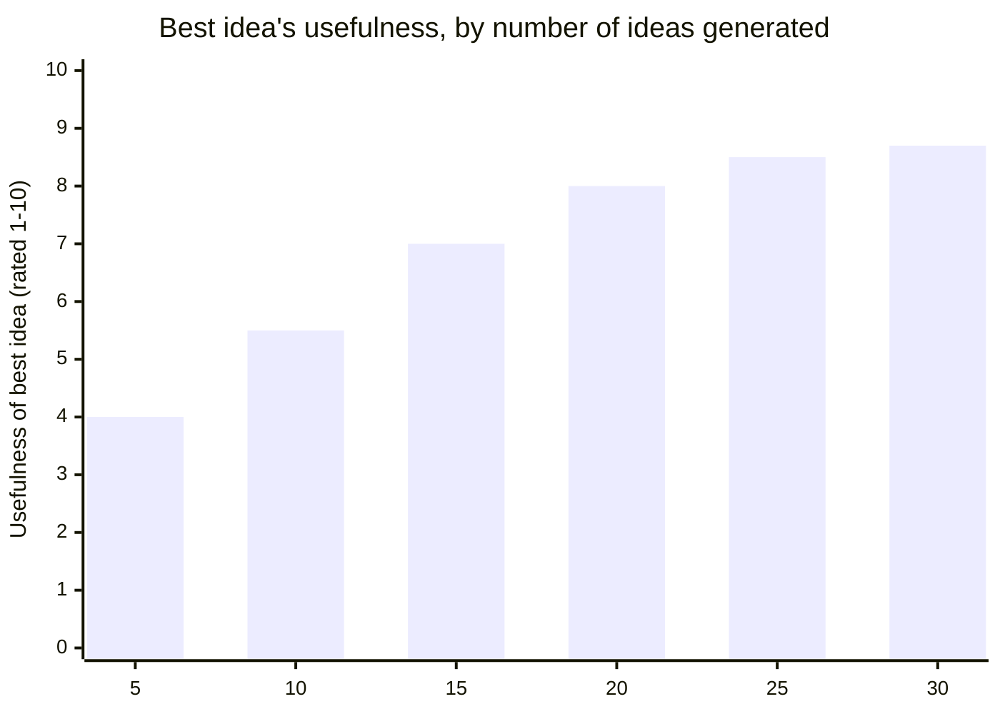

## The loop, not the checklist

The cafeteria team from L1 fixed the menu-board problem and moved on. Two
weeks later, wait times crept back up — not at the food station this
time, but at the register, where a new "combo meal" option had cashiers
asking clarifying questions. **If design thinking were a five-step
checklist you complete once, what would this team do wrong next — and
what does the loop version tell them to do instead?**

A checklist mentality says "we already did Empathize and Define, we're
done with those" and jumps straight to prototyping a fix for the
register. The loop version says the new symptom is itself a signal to
re-enter Empathize for _this_ specific stall, because a Test finding
about a different bottleneck doesn't get to skip straight to Prototype —
it has to earn a fresh Define first.

Three different arrows come out of Test, not one — and which arrow fires
depends on _what kind of surprise_ the test produced, not on how the team
feels about the result.

| Test result                                                   | Loop back to | Why                                                               |
| ------------------------------------------------------------- | ------------ | ----------------------------------------------------------------- |
| The board helped, but kids still hesitate on combo meals      | Empathize    | A new group/moment of friction was never observed at all          |
| The board's wording confused kids, even though the idea works | Prototype    | The concept is right; only the execution needs another pass       |
| Kids read the board fine but still stall — comparing prices   | Define       | The problem was named wrong: it's price anxiety, not menu options |

## What each stage is actually answering

Before the table below: two students in the group both say they "did
Empathize" for the register-clog problem. One spent ten minutes standing
near the line, reading the room. The other sent a three-question survey.
**Which one is closer to Empathize, and what would the survey-writer have
missed that the observer wouldn't?**

The observer would catch things nobody thinks to put in a survey answer —
a kid re-reading the combo board twice, asking a friend "wait, is the
drink included?", stepping out of line to go back and check. A survey
only captures what people can already articulate about their own
behavior, which is usually not the actual friction point.

| Stage     | Guiding question                                                     | Typical output                                 | Signal you skipped it                                                        |
| --------- | -------------------------------------------------------------------- | ---------------------------------------------- | ---------------------------------------------------------------------------- |
| Empathize | What are people actually doing, not what do they say they do?        | Field notes, direct quotes, timed observations | Your "finding" is really your own assumption, restated with more confidence  |
| Define    | What's the human-centered problem, with no solution baked in?        | A one-sentence problem statement (a POV)       | The "problem statement" already contains a feature name or a product noun    |
| Ideate    | What's the widest range of ways to address this, before judging any? | A long list, deliberately including bad ideas  | The list has exactly one idea on it, and it's the one someone already wanted |
| Prototype | What's the cheapest artifact that tests our riskiest assumption?     | A rough, disposable mockup                     | The "prototype" took longer to build than the actual feature would have      |
| Test      | What did people actually do with it, not what did they say about it? | Observed behavior, a measured before/after     | The only evidence is "they said they liked it"                               |

Quick vocabulary bridge:

| Term       | Meaning in this unit                                                |
| ---------- | ------------------------------------------------------------------- |
| POV        | "Point of view": a one-sentence statement of who needs what and why |
| Bottleneck | The slowest step that controls the whole flow                       |
| Assumption | Something the team believes is true but has not proven              |
| Prototype  | The cheapest artifact that can test one assumption                  |
| Divergent  | Opening the search wide before judging ideas                        |
| Convergent | Narrowing ideas using explicit criteria after the wide search       |

## Define: writing a problem statement that isn't a solution in disguise

A team writes down "users need a bigger, brighter menu board" as their
Define statement and moves on to Ideate. **What's wrong with treating
that as Define — and what test would catch it?**

It already names the solution (a board), so Ideate has nowhere left to
go — every "idea" from here on is just a variation on board design. The
test: read the statement back and ask whether it names a specific
artifact or feature. A real Define statement fills in this shape without
ever naming one:

> **[Person/group]** needs a way to **[verb — do something]** because
> **[the underlying reason, not the requested item]**.

For the cafeteria: "Students at the food station need a way to decide
what to take _before_ they reach the counter, because deciding under
time pressure with a line behind them is what's causing the stall" — no
mention of a board, a sign, or any specific fix. That sentence can be
answered by a dozen different ideas, which is exactly the point.

## Ideate: divergent before convergent

Given the Define statement above, a facilitator's first move is to ban
the word "no" for the next fifteen minutes and ask for at least twenty
ideas, however impractical. **Why deliberately ask for bad ideas
instead of going straight for the best one?**

Because judging ideas while generating them collapses the search to
whatever's already familiar — usually a version of the first fix anyone
thought of. Idea _volume_ is a rough proxy for solution _coverage_: a
bigger net catches ideas nobody would have reached by direct reasoning
from the problem statement, including some of the best ones.

The curve climbs fast early and flattens later — the first handful of
ideas usually looks like small variations on the obvious fix; the
strongest ideas tend to show up once the obvious ones are exhausted and
the group has to reach further. This is also why Ideate has two distinct
halves, not one continuous activity:

| Half       | What happens                                              | Rule                            |
| ---------- | --------------------------------------------------------- | ------------------------------- |
| Divergent  | Generate as many candidate ideas as possible              | Defer judgment, quantity first  |
| Convergent | Group, vote, and narrow to a short list worth prototyping | Apply judgment, criteria stated |

Skipping straight to convergent — picking a favorite in the first five
minutes — is the same mistake as writing a solution-shaped Define
statement: it forecloses the search before it started.

## Prototype and Test: cheap artifact, real behavior

The group picks "a menu board with photos, prices grouped by wait time to
prepare" from their narrowed list. **Should they hire a sign shop before
lunch tomorrow, or something else?**

Something else — a laminated sign is a _finished_ artifact, and finished
artifacts are expensive to change if the idea turns out wrong. A
Prototype only needs to be real enough to test the riskiest assumption
("will a visible board actually shorten decision time"), so a sheet of
poster paper taped up for one lunch period tests that just as well as a
professionally printed sign, at a fraction of the cost of being wrong.

Test then means timing the _real_ line with the paper board up — not
asking students in the hallway afterward "did you like the sign?" A
"yes" to that question is weak evidence; a stopwatch reading is direct
evidence, because it measures the actual behavior the Define statement
was about (deciding before reaching the counter), not a reported opinion
about the artifact.

## The mental model in one line

Every stage exists to protect against one specific failure: Empathize
protects against solving an assumed problem; Define protects against a
vague or solution-shaped problem; Ideate protects against anchoring on
the first idea; Prototype protects against over-investing before
validating; Test protects against trusting opinions over behavior. Skip
any one, and that specific failure mode comes back — which is why the
loop keeps circling instead of stopping after one pass.
