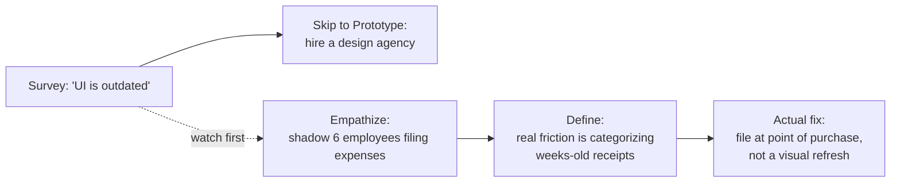
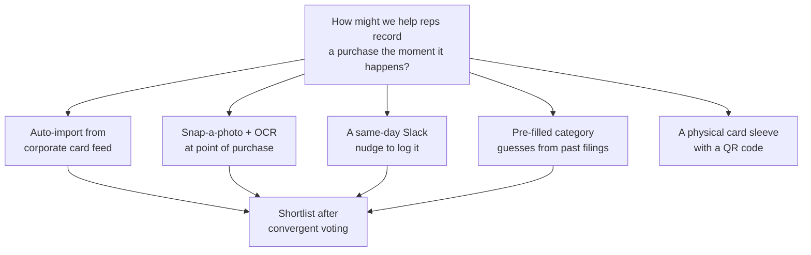
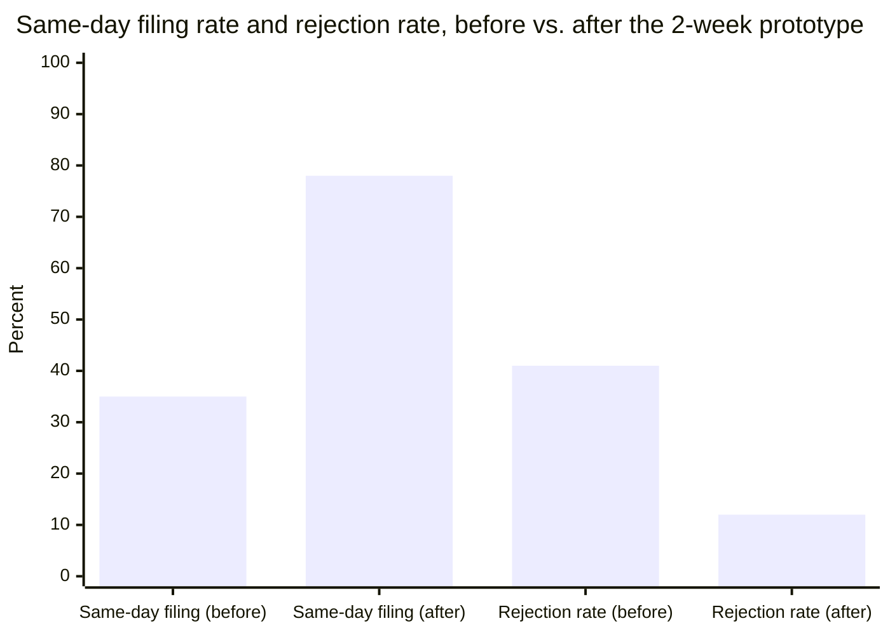

import Scenario from "../../../components/Scenario.astro";

<Scenario label="The scenario">
  <Fragment slot="facts">
    

      

        35%
        reports filed same-day (before)
      

      

        

      

    

    
The instinct vs. what shipped

    

      
🎨 First instinct: "redesign the UI"

      
👀 Shadowed 6 employees filing real expenses

      
🎯 Real friction: categorizing weeks-old receipts, not the UI

      
🧪 Tested with a spreadsheet + a human, no code written

    

  </Fragment>

ExpenseFlow, a mid-size company's internal tool for filing reimbursement
reports, has a 41% rejection rate on submitted reports and a
company-wide survey where the top complaint is "the app is outdated and
annoying." The product lead's first instinct, backed by that survey: get
a design agency to modernize the UI. Before signing that contract,
someone on the team asks for two weeks to actually watch people file
expenses first.

</Scenario>

The survey wasn't wrong that people were frustrated — it was wrong about
*why*, because "the UI looks old" is the easiest thing to blame when
you're annoyed and don't have language for the actual friction. Watch
what five stages of design thinking do with the same starting complaint.

## Stage 1 — Empathize: watching instead of asking

**Before reading on: if you only had the survey, what would you have
missed by not watching anyone actually file a report?**

The team shadowed six employees across roles — two traveling sales reps,
an engineer who files maybe twice a year, and two people who approve
reports rather than file them — and simply watched, taking notes instead
of asking leading questions.

| Who                          | What they actually did                                                        | What they said when asked directly       |
| ------------------------------ | --------------------------------------------------------------------------------- | ---------------------------------------------- |
| Traveling sales rep (Priya)     | Kept a shoebox of paper receipts for 3 weeks, filed everything in one sitting     | "The form fields are confusing"                |
| Traveling sales rep (Marcus)    | Photographed receipts immediately, forgot which ones he'd already logged           | "The categories don't match what I need"       |
| Engineer, rare filer (Dev)      | Filed once, gave up halfway, asked a colleague to finish it for him                 | "It's fine, I just don't do it often"          |
| Approver (Angela)               | Rejected line items where the category didn't match the card statement's label     | "People just don't fill it in carefully"       |

Nobody in the room, when asked directly, said "I struggle to remember
what a three-week-old receipt was for." But that's what the observation
showed happening in every single case where a report got rejected — the
delay between purchase and filing, not the form's appearance, was where
the actual information got lost.

## Stage 2 — Define: naming the problem without naming a fix

**Two candidate Define statements are on the table. Which one is
actually usable, and which one has quietly already picked a solution?**

- **A:** "Employees need a more modern, visually appealing expense form."
- **B:** "Traveling employees need a way to record what a purchase was
  for at the moment it happens, because reconstructing that detail
  weeks later from a pile of receipts is where accuracy breaks down."

Statement A already names the fix (a form redesign) — Ideate would have
nowhere to go except font choices and color palettes. Statement B names
the actual mechanism of failure (delay between purchase and memory) and
leaves the *how* completely open. The team adopted B, and re-scoped the
project from "redesign the UI" to "close the gap between purchase and
filing."

This also surfaced a second, distinct problem the original survey never
separated out: Angela's rejection pattern wasn't about employee UI at
all — it was a mismatch between the category labels employees chose and
the labels the corporate card statement used. That became its own,
narrower Define statement to revisit later, rather than something the
team tried to solve inside the same fix.

## Stage 3 — Ideate: a wide net before narrowing

Working from statement B, the team ran a 20-minute divergent session with
one rule: no idea gets discussed or dismissed until the list is done.

The shortlist that survived voting kept three ideas, deliberately not
one: a same-day nudge (cheapest to test), pre-filled category guesses
(directly targets Angela's rejection pattern), and OCR-from-photo
(highest potential value, but the riskiest and most expensive to build).
Ideating in the open, before committing engineering time to any one of
them, is what made it possible to test the cheap idea first instead of
building the expensive one on faith.

## Stage 4 — Prototype: the cheapest thing that could be wrong

**The OCR idea tested best in the brainstorm discussion. Should the team
start there?**

No — not before testing the *underlying* assumption behind all three
ideas: that filing at the moment of purchase, instead of batching later,
actually improves accuracy. Building OCR first would spend real
engineering weeks testing that assumption indirectly, wrapped inside a
feature that could also fail for unrelated reasons (bad photo quality,
OCR misreads).

Instead, the prototype was a shared spreadsheet and a person: for two
weeks, five volunteer reps texted a photo of each receipt to a team
member the moment they made a purchase, who manually logged it with a
pre-filled category guess based on the merchant name — a **Wizard of Oz**
prototype, where a human manually does what the eventual software would
automate. No OCR, no automation, nothing shipped — just enough to observe
whether same-day logging changed behavior at all.

## Stage 5 — Test: measuring behavior, not opinions

Same-day filing jumped from 35% to 78%, and the rejection rate dropped
from 41% to 12% among the five volunteers — measured from actual
submission timestamps and approval outcomes, not from asking "did this
help?" (three of the five, asked directly, said the process "felt about
the same," even though their filing behavior had clearly changed — a
reminder that self-report and observed behavior can disagree even when
the same person is the subject of both).

The result validated the core assumption (moment-of-purchase logging
reduces errors) without a single line of production code, and it also
surfaced a new finding: reps still resisted logging cash purchases,
because there was no receipt photo trigger for those. That became a new
Empathize question for the next loop, not a flaw in the current fix.

## What each of the five stages protected against here

| Stage      | What it caught in this case                                                          |
| ---------- | ---------------------------------------------------------------------------------------- |
| Empathize  | The survey's "outdated UI" framing, which would have led to a visual refresh that fixed nothing |
| Define     | Statement A's disguised solution, and Angela's separate category-mismatch problem hiding inside the same complaint |
| Ideate     | Anchoring on OCR (the flashiest idea) before testing the cheaper, shared assumption underneath it |
| Prototype  | Weeks of engineering spent validating an assumption that a spreadsheet could validate for free |
| Test       | Trusting "felt about the same" self-reports over the timestamps that showed real behavior had changed |

## Failure modes

  

    ⚠️
    
      <strong>Skipping straight from complaint to Prototype.</strong> Hiring
      the design agency on day one would have shipped a modernized version
      of the exact same broken workflow.
    
  

  

    ⚠️
    
      <strong>A Define statement that already names the fix.</strong>{" "}
      Statement A ("more modern form") closed off every idea except font
      and color choices before Ideate even started.
    
  

  

    ⚠️
    
      <strong>Prototyping the flashiest idea instead of the cheapest
      test.</strong> OCR was the most exciting idea in the room and the
      most expensive way to learn whether the underlying premise even held.
    
  

  

    ⚠️
    
      <strong>Grading Test on opinions instead of behavior.</strong> Three
      of five volunteers said the process "felt about the same" — the
      timestamps said otherwise, and the timestamps are what the Define
      statement was actually about.
    
  

## When the full cycle is worth it — and when it's overkill

| Situation                                                              | Call                                                                     |
| -------------------------------------------------------------------------- | ---------------------------------------------------------------------------- |
| High uncertainty about the real problem, many stakeholders, expensive to reverse | Run the full loop — this is exactly what ExpenseFlow needed                 |
| A well-understood problem with clear precedent (fixing a known typo, a broken link) | Skip the ceremony — there's no ambiguity about the problem left to uncover  |
| A trivial internal change with one user and a five-minute build           | A quick conversation substitutes for formal Empathize/Define — the loop still applies conceptually, just compressed to minutes |
| A customer-facing redesign touching thousands of users, contractual or compliance stakes | The full cycle is close to mandatory — the cost of Empathizing wrong is now multiplied by scale |

Running the full five-stage process on a change everyone already
understands is its own failure mode — the loop exists to resolve real
uncertainty about the problem, not to formally ritualize decisions that
were never actually in doubt.

## Beyond this example

  🧾 ExpenseFlow
  &rarr;
  🏢 Any tool people are quietly avoiding

ExpenseFlow is one case, not the whole territory. A few questions to test
whether the model actually transferred, not just the specific numbers
above:

- If ExpenseFlow were a customer-facing product used by thousands of
  people instead of an internal tool used by dozens, which stage would
  need to change the most — and would a five-person Wizard of Oz test
  still be a defensible Prototype, or would the stakes demand something
  closer to a real (but limited) rollout before Test?
- The team had two weeks for Empathize. If they'd had one day instead,
  what would you cut first — the number of people shadowed, or the depth
  of observation on fewer people — and what's the actual risk of each
  cut?
- Angela's category-mismatch problem got deliberately set aside as its
  own loop rather than folded into the same fix. What would have gone
  wrong if the team had tried to solve both problems with one Define
  statement and one Prototype?
