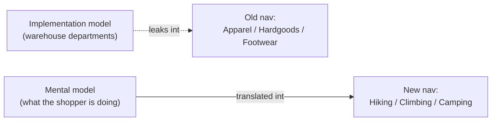

import Scenario from "../../../components/Scenario.astro";
import LevelIntro from "../../../components/LevelIntro.astro";

<Scenario>
  <Fragment slot="facts">
    

      

        34%
        found it under the old nav
      

      

        

      

      

        91%
        found it after the fix
      

      

        

      

    

    
Old nav (by department)

    

      
👕 Apparel

      
🧰 Hardgoods

      
👟 Footwear

    

    
New nav (by activity)

    

      
🥾 Hiking

      
🧗 Climbing

      
🏕️ Camping

    

  </Fragment>

Trailhead Supply Co. sells outdoor gear online. Its warehouse — and its
website nav — is organized the way the buying team thinks about the
business: **Apparel, Hardgoods, Footwear, Accessories**. A waterproof
shell jacket lives under Apparel, because that's what it is on a
spreadsheet.

A support ticket comes in: "I've been on your site for ten minutes and I
can't find a rain jacket for a hike. Do you even sell them?" The jacket
is three clicks away. It has been the whole time.

| What the team thinks              | What the shopper thinks                   |
| --------------------------------- | ----------------------------------------- |
| "It's a jacket, so it's Apparel." | "I'm going hiking, so I'll click Hiking." |
| Categories = how we stock it      | Categories = why I'm here                 |

**Before reading on: the site isn't missing the product, isn't broken, and isn't badly written — so what, specifically, is wrong?**

</Scenario>

Nothing about the page itself is broken. The jacket exists, the photo
loads, the price is right, checkout works. The thing that's broken is
the **map** — the structure the shopper has to guess their way through
to reach a product that was there all along.

In plain words: information architecture is deciding which door a person
sees first when they are trying to reach something. A grocery store
could organize shelves by supplier contract, but shoppers expect "fruit,"
"bread," and "cleaning supplies." Trailhead made the same mistake
digitally: it exposed the company's storage map instead of the shopper's
search map.

<LevelIntro
  items={[
    "Mental model vs. implementation model",
    "The four building blocks of IA",
    "Card sorting as the way to test a taxonomy",
  ]}
/>

- **Information architecture (IA)** is how a product's content and
  features are organized, labeled, and connected so people can find
  what they need — the map, not the territory.
- A **mental model** is how a person naturally groups and names things
  in their head before they ever see your site. Trailhead's shoppers
  group by _activity_ ("I'm going hiking"); the buying team groups by
  _stock category_ ("it's Apparel"). Both are internally consistent —
  they just don't match.
- An **implementation model** is how the underlying system actually
  organizes things (warehouse departments, database tables, org
  charts). IA fails whenever the implementation model leaks straight
  into the nav instead of being translated into the visitor's model.
- The core building blocks of IA:
  - **Hierarchy / taxonomy** — what's nested under what.
  - **Navigation systems** — global (always visible), local (within a
    section), contextual (links inside content itself, like "you might
    also need trekking poles" on the jacket page).
  - **Labeling systems** — the actual words used for categories and
    links; a label that makes sense internally ("Hardgoods") can be
    meaningless to a visitor.
  - **Search vs. browse** — two different ways to find the same item,
    which fail differently and need different fixes.
- **Card sorting** is the standard technique for finding the mismatch
  before it ships: give people cards with content/feature names and let
  them group and label the groups themselves — no menu to influence
  them. The groupings people produce are the mental model; compare that
  to what's live.
- Findability isn't a nice-to-have layered on top of a product — a
  feature nobody can find might as well not exist. It shows up as
  abandoned carts, support tickets, and "we already built that, why are
  they asking for it again."

The shape of the fix is always the same: stop asking "how do we store
this," and start asking "how would someone looking for this describe
it."

Quick vocabulary bridge:

| Term                 | Meaning here                                                                   |
| -------------------- | ------------------------------------------------------------------------------ |
| IA                   | The map of content, features, labels, and paths people use to find things      |
| Taxonomy             | The category system: what buckets exist and what belongs in each               |
| Hierarchy            | The nesting: which buckets sit inside other buckets                            |
| Mental model         | The user's natural way of grouping and naming things                           |
| Implementation model | The company's internal way of storing, staffing, or building things            |
| Browse               | Clicking through categories when you know the situation but not the exact name |
| Card sort            | Asking people to group unlabeled content cards so their model becomes visible  |

| Building block       | Question it answers                         |
| -------------------- | ------------------------------------------- |
| Hierarchy / taxonomy | What's nested under what?                   |
| Navigation systems   | Global, local, or contextual — where am I?  |
| Labeling systems     | Does this word mean the same thing to them? |
| Search vs. browse    | Do they know the name, or just the need?    |
| Card sorting         | How do real people group this, unprompted?  |
