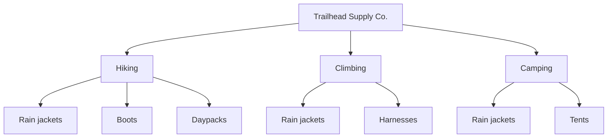

import Scenario from "../../../components/Scenario.astro";

<Scenario label="The design question">
  <Fragment slot="facts">
    

      
🌳 Hierarchy — what's nested under what

      
🧭 Navigation — global / local / contextual

      
🏷️ Labeling — what the categories are called

      
🔍 Search vs. browse — two failure modes

    

    

      All four operate on the <strong>same tree</strong> at once — changing one without checking the others is how redesigns quietly break things.
    

  </Fragment>

You could fix Trailhead's nav by just renaming "Apparel" to "Hiking
Gear." Would that actually solve the problem, or only patch the part of
it that's visible from the homepage?

</Scenario>

Renaming one label fixes one symptom. The rain jacket is also relevant
to climbing (layering under a hardshell) and to camping (staying dry in
a tent). A single rename doesn't touch that — the deeper issue is that
IA is a **system of four interacting parts**, not one dropdown menu.

## 1. Hierarchy and taxonomy — what's nested under what?

**Guiding question: if two categories both plausibly contain the same
item, where does it actually go — and does it have to pick just one?**

A **taxonomy** is the set of categories and the rules for what belongs
in each. A **hierarchy** is how those categories nest — a tree, not a
flat list. Depth and breadth trade off against each other:

- **Deep and narrow** (few choices per level, many levels): easy to
  scan each screen, but the visitor has to make more correct guesses in
  a row to reach anything.
- **Shallow and wide** (many choices per level, few levels): fewer
  guesses needed, but each screen is more to scan and more likely to
  overwhelm.

Notice "Rain jackets" appears under three branches — the same physical
product, reachable from every activity a shopper might have in mind.
That's not duplication of inventory, it's cross-listing in the
taxonomy: one product, several legitimate paths to it.

The same distinction shows up outside e-commerce. A school library might
classify one book under "Science" for the librarian's shelf system, but
a student looking for "homework help about plants" may expect it under
"Biology," "Gardening," or "School projects." The taxonomy is the set of
labels; the hierarchy is where those labels sit; cross-listing is what
lets the same real thing be reachable from more than one reasonable path.

## 2. Navigation systems — where am I, and where can I go?

**Guiding question: is this link supposed to work from anywhere on the
site, or only from here?**

| System         | Always visible?       | Example on Trailhead                                  |
| -------------- | --------------------- | ----------------------------------------------------- |
| **Global**     | Yes, every page       | The top nav bar: Hiking / Climbing / Camping / Search |
| **Local**      | Only within a section | The filter sidebar once you're inside "Hiking"        |
| **Contextual** | Only where relevant   | "Pairs well with trekking poles" on the jacket page   |

Confusing these is a common failure: putting a local filter (like "Men's
/ Women's / Kids'") into the always-visible global bar clutters every
single page with a choice that's only relevant on category pages.
Putting a contextual link ("you might also need...") into local
navigation makes it look like a permanent category instead of a
suggestion tied to one product.

## 3. Labeling systems — does the word mean what you think it means?

**Guiding question: would someone outside this company recognize this
label, or does it only make sense if you already know the org chart?**

"Hardgoods" is a real term — inside outdoor retail, it means
non-clothing equipment: tents, stoves, carabiners. A shopper has never
heard it. A label can be:

- **Accurate but internal** ("Hardgoods") — fails visitors even though
  it's technically correct.
- **Ambiguous** ("Gear") — too broad to narrow anything down.
- **Task-aligned** ("Camping") — matches what the visitor is trying to
  do, which is the actual test a label has to pass.

## 4. Search vs. browse — two different ways to fail

**Guiding question: does this visitor already know the product's name,
or only the problem they're trying to solve?**

- **Search** works when the visitor can name what they want ("Trailhead
  3-season rain shell"). It fails silently when their word doesn't
  match the product's word — searching "raincoat" and getting zero
  results because every listing says "shell jacket."
- **Browse** works when the visitor knows their situation but not the
  product name ("something for a rainy hike"). It fails when the
  taxonomy doesn't have a branch that matches that situation.

A site that only invests in search still fails every visitor who
doesn't know the exact name yet — which, for a new activity like
someone's first hike, is most of them. A site that only invests in
browse fails returning visitors who know exactly what they want and
resent clicking through three menus to get back to it. **Both are
required, and they fail in opposite situations** — that's why fixing
one doesn't make the other optional.

## Card sorting: finding the mismatch before it ships

**Guiding question: if you can't ask every visitor how they'd organize
this, how do you find out without guessing?**

Card sorting hands participants a stack of cards (one per
product/content type — "rain jacket," "harness," "trekking poles,"
"tent stakes") with no menu in front of them, and asks them to group the
cards into piles and name each pile themselves.

- **Open card sort** — participants invent their own category names.
  Best early, when you don't know the shape of the mental model yet.
- **Closed card sort** — participants sort cards into categories you've
  already proposed. Best late, to validate a specific taxonomy before
  shipping it.

The output isn't a single "right" grouping — it's a distribution. If 80%
of participants put "rain jacket" in a pile they call "hiking," that's
strong signal the taxonomy should have a Hiking branch that reaches it,
regardless of what the warehouse calls it.

The interactive for this unit uses a small math shortcut to estimate
effort: extra choices per level add less and less _individually_, but
many levels multiply the number of correct guesses a visitor must make
in a row. You do not need logarithms to use the lesson; just read the
output as "how many decisions does the menu ask the person to survive?"
